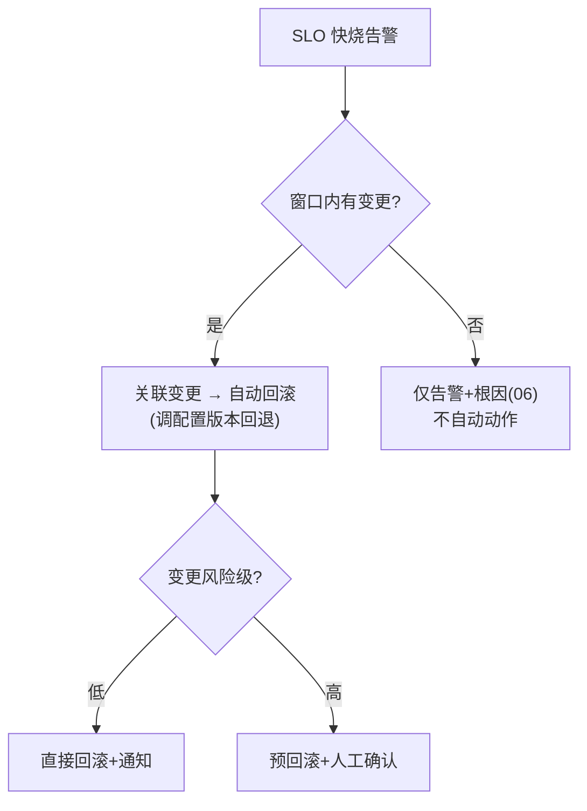

# 08-可观测驱动自动回滚

> **定位**：观测的终点是**动作**——**① 回滚触发规则（SLO 燃烧×变更关联）② 自动回滚执行（联动发布管道）③ 误回滚防护（变更窗口限定+人工确认分级）**。呼应 [26-灰度](../../项目/26-企业级Agent数据飞轮平台/06-灰度联动与守门放量.md)、[23-秒级回滚](../../项目/23-企业级Agent意图路由网关/06-路由灰度与秒级回滚.md)。前置阅读：[07-SLO与错误预算](07-SLO与错误预算.md)。
>
> **铁律 0**：触发规则/联动自研「概念代码」；回滚执行复用各平台既有回滚能力（如配置版本回退）。

---

## 一、四问

| 问 | 答 |
|----|----|
| **新增了什么需求** | ①触发规则（变更后窗口内 SLO 快烧 → 关联该变更）②自动回滚编排（调发布管道回退）③防护（仅变更窗口内自动；重大回滚人工确认） |
| **影响了哪些模块** | SloService → ActionRouter；对接发布管道 API |
| **架构如何演进** | 可观测从"看"演进为"闭环控制" |
| **上一版痛点** | 出问题→人看到→人决策→人回滚，夜间故障 MTTR 长 |

**本迭代验收**：①变更引发快烧 → 自动回滚（分钟级 MTTR）②非变更期异常只告警不误回滚 ③重大回滚有人工确认门。

### 一.1 本节核对（四问与迭代验收）

- [ ] 四问与"可观测从看 → 闭环控制"的演进一致
- [ ] 三条验收（变更快烧自动回滚 / 非变更期不误回滚 / 高风险人工确认）与 `## 二` 双防护门对应

## 二、触发与防护

**防护双门**：①**只回滚"刚变更过"的**（避免把历史问题误归因新变更）②高风险变更回滚需人工确认（呼应 [28-教程HITL](../../教程/61-Human-in-the-Loop与审批流.md)）。

### 二.1 本节测试与验证（触发与防护）

**前置条件**：07 SLO 快烧可触发；发布管道可记录变更窗口与版本回退；回滚/通知通道可用。

**材料——核对手段**：在变更后窗口内制造一次 SLO 快烧，对比"变更期"与"非变更期"两类异常的动作差异。

**步骤与断言**：

| # | 操作 | 预期（PASS 判据） |
|---|------|------------------|
| 1 | 发布变更后在窗口内触发快烧 | 关联到该变更 → 分钟级自动回滚（调配置版本回退），MTTR ≤ 5min |
| 2 | 无变更期制造异常 | 仅告警 + 根因（06），不触发自动回滚（不误回滚历史问题） |
| 3 | 对高风险变更（风险级=高）触发快烧 | 进入"预回滚 + 人工确认"门，等待确认后执行 |
| 4 | 低风险变更 | 直接回滚并通知 |
| 5 | 回滚后观察 | SLO 燃烧率回落，确认动作有效 |

**失败排查**：①非变更期误回滚 → 变更窗口关联缺失（回滚未绑定 recent change）；②高风险跳过确认 → 风险级判定/确认门逻辑缺失；③回滚无效 → 版本回退接口未接到发布管道，回查联动契约。

## 三、全篇回归验证

**回归断言**（`## 二.1` 本节测试通过后整体验收）：

| # | 操作 | 预期（PASS 判据） |
|---|------|------------------|
| 1 | 变更/非变更、低/高风险四种组合各走一遍 | 动作符合"双防护门"：只回滚刚变更过 + 高风险人工确认，无越界动作 |

**失败排查**：组合中有越界 → 门控分支漏，回 `## 二.1` 核对流程分支。

> **下一步**：动作闭环了。09 进阶做**多租户可观测视图**——租户级隔离与健康透视。
