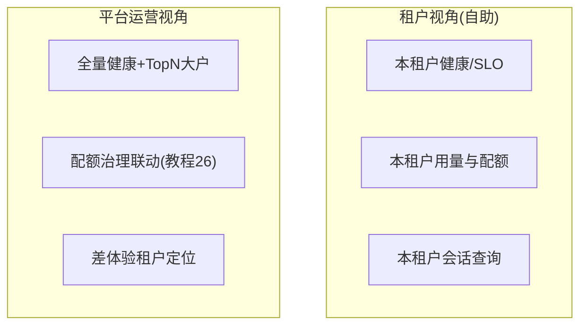

# 09-多租户可观测视图

> **定位**：可观测的**租户维度**——**① 租户级健康/成本/效果视图 ② 租户数据隔离（遥测权限）③ 大户透视（Top 租户资源占用/差体验定位）**。呼应 [26-多租户](../../教程/26-多租户隔离与资源治理.md)、[07-SaaS SLO](../../项目/07-跨国多租户SaaS-Agent平台/07-SLO与容量规划.md)。前置阅读：[08-可观测驱动自动回滚](08-可观测驱动自动回滚.md)。
>
> **铁律 0**：租户隔离视图自研「概念代码」（02 管道的租户标签是地基）。

---

## 一、四问

| 问 | 答 |
|----|----|
| **新增了什么需求** | ①租户切片视图（健康/成本/效果按租户）②遥测权限（租户只见自己；平台运营见全量）③大户透视（TopN 占用/差体验租户定位） |
| **影响了哪些模块** | 玻璃板 → 租户维度路由；查询 → 权限过滤 |
| **架构如何演进** | 可观测从"平台视角单一"演进为"平台+租户双视角" |
| **上一版痛点** | SaaS 租户体验差无从举证；大户挤占资源看不见 |

**本迭代验收**：①租户只见自己遥测 ②平台视角 TopN 大户可见 ③差体验租户可定位到会话。

## 二、双视角

**价值**：租户自助（减少工单）+ 平台治理（大户/差体验双清单）——遥测标签（02 增补的 tenant.id）是这一切的地基。

## 三、验收

| 测试 | 期望 |
|------|------|
| 租户 A 查 B 数据 | 拒绝 |
| TopN 大户 | 占用排行可下钻 |
| 差体验租户 | SLO 达成率排行定位 |

> **下一步**：租户视图齐了。10 进阶做**容量与性能观测**——容量规划的数据地基。
