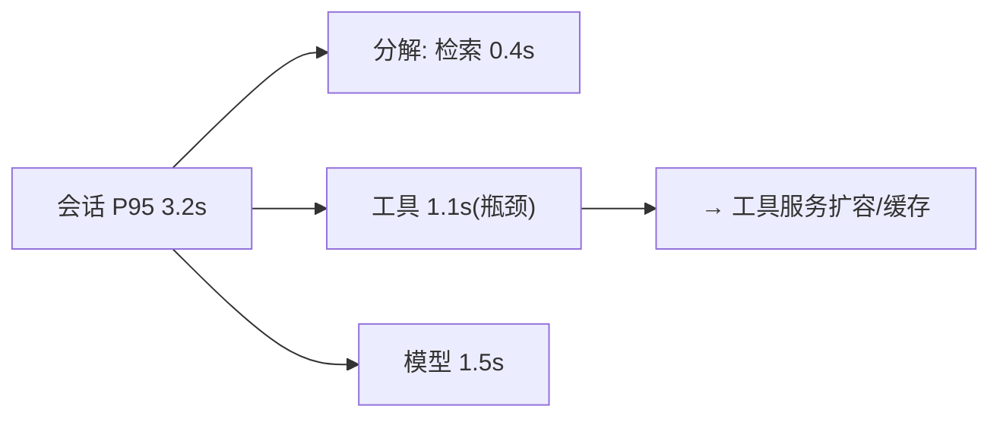

# 10-容量与性能观测

> **定位**：给容量规划提供**数据地基**——**① 容量指标（并发/GPU/队列/限流触发）② 性能画像（模型/工具/检索各层 P95 趋势）③ 容量预警与扩容建议**。呼应 [33-部署运维](../../教程/04-企业级架构主干/13-部署与运维.md)、[09-容量预测](../../项目/09-智能运维AIOps平台/07-容量预测.md)、[16-附录AIInfra](../../附录/15-AIInfra与推理部署/01-GPU调度与K8s部署.md)。前置阅读：[09-多租户可观测视图](09-多租户可观测视图.md)。
>
> **铁律 0**：容量指标采集=管道既有；画像/预警自研「概念代码」。

---

## 一、四问

| 问 | 答 |
|----|----|
| **新增了什么需求** | ①容量仪表（并发会话/GPU 利用/队列深度/限流触发率）②分层性能画像（模型/工具/检索 P95 趋势与瓶颈段）③容量预警（趋势外推→扩容建议） |
| **影响了哪些模块** | 玻璃板 → 容量视图；新增 CapacityJob |
| **架构如何演进** | 可观测补齐"容量"最后一块视图 |
| **上一版痛点** | 扩容拍脑袋；性能瓶颈说不清在哪层 |

**本迭代验收**：①容量仪表实时 ②瓶颈段定位（哪层拖慢 P95）③趋势预警提前 ≥3 天。

### 一.1 本节核对（四问与迭代验收）

- [ ] 四问与"可观测补齐容量最后一块视图"的演进一致
- [ ] 三条验收（容量仪表实时 / 瓶颈段定位 / 趋势预警≥3 天）与 `## 二` 分层画像对应

## 二、分层性能画像



**要点**：P95 要**按层分解**而非只看端到端——分解才知道优化哪层（工具慢加缓存、模型慢走降级/路由，呼应 [32-降级](../../教程/04-企业级架构主干/12-模型路由与降级.md)）。

### 二.1 本节测试与验证（容量仪表与分层画像）

**前置条件**：管道既有容量指标（并发/GPU/队列/限流触发）；CapacityJob 定时采集并维护分层 P95。

**材料——核对手段**：制造工具/模型层人为延迟，观察端到端 P95 与分层分解；拉长窗口验证趋势预警。

```bash
# 对某时间窗查询分层 P95 分解与容量仪表
curl "http://localhost:8081/obs/capacity?window=1h"
```

预期输出示例（容量仪表实时值 + 端到端 P95 按层分解）：

```json
{
  "window": "1h",
  "gauge": { "activeSessions": 42, "gpuUtilPct": 68, "queueDepth": 7, "rateLimitTriggerPct": 1.2 },
  "p95ByLayerMs": { "endToEnd": 3200, "retrieval": 400, "tool": 1100, "model": 1500 },
  "advice": [ { "layer": "tool", "action": "扩容/缓存" } ]
}
```

**步骤与断言**：

| # | 操作 | 预期（PASS 判据） |
|---|------|------------------|
| 1 | 打开容量仪表 | 并发会话/GPU 利用/队列深度/限流触发率实时可见并刷新 |
| 2 | 给工具层注入延迟增大 | 端到端 P95 上升，分层分解定位到工具层为瓶颈段 |
| 3 | 按瓶颈段给建议 | 工具慢→扩容/缓存；模型慢→降级/路由建议（32） |
| 4 | 拉长窗口看趋势 | 趋势外推提前 ≥3 天给出容量预警与扩容建议 |

**失败排查**：①仪表不刷 → 容量指标未采到（采集链路/采集周期）；②瓶颈误判 → 分层分解字段（模型/工具/检索）对不上实际耗时归属；③预警不提前 → 趋势窗口/外推阈值配置偏短。

## 三、全篇回归验证

**回归断言**（`## 二.1` 本节测试通过后整体验收）：

| # | 操作 | 预期（PASS 判据） |
|---|------|------------------|
| 1 | 工具/模型/检索三层各造一次慢点 | 端到端 P95 能分解到对应层，容量仪表实时，趋势预警按窗口触发 |

**失败排查**：某一层定位总失灵 → 该层耗时归属/采集缺失，回 `## 二.1` 对应层复核。

> **下一步**：10 个迭代/进阶让可观测中枢完整：管道/玻璃板/成本/效果/根因/SLO/回滚/租户/容量。下一步进 **11-核心代码讲解**；随后 12-ADR、13-前沿收官。
