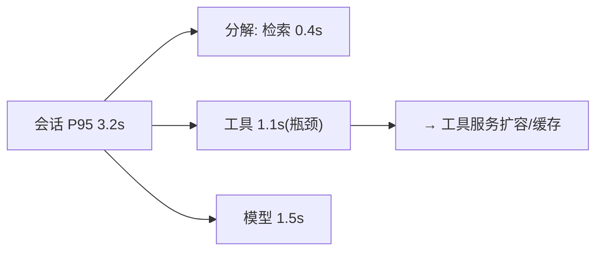

# 10-容量与性能观测

> **定位**：给容量规划提供**数据地基**——**① 容量指标（并发/GPU/队列/限流触发）② 性能画像（模型/工具/检索各层 P95 趋势）③ 容量预警与扩容建议**。呼应 [33-部署运维](../../教程/33-部署与运维.md)、[09-容量预测](../../项目/09-智能运维AIOps平台/07-容量预测.md)、[16-附录AIInfra](../../附录/16-AIInfra与推理部署/01-GPU调度与K8s部署.md)。前置阅读：[09-多租户可观测视图](09-多租户可观测视图.md)。
>
> **铁律 0**：容量指标采集=管道既有；画像/预警自研「概念代码」。

---

## 一、四问

| 问 | 答 |
|----|----|
| **新增了什么需求** | ①容量仪表（并发会话/GPU 利用/队列深度/限流触发率）②分层性能画像（模型/工具/检索 P95 趋势与瓶颈段）③容量预警（趋势外推→扩容建议） |
| **影响了哪些模块** | 玻璃板 → 容量视图；新增 CapacityJob |
| **架构如何演进** | 可观测补齐"容量"最后一块视图 |
| **上一版痛点** | 扩容拍脑袋；性能瓶颈说不清在哪层 |

**本迭代验收**：①容量仪表实时 ②瓶颈段定位（哪层拖慢 P95）③趋势预警提前 ≥3 天。

## 二、分层性能画像

**要点**：P95 要**按层分解**而非只看端到端——分解才知道优化哪层（工具慢加缓存、模型慢走降级/路由，呼应 [32-降级](../../教程/32-模型路由与降级.md)）。

## 三、验收

| 测试 | 期望 |
|------|------|
| 容量仪表 | 并发/GPU/队列实时 |
| P95 分解 | 瓶颈层定位 |
| 趋势预警 | 提前预警+建议 |

> **下一步**：10 个迭代/进阶让可观测中枢完整：管道/玻璃板/成本/效果/根因/SLO/回滚/租户/容量。下一步进 **11-核心代码讲解**；随后 12-ADR、13-前沿收官。
