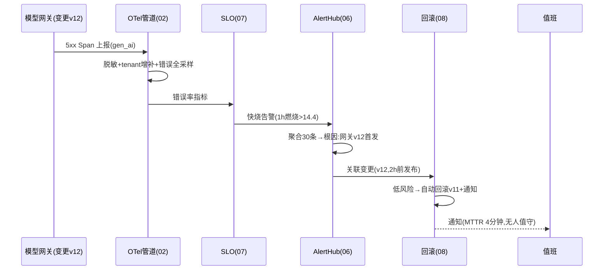

# 11-核心代码讲解

> **定位**：把项目 28 的核心实现串成主线——以**一次"夜间模型网关抖动引发 SLO 快烧 → 自动回滚"**事件贯穿各迭代代码的协作。前置阅读：[01-最小Demo](01-最小Demo.md) 至 [10-容量与性能观测](10-容量与性能观测.md) 全部。
>
> **铁律 0**：Observation/OTel/gen_ai 实证基座；聚合/根因/联动为「概念代码」。

---

## 一、一次夜间故障的观测旅程



## 二、中枢主链（串联各迭代）

```java
// 概念代码：可观测中枢核心链
Flux<Signal> signals = pipeline.stream()                     // 02 管道(脱敏/采样/标签)
    .publishTo(meterRegistry, traceStore, llmStore);          // 三路
sloEngine.watch(signals)                                     // 07 SLO/燃烧率
    .compose(alertHub::aggregateAndRca)                      // 06 聚合根因
    .filter(Alert::actionable)
    .subscribe(actionRouter::execute);                       // 08 回滚/扩容动作
glassBoard.serve(SRE, BIZ, FINANCE, tenantScope);            // 03/04/05/09 视图
```

## 三、分层职责（读代码抓手）

| 类 | 迭代 | 职责 |
|----|------|------|
| `Pipeline`(配置) | 02 | 脱敏/采样/租户标签/三路导出 |
| `GlassBoard` | 03/09 | 三视图+租户双视角 |
| `CostAttribution` | 04 | usage 多维下钻 |
| `SignalLinker` | 05 | 评测/漂移挂链路 |
| `AlertHub`/`RcaEngine` | 06 | 聚合+拓扑根因 |
| `SloEngine` | 07 | 双层 SLO+错误预算 |
| `ActionRouter` | 08 | 自动回滚(双防护门) |
| `CapacityJob` | 10 | 分层画像+容量预警 |

## 四、最容易踩的三个坑

1. **应用直连后端** → 管理混乱无脱敏。**解法**：统一管道（02）。
2. **指标无租户标** → 无法聚合下钻。**解法**：管道增补标签（02/09）。
3. **无变更关联的自动回滚** → 误回滚历史问题。**解法**：变更窗口限定（08）。

## 五、验收自测（对照 00 量化指标）

| 指标 | 目标 | 实现 |
|------|------|------|
| 一块屏定位 | P95≤3min | 03/06 |
| Trace 覆盖 | ≥95% | 02 |
| 成本下钻 | 会话级100% | 04 |
| 根因建议率 | ≥80% | 06 |
| 脱敏 | 100% | 02 |

> **下一步**：代码串讲完成。12-ADR 记录 8 条关键决策；13-前沿做可观测前沿对照与演进。
