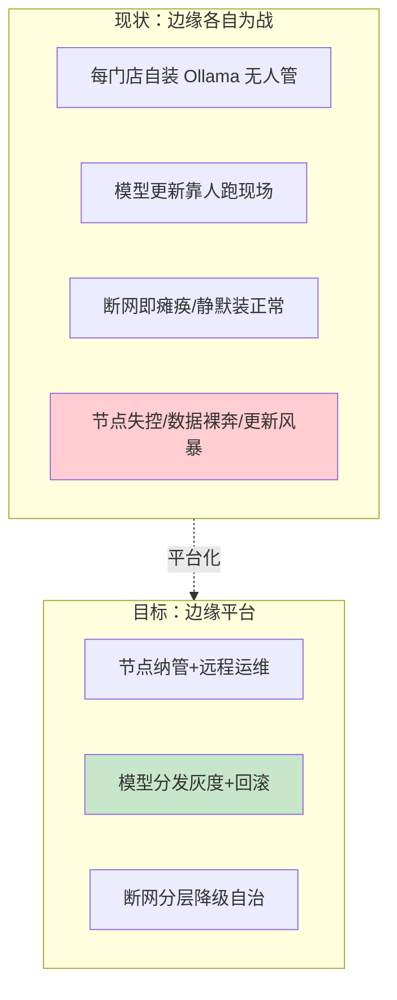
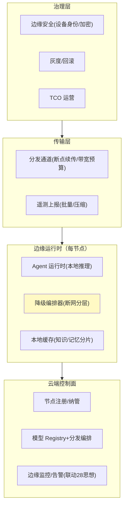

# 00-需求分析与架构设计：企业级边缘 Agent 部署平台

> **定位**：第十八旗舰·**边缘部署视角**——第一性原理：**断网可用、数据不出域、延迟达标**。门店/工厂/现场/车载的 Agent 不能全押云端——本平台把边缘做成**可运维的部署体系**：边缘节点注册纳管、模型分发灰度（GB 级断点续传）、断网分层降级自治、端云记忆/上下文分工、边缘安全（设备身份/本地数据加密）、N 节点远程运维（监控/告警/自愈）。读者画像：要回答"上百个边缘节点怎么管、断网怎么活、模型怎么更新"的架构师。前置阅读：[教程 55-边缘Agent与端云协同部署]、[教程 33-部署与运维]、[前沿 10-边缘Agent与端云协同]。
>
> **铁律 0**：边缘推理（Ollama OpenAI 兼容接入）/Observation 为实证或业界标准；节点纳管/分发/降级编排为自研「概念代码」。与 11/17 项目的边缘迭代思想互通但项目独立。

---

## ★ 阅读顺序总览（序号 = 阅读顺序）

> 本子文件夹 14 个文件（00-13）：

| 阶段 | 文件 | 读者定位 |
|------|------|---------|
| ① 全貌 | 00-需求分析与架构设计 | **先读**：边缘平台四层架构 |
| ② 起步 | 01-最小Demo | **动手**：单边缘节点+本地推理 |
| ③ 主体迭代 | 02~07（节点纳管/模型分发/断网自治/端云分工/边缘安全/远程运维） | **严格顺序** |
| ④ 进阶 | 08~10（多边缘联邦/边缘灰度/经济运营） | **严格顺序** |
| ⑤ 讲解 | 11-核心代码讲解 | **回顾** |
| ⑥ 资产 | 12-ADR / 13-前沿 | **按需/收官** |

---

## 一、为什么边缘要做成平台

**三个核心论点**：

1. **边缘节点是牛群不是宠物**：上百节点的注册/监控/告警/自愈必须平台化（云管端，呼应 [15-分布式内核](../../项目/15-企业级Agent操作系统内核/10-分布式内核与高可用.md) 思想）。
2. **模型更新=变更管理**：GB 级模型包的分层分发+灰度+回滚（不是 scp 到现场）。
3. **断网是设计前提不是故障**：分层降级+显式告知（呼应 [55-§4](../../教程/55-边缘Agent与端云协同部署.md)）。

### 一.1 本节核对（为什么边缘要做成平台）

- [ ] 三个核心论点（牛群不宠物 / 模型更新=变更管理 / 断网是设计前提）能不看正文复述，且各对应一张「现状→目标」Mermaid 图
- [ ] 论证"牛群不是宠物"时能说清它与后续迭代（02 纳管 / 07 运维）的对应关系

## 二、总体架构（四层）

### 二.1 本节核对（总体架构四层）

- [ ] 四层（云控制面/边缘运行时/传输层/治理层）的顺序与箭头 `l1→l2→l3→l4` 能复述，且每层至少能例举一个代表模块
- [ ] 每层模块都能落到后续某迭代篇：云控（02/03）→ 传输（03 分发）→ 治理（06 安全 / 09 灰度 / 10 TCO）

## 三、微服务清单与迭代路线

| 服务 | 职责 | 落地 |
|------|------|------|
| `edge-hub`（云） | 节点纳管/分发/监控 | 主体迭代 |
| `edge-runtime`（边） | 本地 Agent+降级编排 | 迭代 2-4 |
| `edge-security` | 设备身份/数据加密 | 迭代 5 |

**迭代路线**（每迭代回答四问）：

| # | 迭代 | 核心新增 | 痛点回应 |
|---|------|---------|---------|
| 01-最小Demo | 单节点+本地推理+云注册 | 起点 |
| 02 | 节点纳管（注册/心跳/分组） | 节点失控 |
| 03 | 模型分发（分层/断点续传/灰度回滚） | 人肉更新/更新风暴 |
| 04 | 断网自治（分层降级+显式告知） | 断网瘫痪 |
| 05 | 端云分工（记忆/上下文/协作） | 全本地或全云的两难 |
| 06 | 边缘安全（设备身份/本地加密） | 数据裸奔 |
| 07 | 远程运维（监控/告警/自愈） | 上百节点跑现场 |
| 进阶08 | 多边缘联邦（节点协作） | 单节点能力孤岛 |
| 进阶09 | 边缘灰度与 A/B（按节点组） | 边缘发布无验证 |
| 进阶10 | TCO 运营（成本/算力运营） | 边缘经济账不清 |

**量化验收**：①断网核心功能可用率 ≥ 90%（分层降级后）②模型分发 N 节点并发不打满专线（带宽预算生效）③节点心跳覆盖率 ≥ 99% ④边缘数据本地加密 100% ⑤远程运维替代现场率 ≥ 95%。

### 三.1 本节核对（微服务清单与迭代路线）

- [ ] 微服务清单（edge-hub/runtime/security）与「微服务清单与迭代路线」表一一对应，url 无遗漏
- [ ] 五项量化验收（90% / 带宽 / 99% / 100% / 95%）分别能指明由哪篇迭代达标（04 / 03 / 02`+`07 / 06 / 07）

---

## 四、与教程/附录的映射

| 本平台能力 | 教程 | 附录/项目 |
|-----------|------|-----------|
| 端云五形态/降级 | [55-边缘Agent与端云协同部署](../../教程/55-边缘Agent与端云协同部署.md) | [前沿 10](../../前沿/10-边缘Agent与端云协同.md) |
| 推理栈 | [44-供应策略](../../教程/44-多模型协作与供应策略.md) | [16-AIInfra](../../附录/16-AIInfra与推理部署/00-vLLM推理服务与SpringAI集成.md) |
| 容错降级 | [30-容错](../../教程/30-容错与弹性设计.md) | — |
| 端云上下文 | [57-上下文生产化](../../教程/57-上下文工程生产化.md) | [31-端云](../../项目/31-企业级Agent上下文管理平台/10-端侧与边缘上下文.md)（思想复用、独立） |
| 监控 | [33-部署运维](../../教程/33-部署与运维.md) | [28-可观测](../../项目/28-企业级Agent统一可观测平台/00-需求分析与架构设计.md)（思想） |

> **铁律提醒**：Ollama 接入（OpenAI 兼容 base-url）为实证模式；纳管/分发/降级为「概念代码」。与 11/17/31 边缘思想互通、项目独立。

### 四.1 本节核对（与教程/附录的映射）

- [ ] 端云五形态/降级、推理栈、容错、端云上下文、监控五行的教程/附录锚点均有效（路径存在、板块正确）
- [ ] 铁律 0 标注完整：Ollama 实证；纳管/分发/降级均标注「概念代码」，无未标注即当真实的越界
