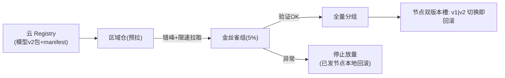

# 03-模型分发与灰度回滚

> **定位**：边缘最重的工程问题——**GB 级模型包怎么安全到上百节点**。核心：**① 分层分发（registry→区域仓→节点）② 断点续传+带宽预算（防更新风暴）③ 灰度（先金丝雀节点组）+ 本地回滚（秒切上一版）**。呼应 [29-灰度](../../教程/29-灰度发布与版本管理.md)。前置阅读：[02-节点纳管与分组治理](02-节点纳管与分组治理.md)。
>
> **铁律 0**：分发编排自研「概念代码」；传输用标准 HTTP Range/对象存储。

---

## 一、四问

| 问 | 答 |
|----|----|
| **新增了什么需求** | ①分发三层（云 registry→区域仓→节点拉取）②带宽预算调度（错峰/限速，门店专线不被打满）③灰度验证（金丝雀组先跑）+节点本地双版本秒回滚 |
| **影响了哪些模块** | 新增 DistributionOrchestrator；节点 → 双版本槽位 |
| **架构如何演进** | 模型更新从"人肉scp"演进为"变更管理流水线" |
| **上一版痛点** | 更新风暴打满专线；坏模型全量翻车；回滚跑现场 |

**本迭代验收**：①100 节点并发分发带宽受控（00 验收②）②金丝雀组验证后再放量 ③节点本地回滚 <1min。

## 二、分发流水线

## 三、验收

| 测试 | 期望 |
|------|------|
| 100 节点同发 | 带宽曲线受预算约束 |
| 金丝雀失败 | 放量停止+已发回滚 |
| 节点回滚 | 双槽切换 <1min |
| 断点续传 | 中断后不重传已完成分片 |

> **下一步**：模型能安全到端了，但**断网时节点怎么活**还没系统化。04 迭代做**断网自治**——分层降级。
