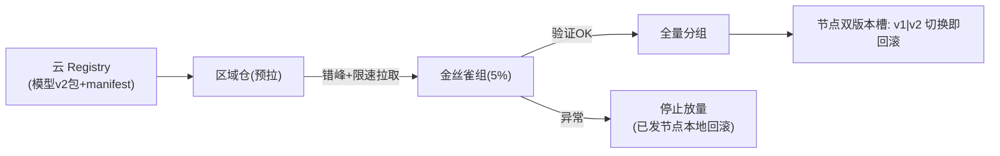

# 03-模型分发与灰度回滚

> **定位**：边缘最重的工程问题——**GB 级模型包怎么安全到上百节点**。核心：**① 分层分发（registry→区域仓→节点）② 断点续传+带宽预算（防更新风暴）③ 灰度（先金丝雀节点组）+ 本地回滚（秒切上一版）**。呼应 [29-灰度](../../教程/29-灰度发布与版本管理.md)。前置阅读：[02-节点纳管与分组治理](02-节点纳管与分组治理.md)。
>
> **铁律 0**：分发编排自研「概念代码」；传输用标准 HTTP Range/对象存储。

---

## 一、四问

| 问 | 答 |
|----|----|
| **新增了什么需求** | ①分发三层（云 registry→区域仓→节点拉取）②带宽预算调度（错峰/限速，门店专线不被打满）③灰度验证（金丝雀组先跑）+节点本地双版本秒回滚 |
| **影响了哪些模块** | 新增 DistributionOrchestrator；节点 → 双版本槽位 |
| **架构如何演进** | 模型更新从"人肉scp"演进为"变更管理流水线" |
| **上一版痛点** | 更新风暴打满专线；坏模型全量翻车；回滚跑现场 |

**本迭代验收**：①100 节点并发分发带宽受控（00 验收②）②金丝雀组验证后再放量 ③节点本地回滚 <1min。

### 一.1 本节核对（四问与迭代验收）

| # | 核对项 | 判据 |
|---|--------|------|
| 1 | 四问口径齐全 | 新增需求（三层分发/带宽预算/金丝雀+双槽回滚）/影响模块（DistributionOrchestrator）/演进（人肉scp→变更流水线）/痛点（更新风暴/翻车/跑现场）四行均有 |
| 2 | 本迭代验收可度量 | ①带宽受控 ②金丝雀先验证 ③回滚<1min——三项均落到 §二 流水线/§三 验收 |

## 二、分发流水线

### 二.1 本节测试与验证（分发流水线：带宽预算 / 灰度回滚 / 断点续传）

**前置条件**：`DistributionOrchestrator` 已实现三层分发（云 Registry→区域仓→节点拉取）；带宽预算（错峰+限速）与节点双版本槽生效；有一个大于单个会话可传完的模型包用于断点续传验证。

**材料——流水线内含的旋钮**：金丝雀组 `5%`；放量规则 `验证OK才全量`、`异常停止放量`；节点双槽 `v1|v2 切换即回滚`；传输走标准 HTTP `Range`（断点续传）。

**步骤与断言**：

| # | 操作 | 预期（PASS 判据） |
|---|------|------------------|
| 1 | 触发 100 节点并发分发新模型 v2 | 带宽曲线受预算约束（错峰/限速生效），专线不打满（00 验收②） |
| 2 | 先对金丝雀组（5%）下发 | 仅金丝雀节点更新；其余节点仍 v1 |
| 3 | 金丝雀验证指标异常时 | 放量自动停止；已下发节点本地切回 v1（双槽切换 <1min） |
| 4 | 模拟分发中途断网/中断 | 节点断点续传，已完成分片不重传 |
| 5 | 正常全量完成后 | 全部节点 v2；任一节点可秒切 v1 验证回滚通路 |

**失败排查**：①并发打满专线→带宽预算（限速/错峰窗口）未生效或仅作用于部分节点；②金丝雀放量停不→验证指标判据与守门未接；③回滚超 <1min→双槽切换走重下载而非本地槽切换；④续传重传全量→未用 HTTP Range or 续传元数据未持久化。

## 三、验收

| 测试 | 期望 |
|------|------|
| 100 节点同发 | 带宽曲线受预算约束 |
| 金丝雀失败 | 放量停止+已发回滚 |
| 节点回滚 | 双槽切换 <1min |
| 断点续传 | 中断后不重传已完成分片 |

### 三.1 本节核对（验收表）

- [ ] 验收表四行（同发/金丝雀/回滚/续传）与 §二.1 步骤 1/2-3/5/4 一一对应
- [ ] "回滚 <1min"有可度量判据（双槽切换计时），非空话

> **下一步**：模型能安全到端了，但**断网时节点怎么活**还没系统化。04 迭代做**断网自治**——分层降级。
