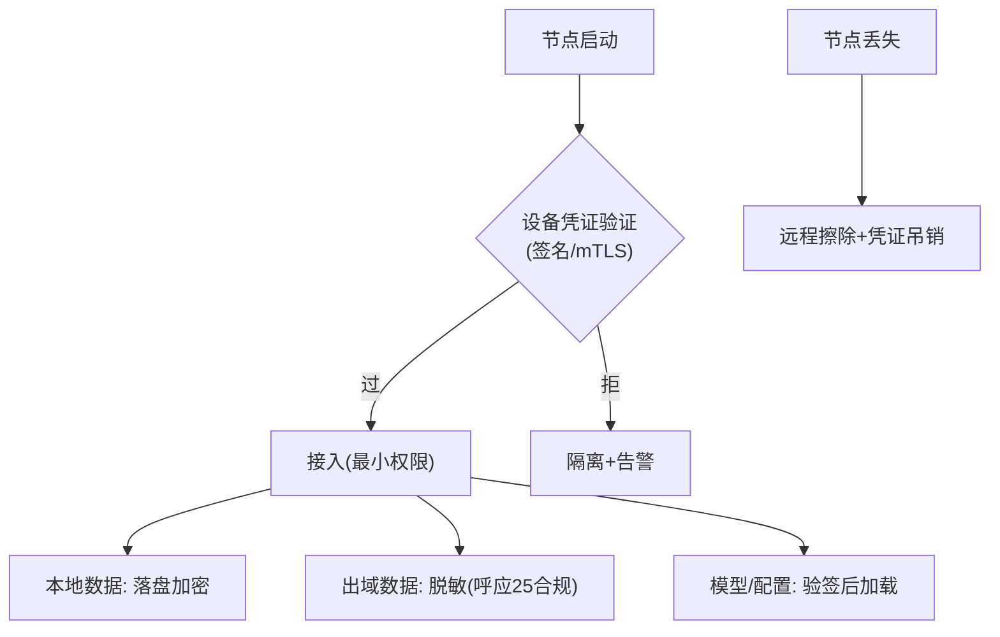

# 06-边缘安全与设备信任

> **定位**：边缘是**物理暴露面**——**① 设备身份（不可伪造的节点凭证）② 本地数据加密（落盘加密/出域脱敏）③ 模型与配置完整性（签名校验防篡改）④ 丢失处置（远程擦除）**。呼应 [31-安全](../../教程/04-企业级架构主干/11-安全与权限控制.md)、[16-身份零信任](../../项目/16-企业级Agent服务网格/04-身份零信任与mTLS.md)。前置阅读：[05-端云分工与数据同步](05-端云分工与数据同步.md)。
>
> **铁律 0**：安全机制自研「概念代码」（mTLS/签名用业界标准，需引入依赖后实证）。

---

## 一、四问

| 问 | 答 |
|----|----|
| **新增了什么需求** | ①设备凭证（启动签名验证/mTLS 双向）②本地数据落盘加密+出域脱敏 ③模型/配置包签名校验（防篡改投放）④丢失节点远程擦除+凭证吊销 |
| **影响了哪些模块** | 节点启动 → 身份链；存储/上报 → 加密脱敏；分发 → 校验 |
| **架构如何演进** | 边缘补齐零信任边界 |
| **上一版痛点** | 门店设备被盗=数据裸奔；伪造节点接入；篡改模型包投毒 |

**本迭代验收**：①无凭证节点接入被拒 ②本地数据落盘加密 100%（00 验收④）③模型包验签失败拒装 ④丢失节点可远程擦除。

### 一.1 本节核对（四问与迭代验收）

| # | 核对项 | 判据 |
|---|--------|------|
| 1 | 四问口径齐全 | 新增需求（设备凭证/落盘加密+脱敏/签名校验/远程擦除）/影响模块（身份链/存储上报/分发校验）/演进（零信任边界）/痛点（盗=裸奔/伪造接入/篡改投毒）四行均有 |
| 2 | 本迭代验收可度量 | ①拒无凭证 ②落盘加密100% ③验签拒装 ④可擦除——四项与 §二 四道防线一一对应 |

## 二、四道防线



### 二.1 本节测试与验证（四道防线：凭证 / 加密脱敏 / 验签 / 擦除）

**前置条件**：节点启动走 `设备凭证验证（签名/mTLS）`；本地存储已接落盘加密；出域上报接脱敏；模型/配置加载前做验签；远程擦除通道已打通。（mTLS/签名需引入依赖后实证。）

**核对命令**（节点信任态与擦除审计可查）：

```bash
curl -s http://localhost:8081/edge-hub/nodes/edge-001/trust    # 节点信任态
# 预期输出（节选）：
#   {"nodeId":"edge-001","deviceCert":"VALID","diskEncryption":"ON",
#    "modelSigVerified":true,"wipeStatus":"NONE"}
```

**步骤与断言**：

| # | 操作 | 预期（PASS 判据） |
|---|------|------------------|
| 1 | 用无/伪凭证节点请求接入 | 接入被拒并隔离+告警（零信任：拒绝+告警，而非放行） |
| 2 | 直读节点磁盘上的本地数据文件 | 内容为密文（非明文），落盘加密 100% 生效（00 验收④） |
| 3 | 篡改已签名的模型/配置包后下发 | 验签失败、节点拒装（防篡改投放） |
| 4 | 对标记丢失的节点下发远程擦除 | 擦除指令生效，本地数据清除且凭证吊销 |
| 5 | 出域上报含敏感字段的数据 | 上报内容为脱敏数据（不把 PII 明文带出域） |

**失败排查**：①伪凭证能接入→凭证验证未在启动链执行或 mTLS 关闭；②读磁盘见明文→落盘加密未启用或密钥绕行；③篡改包照装→签名校验被跳过或公钥不可信；④擦除无效→擦除指令未签/任务未落到设备；⑤脱敏漏 PII→出域通道未接脱敏规则。

## 三、验收

| 测试 | 期望 |
|------|------|
| 伪造凭证 | 拒绝+告警 |
| 读磁盘 | 数据密文 |
| 篡改模型包 | 验签失败拒装 |
| 丢失处置 | 擦除指令生效 |

### 三.1 本节核对（验收表）

- [ ] 验收表四行与 §二.1 步骤 1/2/3/4 一一对应
- [ ] 四项安全断言均有 PASS 判据，且"密文/拒绝/拒装/生效"为可判定的安全边界

## 四、全篇回归验证

> 各节断言已上移至 §二.1（四道防线：凭证 / 加密脱敏 / 验签 / 擦除）；本表为整篇迭代的回归验收，不重复材料。

| # | 验收项（断言） | 标准 | 复验方式 |
|---|---------------|------|---------|
| 1 | 拒无凭证接入 | 伪/无凭证被拒 + 隔离告警 | §二.1 步骤1 |
| 2 | 落盘加密 100% | 直读磁盘为密文 | §二.1 步骤2 |
| 3 | 验签拒装 | 篡改模型/配置包验签失败拒装 | §二.1 步骤3 |
| 4 | 远程擦除生效 | 丢失节点数据清除 + 凭证吊销 | §二.1 步骤4 |
| 5 | 出域脱敏 | 上报不含 PII 明文 | §二.1 步骤5 |
| 6 | 信任态可查 | 设备凭证/加密/验签状态接口可读 | 复验：执行 §二.1 核对命令 |

**回归失败排查**：按 §二.1 失败排查逐条回溯（验证未在启动链/密钥绕行/校验被跳过/擦除未落设备/脱敏规则漏 PII）。

## 五、验收对照

> 00-需求分析量化验收④（边缘数据本地加密 100%）在本迭代直接收口。

| 验收项 | 标准 | 状态 |
|--------|------|------|
| 本地数据加密 100% | 落盘数据全部密文 | ✅（§二.1 步骤2） |
| 设备零信任 | 无/伪凭证拒入 + 告警 | ✅（§二.1 步骤1） |
| 模型包防篡改 | 验签失败拒装 | ✅（§二.1 步骤3） |
| 丢失可处置 | 远程擦除 + 凭证吊销生效 | ✅（§二.1 步骤4） |

> **下一步**：安全设防了，但**上百节点的日常运维**还没体系。07 迭代做**远程运维**——监控/告警/自愈。
