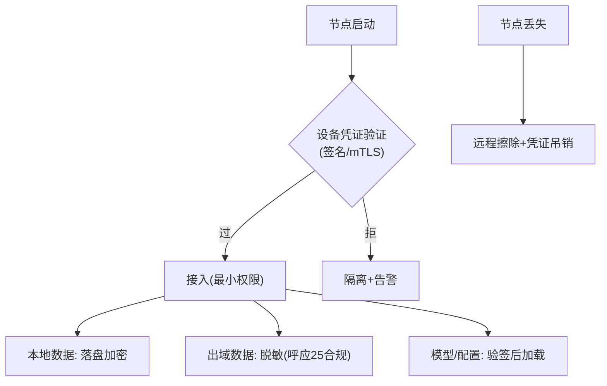

# 06-边缘安全与设备信任

> **定位**：边缘是**物理暴露面**——**① 设备身份（不可伪造的节点凭证）② 本地数据加密（落盘加密/出域脱敏）③ 模型与配置完整性（签名校验防篡改）④ 丢失处置（远程擦除）**。呼应 [31-安全](../../教程/31-安全与权限控制.md)、[16-身份零信任](../../项目/16-企业级Agent服务网格/04-身份零信任与mTLS.md)。前置阅读：[05-端云分工与数据同步](05-端云分工与数据同步.md)。
>
> **铁律 0**：安全机制自研「概念代码」（mTLS/签名用业界标准，需引入依赖后实证）。

---

## 一、四问

| 问 | 答 |
|----|----|
| **新增了什么需求** | ①设备凭证（启动签名验证/mTLS 双向）②本地数据落盘加密+出域脱敏 ③模型/配置包签名校验（防篡改投放）④丢失节点远程擦除+凭证吊销 |
| **影响了哪些模块** | 节点启动 → 身份链；存储/上报 → 加密脱敏；分发 → 校验 |
| **架构如何演进** | 边缘补齐零信任边界 |
| **上一版痛点** | 门店设备被盗=数据裸奔；伪造节点接入；篡改模型包投毒 |

**本迭代验收**：①无凭证节点接入被拒 ②本地数据落盘加密 100%（00 验收④）③模型包验签失败拒装 ④丢失节点可远程擦除。

## 二、四道防线

## 三、验收

| 测试 | 期望 |
|------|------|
| 伪造凭证 | 拒绝+告警 |
| 读磁盘 | 数据密文 |
| 篡改模型包 | 验签失败拒装 |
| 丢失处置 | 擦除指令生效 |

> **下一步**：安全设防了，但**上百节点的日常运维**还没体系。07 迭代做**远程运维**——监控/告警/自愈。
