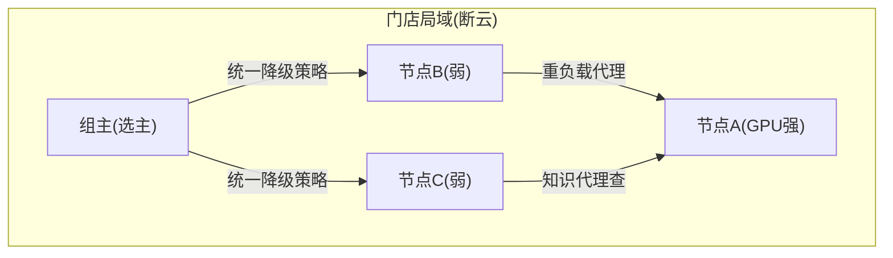

# 08-多边缘联邦与节点协作

> **定位**：从"节点孤岛"到**边缘联邦**——**① 局域节点协作（同门店/产线节点互援：算力/知识共享）② 联邦检索（跨节点知识代理查询）③ 边缘组自治（组内选主/断云时组协调）**。呼应 [27-联邦](../../项目/27-企业级Agent协作平台/09-跨组织协作与联邦.md) 思想在边缘侧的应用。前置阅读：[07-远程运维与自愈](07-远程运维与自愈.md)。
>
> **铁律 0**：联邦机制自研「概念代码」（局域发现用标准 mDNS/组播思想）。

---

## 一、四问

| 问 | 答 |
|----|----|
| **新增了什么需求** | ①局域互援（强节点帮弱节点跑推理）②联邦检索（本节点无知识→代理查组内）③组自治（断云时组内选主协调降级策略） |
| **影响了哪些模块** | EdgeRuntime → 组通信层 |
| **架构如何演进** | 边缘从"云管的个体"演进为"云管组、组管节点"两级 |
| **上一版痛点** | 同店 3 节点各自为战（弱节点卡死强节点闲）；单节点知识不全 |

**本迭代验收**：①弱节点请求被强节点代理执行 ②组内联邦检索命中他节点知识 ③断云时组内自治（选主+统一降级）。

### 一.1 本节核对（四问与迭代验收）

| # | 核对项 | 判据 |
|---|--------|------|
| 1 | 四问口径齐全 | 新增需求（局域互援/联邦检索/组自治）/影响模块（EdgeRuntime→组通信层）/演进（云管个体→云管组组管节点）/痛点（各自为战/单点知识全）四行均有 |
| 2 | 本迭代验收可度量 | ①强代弱 ②联邦命中他节点 ③断云组自治——三项与 §二 局域互援/§三 验收对应 |

## 二、局域互援

### 二.1 本节测试与验证（局域互援与组内自治）

**前置条件**：同门店局域内有强弱节点（如 GPU 强节点 A、弱节点 B/C）；组通信层（标准 mDNS/组播发现）已实现；组主（选主）与统一降级策略已接。

**步骤与断言**：

| # | 操作 | 预期（PASS 判据） |
|---|------|------------------|
| 1 | 弱节点 B 提交重负载推理任务 | 任务被代理转发到强节点 A 执行（A 承接，B 不卡死） |
| 2 | 弱节点 C 在本节点无相关知识时检索 | 联邦检索命中组内节点 A 的知识返回 |
| 3 | 断云后观察组内行为 | 组主（选主）自动产生并下发统一降级策略，组内不各自为战 |
| 4 | 组主故障（强节点 A 下线） | 重新选主，降级策略仍可下发 |

**失败排查**：①弱节点重任务本地硬扛→代理路由未开启或未按负载判定；②联邦检索 miss→组内知识代理查询未广播或缓存未命中；③断云无组主→选主协议未触发（mDNS 发现失效）；④组主挂了组解散→选主无容错/心跳未检测主节点。

## 三、验收

| 测试 | 期望 |
|------|------|
| 弱节点重任务 | 强节点代理执行 |
| 本地无知识 | 组内联邦命中 |
| 断云 | 组主协调（不各自为战） |

### 三.1 本节核对（验收表）

- [ ] 验收表三行与 §二.1 步骤 1/2/3-4 一一对应
- [ ] "组主统一降级策略"有明确 PASS 判据（选主自动、降级统一下发），无各自为战漏洞

> **下一步**：节点能协作了。09 进阶做**边缘灰度与 A/B**——按节点组的发布验证。
