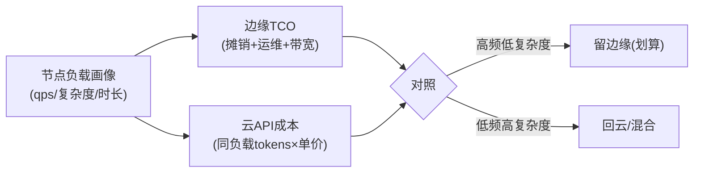

# 10-TCO 运营与容量规划

> **定位**：边缘的**经济账**——**① TCO 模型（硬件摊销/运维/带宽/电力）② 云边成本对比看板（边缘自建 vs 云 API 实时对照）③ 容量规划（节点算力/负载/扩缩建议）**。呼应 [55-§7](../../教程/55-边缘Agent与端云协同部署.md)、[44-自建vs商用](../../教程/44-多模型协作与供应策略.md)、[28-容量](../../项目/28-企业级Agent统一可观测平台/10-容量与性能观测.md)。前置阅读：[09-边缘灰度与AB实验](09-边缘灰度与AB实验.md)。
>
> **铁律 0**：TCO 模型/看板自研「概念代码」（数据来自遥测+资产台账）。

---

## 一、四问

| 问 | 答 |
|----|----|
| **新增了什么需求** | ①TCO 台账（硬件/运维/带宽/电力的节点级归集）②云边对照看板（同负载边缘成本 vs 云 API 成本）③容量建议（负载 vs 算力的扩缩与云边迁移建议） |
| **影响了哪些模块** | 新增 EdgeFinJob；容量数据 → 遥测 |
| **架构如何演进** | 边缘从"技术部署"演进为"可核算资产" |
| **上一版痛点** | 边缘成本说不清；"该不该把某负载回云"无数据依据 |

**本迭代验收**：①节点级 TCO 可查 ②云边对照实时 ③容量建议可执行（扩/缩/迁移）。

## 二、云边对照与决策

## 三、验收

| 测试 | 期望 |
|------|------|
| TCO 台账 | 节点级四项成本 |
| 云边对照 | 同负载双列对照 |
| 容量建议 | 过载节点/闲置节点各有动作 |

> **下一步**：10 个迭代/进阶让边缘平台完整：纳管/分发/自治/分工/安全/运维/联邦/灰度/TCO。下一步进 **11-核心代码讲解**；随后 12-ADR、13-前沿收官。
