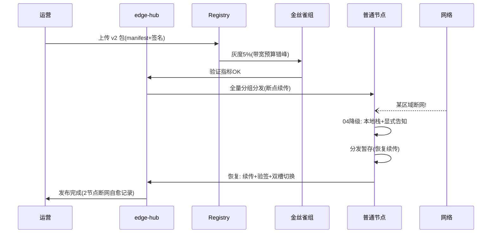

# 11-核心代码讲解

> **定位**：把项目 29 的核心实现串成主线——以**一次"新模型 v2 发布到 100 门店，期间某区域断网"**事件贯穿各迭代代码的协作。前置阅读：[01-最小Demo](01-最小Demo.md) 至 [10-TCO运营与容量规划](10-TCO运营与容量规划.md) 全部。
>
> **铁律 0**：Ollama 接入（OpenAI 兼容）/Observation 实证或标准；纳管分发降级为「概念代码」。

---

## 一、一次模型发布的边缘旅程



## 二、边缘主链（串联各迭代）

```java
// 概念代码：节点运行时主循环
@Component
public class EdgeRuntime {
    // 启动: 身份验证(06) → 注册档案(02) → 心跳+遥测(07)
    // 运行: 网络态检测(04) → 降级编排 → 本地/托管装配(05/31思想) → 推理(01实证)
    // 更新: 分发监听(03) → 验签(06) → 双槽切换 → 灰度指标上报(09)
    // 运营: TCO 数据随遥测上报(10)
}
```

## 三、分层职责（读代码抓手）

| 类 | 迭代 | 职责 |
|----|------|------|
| `NodeProfile`/`Hub` | 01/02 | 注册/心跳/分组 |
| `DistributionOrchestrator` | 03 | 分层分发/带宽/灰度回滚 |
| `DegradeOrchestrator` | 04 | 断网分层降级+显式告知 |
| `EdgeCloudSplit` | 05 | 记忆/上下文/协作分工同步 |
| `EdgeSecurity` | 06 | 凭证/加密/验签/擦除 |
| `EdgeOps` | 07 | 遥测/告警/自愈剧本 |
| `LanFederation`/`CanaryJob`/`EdgeFinJob` | 08/09/10 | 联邦/实验/TCO |

## 四、最容易踩的三个坑

1. **模型更新全量齐发** → 专线打满。**解法**：带宽预算+错峰（03）。
2. **断网静默装正常** → 用户信任崩塌。**解法**：显式告知（04）。
3. **弱节点硬扛重负载** → 卡死。**解法**：局域互援（08）。

## 五、验收自测（对照 00 量化指标）

| 指标 | 目标 | 实现 |
|------|------|------|
| 断网可用率 | ≥90% | 04 |
| 带宽受控 | 100节点不炸 | 03 |
| 心跳覆盖 | ≥99% | 02/07 |
| 落盘加密 | 100% | 06 |
| 远程替代现场 | ≥95% | 07 |

> **下一步**：代码串讲完成。12-ADR 记录 8 条关键决策；13-前沿做边缘 AI 前沿对照与演进收官。
