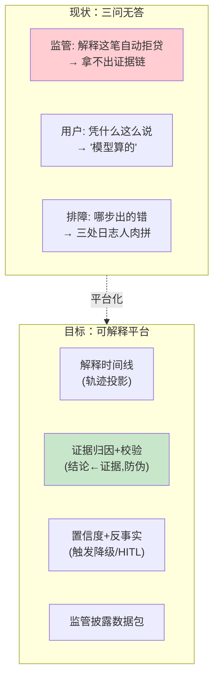
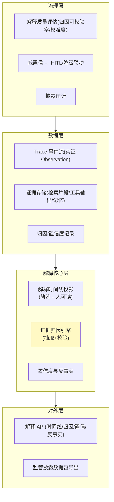

# 00-需求分析与架构设计：企业级 Agent 可解释与透明平台

> **定位**：第十四旗舰·**可解释视角**——第一性原理：**每个决策有证据链、每个结论有置信度、每次执行有可读时间线**。监管要"解释义务"（EU AI Act 式）、用户要"凭什么这么说"、排障要"哪步出的问题"——本平台把 XAI 做成基础设施：轨迹→解释时间线投影、结论←证据归因（可校验防伪解释）、分来源置信度（触发降级/HITL）、反事实边界（高风险决策）、监管披露数据包。读者画像：要回答"监管/用户/排障问'Agent 为什么这样'拿得出证据"的架构师。前置阅读：[教程 99-Agent可解释与透明工程]、[教程 31-全链路可观测性]、[教程 86-Agent治理与合规框架]。
>
> **铁律 0**：轨迹基座=实证 Observation（gen_ai/工具 Span，附录18）；归因/置信度/投影/披露为自研「概念代码」；结构化归因抽取用实证 `entity()` 思想。

---

## ★ 阅读顺序总览（序号 = 阅读顺序）

> 本子文件夹 14 个文件（00-13）：

| 阶段 | 文件 | 读者定位 |
|------|------|---------|
| ① 全貌 | 00-需求分析与架构设计 | **先读**：可解释平台四层架构 |
| ② 起步 | 01-最小Demo | **动手**：轨迹→解释时间线最小投影 |
| ③ 主体迭代 | 02~07（解释时间线/证据归因/归因校验/置信度/反事实/解释API） | **严格顺序** |
| ④ 进阶 | 08~10（监管披露/解释质量评估/低置信HITL联动） | **严格顺序** |
| ⑤ 讲解 | 11-核心代码讲解 | **回顾** |
| ⑥ 资产 | 12-ADR / 13-前沿 | **按需/收官** |

---

## 一、为什么可解释要做成平台

**三个核心论点**：

1. **解释 = 合规交付物**：受监管决策的"解释义务"需要机器可读+人可读的证据链（呼应 [43-治理](../../教程/86-Agent治理与合规框架.md)、[13-附录治理](../../附录/12-AI治理与合规/00-NIST-AI-RMF框架.md)）。
2. **归因必须可校验**：模型自称"依据文档#3"必须核对真实存在——**伪解释比无解释更危险**。
3. **置信度要触发行为**：低置信显式降级/转 HITL，而非装饰数字（呼应 [28-HITL](../../教程/61-Human-in-the-Loop与审批流.md)、[06-置信度分级](../../项目/06-金融风控Agent系统/02-置信度与风险分级.md)）。

### 一.1 本节核对（为什么可解释要做成平台）

- [ ] 三个核心论点（解释 = 合规交付物 / 归因必须可校验 / 置信度要触发行为）能不看正文复述，且各说出一个对应的平台能力模块（P1 时间线 / P2 归因+校验 / P3 置信+反事实 / P4 披露）
- [ ] 「伪解释比无解释更危险」能说清它与后续 04 迭代（归因校验）的对应关系

## 二、总体架构（四层）

### 二.1 本节核对（总体架构四层）

- [ ] 四层（治理层/数据层/解释核心层/对外层）由下至上 `l1→l2→l3→l4` 的叠放顺序能复述，且每层至少例举一个代表模块（G1 质量评估 / E1 时间线投影 / C2 证据归因 / A1 解释 API）
- [ ] 解释核心层三组件（C1 时间线投影 / C2 证据归因 / C3 置信与反事实）能与后续迭代篇一一对应（02 / 03-04 / 05-07）

## 三、微服务清单与迭代路线

| 服务 | 职责 | 落地 |
|------|------|------|
| `explain-core` | 时间线投影 + 归因 + 置信度（核心） | 主体迭代 |
| `explain-store` | 证据/归因/置信记录 | 迭代 2-5 |
| `explain-api` | 解释查询 + 披露导出 | 迭代 6 + 进阶 |
| `explain-gov` | 质量评估 + HITL 联动 | 进阶 |

**迭代路线**（每迭代回答四问）：

| # | 迭代 | 核心新增 | 痛点回应 |
|---|------|---------|---------|
| 01-最小Demo | 轨迹→解释时间线最小投影 | 起点 |
| 02 | 解释时间线工程化（人可读重排） | Trace 是机器格式 |
| 03 | 证据归因（结论←证据抽取） | 结论无依据追溯 |
| 04 | 归因校验（防伪解释） | 模型编造归因 |
| 05 | 分来源置信度 + 校准 | 单一数字置信不可信 |
| 06 | 解释 API（时间线/归因/置信查询） | 解释能力无法被消费 |
| 07 | 反事实边界（高风险决策） | "差多少会翻转"无答案 |
| 进阶08 | 监管披露数据包 | 合规披露义务 |
| 进阶09 | 解释质量评估（飞轮） | 解释好坏不可度量 |
| 进阶10 | 低置信 → HITL/降级联动 | 置信度不触发行为 |

**量化验收**：①高风险结论归因可校验率 ≥ 98%（伪归因 ≤2%）②解释时间线生成 P95 ≤ 3s ③置信度校准误差 ≤ 0.1（分桶）④监管数据包导出完整率 100% ⑤低置信 100% 触发降级/HITL。

### 三.1 本节核对（微服务清单与迭代路线）

- [ ] 微服务清单（explain-core / explain-store / explain-api / explain-gov）能与「微服务清单与迭代路线」表一一对应，无缺漏错位
- [ ] 五项量化验收（98% / 3s / 0.1 / 100% / 100%）分别能指明由哪篇迭代达标（04 / 01-02 / 05 / 08 / 10），与 11-核心代码讲解「验收自测」口径一致

---

## 四、与教程/附录的映射

| 本平台能力 | 教程 | 附录/项目 |
|-----------|------|-----------|
| XAI 三维度 | [99-Agent可解释与透明工程](../../教程/99-Agent可解释与透明工程.md) | — |
| 轨迹基座 | [31-全链路可观测性](../../教程/31-全链路可观测性.md) | [教程 33-最小闭环：Agent各阶段输出打印到控制台](../../教程/33-最小闭环：Agent各阶段输出打印到控制台.md) |
| 治理/披露 | [43-治理合规](../../教程/86-Agent治理与合规框架.md) | [13-NIST AI RMF](../../附录/12-AI治理与合规/00-NIST-AI-RMF框架.md) |
| 轨迹评估 | [37-评估](../../教程/80-自我反思与Agent评估.md) | [19-轨迹级评估](../../项目/19-企业级Agent信任与评测平台/08-轨迹级评估与模拟沙箱.md) |
| 置信分级/HITL | [28-HITL](../../教程/61-Human-in-the-Loop与审批流.md) | [06-置信度分级](../../项目/06-金融风控Agent系统/02-置信度与风险分级.md) |

> **铁律提醒**：轨迹基座用实证 Observation；归因/置信度/反事实为自研「概念代码」。任何新 SDK javap 实证后方可写入正文。

### 四.1 本节核对（与教程/附录的映射）

- [ ] XAI 三维度、轨迹基座、治理/披露、轨迹评估、置信分级/HITL 五行锚点均有效（路径存在、板块正确），可一一对应到本平台后续某篇
- [ ] 铁律 0 标注完整：轨迹基座标实证 Observation；归因/置信度/反事实均标「概念代码」，无"未标注即当真实"的越界项
