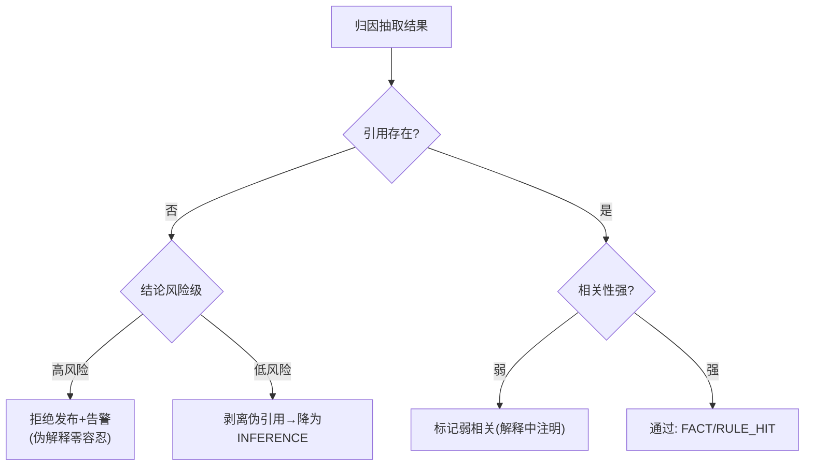

# 04-归因校验与防伪解释

> **定位**：本平台的**良心迭代**——校验归因真实性，**伪解释比无解释更危险**。核心：**① 引用存在性校验（引用的 EV-id 真实存在）② 内容相关性校验（证据内容真的支撑结论）③ 伪归因处置（拒答归因/降级/标记）**。呼应 [教程 56 §4](../../教程/56-Agent可解释与透明工程.md)、[19-幻觉检测](../../项目/19-企业级Agent信任与评测平台/03-离线评估流水线.md)。前置阅读：[03-证据归因引擎](03-证据归因引擎.md)。
>
> **铁律 0**：存在性校验确定性（自研）；相关性校验用实证 `EmbeddingModel` 相似度 + 可选 LLM 判别。

---

## 一、四问

| 问 | 答 |
|----|----|
| **新增了什么需求** | ①存在性校验（EV-id 在本次上下文证据集中）②相关性校验（证据↔结论相似度/蕴含判断）③伪归因处置（剥离归因→降为 INFERENCE / 拒绝发布 / 告警） |
| **影响了哪些模块** | AttributionEngine → 加校验管线；发布链 → 校验前置 |
| **架构如何演进** | 从"信任模型归因"演进为"归因必校验" |
| **上一版痛点** | 模型可声称"依据 EV-9"而 EV-9 不存在或内容无关——伪解释误导用户与监管 |

**本迭代验收**：①不存在引用 100% 检出 ②低相关归因检出并降级 ③高风险结论伪归因 → 拒绝发布 + 告警（对照 00 验收①：可校验率 ≥98%）。

### 一.1 本节核对（四问与本迭代验收）

| # | 核对项 | 判据 |
|---|--------|------|
| 1 | 四问口径齐全 | 新增需求（存在性/相关性校验/伪归因处置）/影响模块（AttributionEngine 加校验管线、发布链前置）/架构演进（信任→必校验）/上一版痛点四行均有 |
| 2 | 本迭代验收可度量 | ①不存在引用 100% 检出（可判确定性）②低相关检出降级 ③高风险伪归因拒绝发布+告警——可作 PASS 判据，落点对应 §二 `validate` 的两级与 §三 分级 |

## 二、两级校验管线

```java
// 概念代码：归因校验
public ValidatedAttribution validate(Conclusion c, Set<String> givenEvidenceIds) {
    // 一级：存在性（确定性，零成本）
    List<String> bogus = c.evidenceIds().stream()
        .filter(id -> !givenEvidenceIds.contains(id)).toList();
    if (!bogus.isEmpty()) return stripOrReject(c, bogus);        // 剥离伪引用→降INFERENCE

    // 二级：相关性（证据↔结论 相似度）
    for (String id : c.evidenceIds()) {
        double sim = cosine(embeddingModel.embed(c.text()),      // 实证 embed
                            embeddingModel.embed(evidence(id).content()));
        if (sim < RELEVANCE_MIN) markWeak(c, id);                // 弱相关标记
    }
    return ValidatedAttribution.of(c);
}
```

### 二.1 本节测试与验证（两级校验管线）

**前置条件**：§03 `Evidence` 集与归因产物可用；`embeddingModel.embed(...)`（实证 `EmbeddingModel`）已接入；`RELEVANCE_MIN` 相似度阈值已配；`stripOrReject`/`markWeak` 处置已实现。

**材料——代码内含的旋钮**：一级存在性 `givenEvidenceIds.contains(id)`（确定性、零成本）；二级相关性 `cosine(embed(text), embed(evidence.content))` 与 `RELEVANCE_MIN` 比较；处置 `stripOrReject`（剥离→降 INFERENCE）/`markWeak`（弱相关标记）。

**步骤与断言**：

| # | 操作 | 预期（PASS 判据） |
|---|------|------------------|
| 1 | 构造引用 `EV-99`（本次上下文证据集中不存在）的结论 | 存在性校验 100% 检出 `bogus` 非空 |
| 2 | 对检出伪引用执行处置 | 低风险 → 剥离 `EV-99` 后降为 `INFERENCE`；高风险 → 拒绝发布 + 告警 |
| 3 | 构造引用存在但内容无关的结论 | 相关性校验标 `markWeak`（弱相关），解释中注明 |
| 4 | 构造引用存在且内容相关的结论 | 通过，保持 `FACT`/`RULE_HIT`，无弱标记 |
| 5 | 扰动相似度阈值验证 | 下调 `RELEVANCE_MIN` 后更多弱相关被判弱；上调后弱标记减少——阈值生效 |

**失败排查**：①`EV-99` 未检出→`givenEvidenceIds` 未传入本次上下文证据集（集合来源错）；②强相关被误标弱→`RELEVANCE_MIN` 过高或 `embeddingModel` 维度/模型与环境不符；③伪归因不拒绝→高风险判定条件未覆盖该风险级；④存在性过严把真实引用也剥→`givenEvidenceIds` 与 `register` 登记的 id 命名不一致。

## 三、伪归因处置分级



**分级理由**：高风险（拒贷/医疗）伪归因=欺骗，必须拒；低风险（闲聊引用错）剥离降级即可，不必赶尽杀绝（成本平衡）。

### 三.1 本节核对（伪归因处置分级）

- [ ] 处置分级流程（引用存在判决 → 相关性判决 → 高风险拒/低风险剥离降级/弱相关标记）能对照 Mermaid 复述
- [ ] 分级理由能说清"高风险拒、低风险剥离"的成本权衡——不是一律赶尽杀绝

## 四、校验也是质量信号

伪归因率（按 Agent/按场景统计）汇入 09 的解释质量评估——**某 Agent 伪归因率高说明它在"表演解释"**，是比幻觉更隐蔽的质量问题（呼应 [19-在线哨兵](../../项目/19-企业级Agent信任与评测平台/04-在线哨兵与漂移告警.md)）。

### 四.1 本节核对（校验也是质量信号）

- [ ] 能说清"伪归因率"如何成为 09 解释质量评估的输入指标，且"高伪归因率 = 表演解释"是比幻觉更隐蔽的质量问题
- [ ] 校验产物（拒绝/剥离/弱标记计数）能作为统计口径汇入 09，与飞轮闭环衔接自洽

## 五、验收

| 测试 | 期望 |
|------|------|
| 引用 EV-99（不存在） | 检出，剥离/拒绝 |
| 引用存在但内容无关 | 弱相关标记 |
| 高风险伪归因 | 拒绝发布+告警 |
| 正常归因 | 通过为 FACT |

### 五.1 本节核对（验收表）

- [ ] 验收表四行（EV-99 不存在 / 存在但无关 / 高风险伪归因 / 正常归因）与 §二.1 步骤 1-2/3/2/4 一一对应，无验收项落空
- [ ] "存在但内容无关 → 标注弱相关（解释中注明）"有明确断言（§二.1 步骤 3），非空许愿

> **下一步**：归因可信了，但**结论多大把握**（置信度）还没量化。05 迭代做**分来源置信度与校准**。
