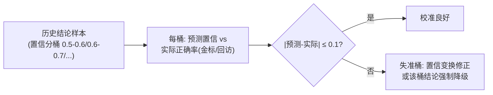

# 05-分来源置信度与校准

> **定位**：给结论一个**可信的置信度**——分来源标注 + 校准验证。核心：**① 分来源置信（规则确定/检索高相似高/低相似低/推测）② 校准验证（置信 0.8 的结论实际 80% 对吗）③ 校准误差治理**。呼应 [教程 56 §5](../../教程/56-Agent可解释与透明工程.md)、[06-置信度分级](../../项目/06-金融风控Agent系统/02-置信度与风险分级.md)。前置阅读：[04-归因校验与防伪解释](04-归因校验与防伪解释.md)。
>
> **铁律 0**：置信计算/校准自研「概念代码」；相似度用实证 `EmbeddingModel`。

---

## 一、四问

| 问 | 答 |
|----|----|
| **新增了什么需求** | ①分来源置信规则（RULE_HIT 确定 / FACT 按证据相似度 / INFERENCE 按采样一致性）②校准管线（分桶: 预测置信 vs 实际正确率）③校准误差超阈治理 |
| **影响了哪些模块** | Conclusion → 附置信；新增 CalibrationJob |
| **架构如何演进** | 从"单一数字置信"演进为"分来源+可校准验证" |
| **上一版痛点** | 模型口头置信 0.9 实际对错参半——未校准的置信是伪信任 |

**本迭代验收**：①置信分来源标注 ②校准误差分桶 ≤0.1（对照 00 验收③）③失准桶触发治理。

### 一.1 本节核对（四问与本迭代验收）

| # | 核对项 | 判据 |
|---|--------|------|
| 1 | 四问口径齐全 | 新增需求（分来源置信规则/校准管线/超阈治理）/影响模块（Conclusion 附置信 + CalibrationJob）/架构演进（单一数字→分来源+可校准）/上一版痛点四行均有 |
| 2 | 本迭代验收可度量 | ①分来源标注 ②分桶误差≤0.1 ③失准桶治理——可作 PASS 判据，落点对应 §二 `switch` 三类置信与 §三 分桶对比 |

## 二、分来源置信计算

```java
// 概念代码：分来源置信
public Confidence score(ValidatedAttribution a) {
    return switch (a.kind()) {
        case RULE_HIT   -> Confidence.certain("规则#" + a.ruleId() + " 命中");      // 确定
        case FACT       -> Confidence.of(evidenceSim(a), "依据 " + a.evidenceIds().size() + " 条证据");
        case INFERENCE  -> Confidence.of(sampleConsistency(a), "推测(采样一致性)");   // N次采样一致率
    };
}
```

### 二.1 本节测试与验证（分来源置信计算）

**前置条件**：§04 的 `ValidatedAttribution`（含 `kind` 与证据）可用；`evidenceSim`/`sampleConsistency` 已实现；`Confidence.certain/of` 构造可用。

**材料——代码内含的旋钮**：`RULE_HIT → Confidence.certain`（规则命中，确定）；`FACT → Confidence.of(evidenceSim(a))`（证据相似度）；`INFERENCE → Confidence.of(sampleConsistency(a))`（N 次采样一致率）。

**步骤与断言**：

| # | 操作 | 预期（PASS 判据） |
|---|------|------------------|
| 1 | 对 `RULE_HIT` 结论调 `score` | 返回 `certain` 确定标注（含规则号），非数字分 |
| 2 | 对 `FACT`（3 条高相似证据）调 `score` | 返回高置信 + 来源说明（"依据 3 条证据"） |
| 3 | 对 `INFERENCE` 调 `score` | 返回采样一致性置信 + 显式"推测"标注 |
| 4 | 构造失准桶（自报 0.9 实际 0.6） | 校准体检 |预测-实际| > 0.1，触发治理（§三 失准桶降级/变换） |
| 5 | 校准体检分桶 | 分桶误差 ≤0.1（对照 §四 第 4 行） |

**失败排查**：①规则结论给了数字分而非 `certain`→`switch` 未走 `RULE_HIT` 分支；②FACT 相似度与直觉不符→`evidenceSim` 的相似度计算或阈值有误；③失准桶不治理→`|预测-实际| ≤0.1` 判断条件或治理钩子未挂；④采样一致性结果波动大→`sampleConsistency` 采样次数不足。

## 三、校准（置信可信度的体检）



**要点**：置信必须用**实际结果回验**——"说 0.8 就该八成对"。失准桶（如自报 0.9 实际 0.6）要么用变换修正，要么**该桶结论强制降级处理**（呼应 [19-AB统计](../../附录/12-评估与可观测生态/03-在线实验与AB统计.md) 的统计纪律）。

### 三.1 本节核对（校准——置信可信度的体检）

- [ ] 校准流程（历史结论分桶 → 每桶比对预测置信 vs 实际正确率 → 超 0.1 进出治理）能对照 Mermaid 复述
- [ ] "置信必须用实际结果回验"一句能说清"说 0.8 就该八成对"的验证含义，并给出失准桶的两种治理（变换修正 / 强制降级）

## 四、验收

| 测试 | 期望 |
|------|------|
| 规则命中 | certain 确定标注 |
| 3 证据高相似 | 高置信+来源说明 |
| 推测 | 采样一致性置信+显式标注 |
| 校准体检 | 分桶误差 ≤0.1 |

### 四.1 本节核对（验收表）

- [ ] 验收表四行（规则命中 / 3 证据高相似 / 推测 / 校准体检）与 §二.1 步骤 1-2/2/3/5 一一对应，无验收项落空
- [ ] "校准体检分桶误差 ≤0.1"有明确计测断言（§二.1 步骤 5），非口头承诺

> **下一步**：时间线、归因、置信都有了，但**外部还消费不到**。06 迭代做**解释 API**——把解释能力开放为服务。
