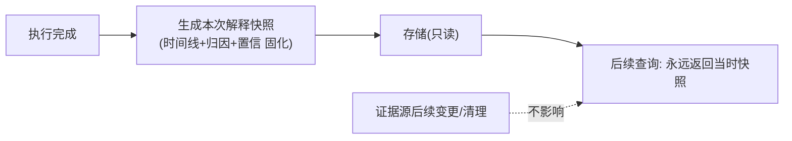

# 06-解释 API 与查询服务

> **定位**：把解释能力**开放为服务**——**① 统一解释 API（时间线/归因/置信/反事实四查询）② 权限控制（谁能看哪级解释）③ 解释快照（历史结论的解释不随存储变化）**。前置阅读：[05-分来源置信度与校准](05-分来源置信度与校准.md)、[23-审计](../../教程/04-企业级架构主干/03-工具执行可观测与审计.md)。
>
> **铁律 0**：API 层自研「概念代码」（WebFlux 响应式）；数据来自 02-05 迭代产物。

---

## 一、四问

| 问 | 答 |
|----|----|
| **新增了什么需求** | ①四个解释端点（timeline/attributions/confidence/counterfactual）②按受众+权限路由（复用 02 三级视图）③解释快照（生成时固化，不随后续存储变更漂移） |
| **影响了哪些模块** | 新增 ExplainApiController；解释产物 → 快照存储 |
| **架构如何演进** | 从"平台内部能力"演进为"可被业务/客服/监管系统调用的服务" |
| **上一版痛点** | 解释能力只有平台内部能看；客服/合规系统无法集成 |

**本迭代验收**：①四端点可用（含受众路由）②无权限受众拿不到取证级 ③历史解释查询结果稳定（快照）。

### 一.1 本节核对（四问与本迭代验收）

| # | 核对项 | 判据 |
|---|--------|------|
| 1 | 四问口径齐全 | 新增需求（四端点/受众权限路由/快照）/影响模块（ExplainApiController + 快照存储）/架构演进（平台内部能力→对外服务）/上一版痛点四行均有 |
| 2 | 本迭代验收可度量 | ①四端点可用 ②取证级限权 ③快照稳定——可作 PASS 判据，落点对应 §二 端点到 §三 快照 |

## 二、四端点设计

```java
// Spring AI 2.0.0 / Java 21 —— 概念代码：解释 API（WebFlux，组装期零阻塞）
@RestController
public class ExplainApiController {
    private final Explainer explainer;                    // 02 分层时间线 render(runId, aud)
    private final AttributionEngine attributionEngine;    // 03 归因产物 + 04 两级校验 validate
    private final ConfidenceScorer confidenceScorer;      // 05 分来源置信 score(a)
    private final CounterfactualEngine cfEngine;          // 07 反事实 ruleCf(d, ctx)
    private final DisclosureService disclosure;           // 08 披露审批记录（取证级入口）

    @GetMapping("/explain/{runId}/timeline")
    Flux<ExplainStep> timeline(@PathVariable String runId,
                               @RequestParam Audience aud) {
        return requireAccess(runId, aud)                              // 权限门先于任何数据读出
            .thenMany(Flux.fromIterable(explainer.render(runId, aud).steps())); // 02: 折叠/概要/取证分层
    }

    @GetMapping("/explain/{runId}/attributions")
    Flux<ValidatedAttribution> attributions(@PathVariable String runId) {
        return requireAccess(runId, Audience.OPERATOR)
            .thenMany(Flux.fromIterable(attributionEngine.attributionsOf(runId))   // 03: 该 run 的归因产物
                .map(c -> attributionEngine.validate(c,                            // 04: 存在性+相关性两级校验
                        attributionEngine.givenEvidenceIds(runId))));
    }

    @GetMapping("/explain/{runId}/confidence")
    Flux<ConfidenceView> confidence(@PathVariable String runId) {
        return requireAccess(runId, Audience.OPERATOR)
            .thenMany(attributions(runId)                               // 复用已校验归因(04)
                .map(a -> ConfidenceView.of(a, confidenceScorer.score(a)))); // 05: RULE_HIT 确定/FACT 证据相似/INFERENCE 采样一致
    }

    @GetMapping("/explain/{runId}/counterfactual")
    Mono<CounterfactualView> counterfactual(@PathVariable String runId) {
        return requireAccess(runId, Audience.OPERATOR)
            .then(Mono.justOrEmpty(attributionEngine.decisionOf(runId)) // 03 产物中的规则决策记录
                .map(d -> cfEngine.ruleCf(d, d.context()))              // 07: 距阈值差(确定性,可承诺)
                .map(CounterfactualView::of)
                .switchIfEmpty(Mono.error(new ResponseStatusException(  // 07: 不可计算 → 诚实声明而非硬造
                    HttpStatus.NOT_FOUND, "该 run 无规则决策，反事实不可计算"))));
    }

    // §四 权限路由：取证级不裸开放，监管调取须走 08 披露审批，否则 403
    private Mono<Void> requireAccess(String runId, Audience aud) {
        return (aud == Audience.REGULATOR && !disclosure.approved(runId))
            ? Mono.error(new ResponseStatusException(HttpStatus.FORBIDDEN, "取证级须走披露审批(08)"))
            : Mono.empty();
    }
}
```

### 二.1 本节测试与验证（四端点设计）

**前置条件**：02-05 迭代产物（时间线/归因/校验/置信）可用；`Audience` 权限路由已实现；WebFlux 应用（WebFlux 铁律：Reactor 响应式，EventLoop 上不 block）。

**材料——代码内含的旋钮**：四端点 `/explain/{runId}/timeline|attributions|confidence|counterfactual`；参数 `@RequestParam Audience aud`；返回 `Flux`/`Mono`（响应式）。

**核对命令**（四端点与权限门自查）：

```bash
curl -s "http://localhost:8081/explain/run-20260830-001/timeline?aud=USER"
# 预期输出（节选）：
#   [{"kind":"evidence","title":"检索: 退货政策","digest":"命中 3 篇文档"}, ...]

curl -s -o /dev/null -w "%{http_code}\n" "http://localhost:8081/explain/run-20260830-001/timeline?aud=REGULATOR"
# 预期输出：
#   403        （取证级须走披露审批(08)，未审批一律 403）

curl -s http://localhost:8081/explain/run-20260830-001/confidence
# 预期输出（节选）：
#   [{"text":"订单已退","kind":"FACT","confidence":0.87}, ...]
```

**步骤与断言**：

| # | 操作 | 预期（PASS 判据） |
|---|------|------------------|
| 1 | `GET /explain/{runId}/timeline?aud=USER` | 返回 `Flux<ExplainStep>` 分层时间线（概要级） |
| 2 | `GET /explain/{runId}/attributions` | 返回 `Flux<ValidatedAttribution>`（已校验归因） |
| 3 | `GET /explain/{runId}/confidence` | 返回 `Flux<ConfidenceView>`（分来源置信） |
| 4 | `GET /explain/{runId}/counterfactual` | 返回 `Mono<CounterfactualView>`（反事实，07） |
| 5 | 用户身份请求取证级（`aud=REGULATOR`） | 返回 403（无权限受众拿不到取证级） |
| 6 | 压力/并发抽查 | 响应式组件返回不阻塞 EventLoop（`Flux`/`Mono` 惰性执行，无 block） |

**失败排查**：①端点 404→路由或 `@RestController` 未生效；②无权限者拿到取证级→受众权限校验未在 controller 前执行或 `aud` 未走权限网关；③响应阻塞卡顿→在某处对响应式结果 `.block()` 或在 EventLoop 上做阻塞调用（违反 WebFlux 铁律）；④端点返回空→底层 `runId` 对应产物（时间线/归因/置信）未生成。

## 三、解释快照（合规关键）



**为什么快照**：证据/文档会更新、记忆会衰减（25-06）——但**对历史决策的解释必须还原"当时依据"**（监管追溯的是决策时点的证据状态，呼应 [25-历史合规](../../教程/04-企业级架构主干/05-历史记录持久化与合规.md)、[13-事件溯源](../../项目/13-事件溯源Agent运行时平台/00-需求分析与架构设计.md) 的"日志即真相"思想）。

### 三.1 本节核对（解释快照——合规关键）

- [ ] 快照流程（执行完成 → 生成本次快照固化 → 只读存储 → 后续查询返回当时快照）能对照 Mermaid 复述
- [ ] 能说清"为什么快照"——证据源/记忆会更新衰减，但对历史决策的解释必须还原决策时点依据

## 四、权限路由

复用 02 受众分级 + [26-多租户](../../教程/04-企业级架构主干/06-多租户隔离与资源治理.md) 权限：用户只看自己会话概要；运营看本租户标准级；监管调取走 08 披露审批（取证级不裸开放）。

### 四.1 本节核对（权限路由）

- [ ] 四类权限（用户看本会话概要 / 运营看租户标准级 / 监管走 08 披露审批 / 取证级不裸开放）能对照正文复述，并能说清"取证级不裸开放"的含义
- [ ] 权限路由与 02 受众分级、26 多租户基准衔接一致，无"权限与受众分级脱节"

## 五、验收

| 测试 | 期望 |
|------|------|
| 四端点 | 返回对应解释产物 |
| 用户身份查取证级 | 403 |
| 证据源更新后查旧解释 | 返回快照不变 |

### 五.1 本节核对（验收表）

- [ ] 验收表三行（四端点 / 用户查取证级 403 / 证据源更新后快照不变）与 §二.1 步骤 1-4/5 及 §三 快照一一对应，无验收项落空
- [ ] "证据源更新后查旧解释返回快照不变"有明确断言（§三 快照只读固化），非空许愿

## 六、全篇回归验证

> 各节断言已上移至 §二.1（四端点设计）；快照与权限在 §三.1/§四.1 核对；本表为整篇迭代的回归验收，不重复材料。

| # | 验收项（断言） | 标准 | 复验方式 |
|---|---------------|------|---------|
| 1 | 四端点可用 | timeline/attributions/confidence/counterfactual 各返回对应产物 | 复验：执行 §二.1 核对命令 |
| 2 | 取证级限权 | 无审批的 `aud=REGULATOR` 请求返回 403 | 复验：执行 §二.1 核对命令（403 一条） |
| 3 | 响应式零阻塞 | 无 `.block()`，EventLoop 不被阻塞 | §二.1 步骤6 |
| 4 | 快照稳定 | 证据源变更后历史解释仍返回当时快照 | §三（只读固化）/§三.1 |

**回归失败排查**：按 §二.1 失败排查逐条回溯（路由未生效/权限校验位置错/block 违反 WebFlux 铁律/产物未生成）。

## 七、验收对照

> 00-需求分析量化验收④（监管数据包导出完整率 100%）的"取证级入口"在本迭代就位（未审批 403，导出闭环在 08）。

| 验收项 | 标准 | 状态 |
|--------|------|------|
| 四端点可用 | 含受众路由的四个解释查询 | ✅（§二.1 步骤1-4） |
| 取证级不裸开放 | 无权限受众拿不到取证级（403） | ✅（§二.1 步骤5/§四） |
| 历史解释稳定 | 快照只读固化不随存储漂移 | ✅（§三/§三.1） |

> **下一步**：解释可被消费了。07 迭代做**反事实边界**——回答"差多少会翻转"这一最难也最有价值的解释。
