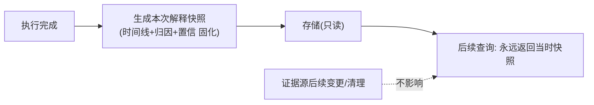

# 06-解释 API 与查询服务

> **定位**：把解释能力**开放为服务**——**① 统一解释 API（时间线/归因/置信/反事实四查询）② 权限控制（谁能看哪级解释）③ 解释快照（历史结论的解释不随存储变化）**。前置阅读：[05-分来源置信度与校准](05-分来源置信度与校准.md)、[23-审计](../../教程/23-工具执行可观测与审计.md)。
>
> **铁律 0**：API 层自研「概念代码」（WebFlux 响应式）；数据来自 02-05 迭代产物。

---

## 一、四问

| 问 | 答 |
|----|----|
| **新增了什么需求** | ①四个解释端点（timeline/attributions/confidence/counterfactual）②按受众+权限路由（复用 02 三级视图）③解释快照（生成时固化，不随后续存储变更漂移） |
| **影响了哪些模块** | 新增 ExplainApiController；解释产物 → 快照存储 |
| **架构如何演进** | 从"平台内部能力"演进为"可被业务/客服/监管系统调用的服务" |
| **上一版痛点** | 解释能力只有平台内部能看；客服/合规系统无法集成 |

**本迭代验收**：①四端点可用（含受众路由）②无权限受众拿不到取证级 ③历史解释查询结果稳定（快照）。

## 二、四端点设计

```java
// 概念代码：解释 API（WebFlux）
@RestController
public class ExplainApiController {
    @GetMapping("/explain/{runId}/timeline")
    Flux<ExplainStep> timeline(@PathVariable String runId,
                               @RequestParam Audience aud) { ... }      // 02 分层时间线

    @GetMapping("/explain/{runId}/attributions")
    Flux<ValidatedAttribution> attributions(@PathVariable String runId) { ... } // 03/04 归因+校验

    @GetMapping("/explain/{runId}/confidence")
    Flux<ConfidenceView> confidence(@PathVariable String runId) { ... }   // 05 置信

    @GetMapping("/explain/{runId}/counterfactual")
    Mono<CounterfactualView> counterfactual(@PathVariable String runId) { ... } // 07 反事实
}
```

## 三、解释快照（合规关键）



**为什么快照**：证据/文档会更新、记忆会衰减（25-06）——但**对历史决策的解释必须还原"当时依据"**（监管追溯的是决策时点的证据状态，呼应 [25-历史合规](../../教程/25-历史记录持久化与合规.md)、[13-事件溯源](../../项目/13-事件溯源Agent运行时平台/00-需求分析与架构设计.md) 的"日志即真相"思想）。

## 四、权限路由

复用 02 受众分级 + [26-多租户](../../教程/26-多租户隔离与资源治理.md) 权限：用户只看自己会话概要；运营看本租户标准级；监管调取走 08 披露审批（取证级不裸开放）。

## 五、验收

| 测试 | 期望 |
|------|------|
| 四端点 | 返回对应解释产物 |
| 用户身份查取证级 | 403 |
| 证据源更新后查旧解释 | 返回快照不变 |

> **下一步**：解释可被消费了。07 迭代做**反事实边界**——回答"差多少会翻转"这一最难也最有价值的解释。
