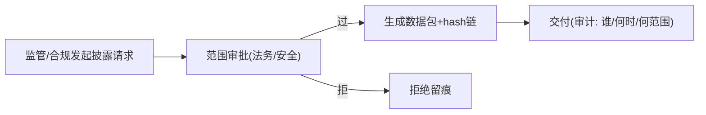

# 08-监管披露数据包

> **定位**：把解释能力组装成**合规交付物**——监管来查时"按标准格式一键导出"。核心：**① 披露数据包结构（决策记录+证据+归因+置信+时间线+审批留痕）② 导出审批流程（披露本身也要审批）③ 标准化格式（对应 EU AI Act 式义务）**。呼应 [43-治理](../../教程/43-Agent治理与合规框架.md)、[19-监管直连披露](../../项目/19-企业级Agent信任与评测平台/10-跨组织信任互认与监管披露.md)。前置阅读：[07-反事实边界解释](07-反事实边界解释.md)。
>
> **铁律 0**：数据包结构/导出自研「概念代码」；内容来自 02-07 产物 + hash 链防篡改（承 [20-hash链审计](../../项目/20-企业级Agent经济与结算平台/06-审计与反欺诈.md)）。

---

## 一、四问

| 问 | 答 |
|----|----|
| **新增了什么需求** | ①数据包结构（机器可读 JSON + 人可读摘要双格式）②导出审批（谁申请/谁批/范围）③防篡改（hash 链）④留存策略 |
| **影响了哪些模块** | 新增 DisclosurePackager；解释快照 → 披露复用 |
| **架构如何演进** | 从"解释查询"演进为"标准化合规交付" |
| **上一版痛点** | 监管来查临时拼材料；格式不标准；无导出审批留痕 |

**本迭代验收**：①一键导出完整数据包（六要素齐）②导出走审批+留痕 ③hash 链防篡改 ④完整率 100%（对照 00 验收④）。

## 二、数据包六要素

```java
// 概念代码：披露数据包
public record DisclosurePack(
        DecisionRecord decision,            // ①决策: 时间/对象/结论/风险级
        List<Evidence> evidences,           // ②证据: 检索片段/工具输出(快照)
        List<ValidatedAttribution> attribs, // ③归因(已校验): 结论←证据
        List<ConfidenceView> confidences,   // ④置信(分来源+校准状态)
        ExplanationTimeline timeline,       // ⑤时间线(取证级)
        ApprovalTrail approvals,            // ⑥HITL审批/披露审批留痕
        String hashChainRoot) {}            // 防篡改锚
```

## 三、导出审批（披露也是敏感操作）



**纪律**：披露**不是想导就导**——涉及用户证据的数据外发要走范围审批（呼应 [25-合规留存](../../教程/25-历史记录持久化与合规.md)、[27-审计回放](../../项目/23-企业级Agent意图路由网关/09-审计回放与合规.md)），且披露本身全程留痕。

## 四、验收

| 测试 | 期望 |
|------|------|
| 一键导出 | 六要素完整 |
| 篡改任一记录 | hash 校验失败 |
| 无审批导出 | 拒绝 |
| 披露留痕 | 谁/何时/范围可查 |

> **下一步**：能交付了，但**解释质量本身好坏**（伪归因率/校准误差/用户满意度）还没有飞轮度量。09 进阶做**解释质量评估**。
