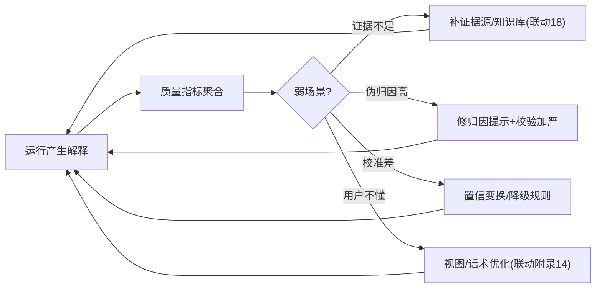

# 09-解释质量评估与飞轮

> **定位**：让**解释本身**成为被评估、被改进的对象。核心：**① 解释质量指标（伪归因率/校准误差/覆盖率/用户有用性）② 差解释归因（哪类场景解释弱）③ 改进闭环（证据质量/归因提示/置信规则）**。呼应 [41-数据飞轮](../../教程/41-数据飞轮与持续改进.md)、[19-评估平台](../../项目/19-企业级Agent信任与评测平台/00-需求分析与架构设计.md)。前置阅读：[08-监管披露数据包](08-监管披露数据包.md)。
>
> **铁律 0**：指标/飞轮自研「概念代码」；数据来自 04-06 产物 + 用户反馈。

---

## 一、四问

| 问 | 答 |
|----|----|
| **新增了什么需求** | ①四指标（伪归因率/校准误差/结论归因覆盖率/解释有用性评分）②按场景聚合找弱区 ③改进回流（补证据源/改归因提示/调置信规则） |
| **影响了哪些模块** | 新增 ExplainQualityJob；评估结果 → 证据源与提示治理 |
| **架构如何演进** | 从"解释可用"演进为"解释越用越好" |
| **上一版痛点** | 解释好坏无度量；伪归因多的场景没人发现 |

**本迭代验收**：①四指标可度量按场景聚合 ②弱场景定位（如"某知识域归因覆盖率低"）③改进动作回流生效。

## 二、四指标

| 指标 | 定义 | 治理动作 |
|------|------|---------|
| 伪归因率 | 校验剥除的引用 / 总引用 | 归因提示修复 / 证据组织优化 |
| 校准误差 | 分桶置信 vs 实际差 | 置信变换 / 失准桶降级 |
| 归因覆盖率 | 有归因结论 / 关键结论总数 | 证据源补充 / 拆分结论提示 |
| 解释有用性 | 用户/客服对解释的评分 | 视图优化 / 摘要策略调整 |

## 三、飞轮闭环

**要点**：解释差的**根因常在上游**——归因覆盖率低多是知识库缺内容（证据源问题），不是归因算法问题。飞轮要把指标**归因到正确的层**再改进。

## 四、验收

| 测试 | 期望 |
|------|------|
| 指标看板 | 四指标按场景可见 |
| 弱场景 | 定位到证据/提示/置信/视图哪层 |
| 改进回流 | 补证据后覆盖率升 |
| 用户评分 | 采集进有用性指标 |

> **下一步**：解释质量可度量可改进了。10 进阶做**低置信 HITL 联动**——让置信度真正触发行为，闭环可解释与人工兜底。
