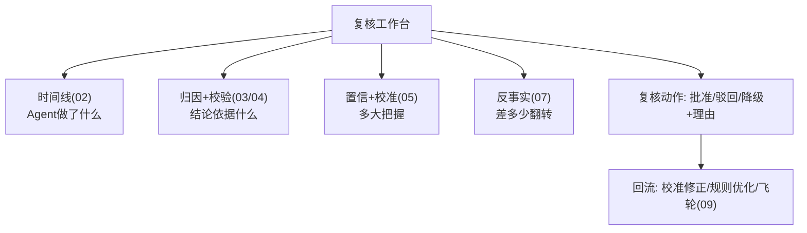

# 10-低置信 HITL 联动

> **定位**：让置信度**触发行为**而非停留在数字——**① 置信×风险 路由矩阵（自动放行/复核/拦截）② 复核工作台（解释即审核材料）③ 复核结果回流（校准+规则改进）**。呼应 [28-HITL](../../教程/04-企业级架构主干/08-Human-in-the-Loop与审批流.md)、[06-置信度分级](../../项目/06-金融风控Agent系统/02-置信度与风险分级.md)、[24-预算HITL](../../项目/24-企业级长任务工作流引擎/10-预算可视化与HITL暂停恢复.md)。前置阅读：[09-解释质量评估与飞轮](09-解释质量评估与飞轮.md)。
>
> **铁律 0**：路由矩阵/工作台自研「概念代码」；HITL 落点承资料库基准（ToolCallingManager/ToolCallback 层）。

---

## 一、四问

| 问 | 答 |
|----|----|
| **新增了什么需求** | ①置信×风险二维路由（高置信低风险自动/低置信或高风险复核/低置信高风险拦截）②复核工作台（把时间线+归因+置信+反事实作为审核材料）③复核结果回流（校准修正+规则优化） |
| **影响了哪些模块** | 置信产物 → 路由矩阵；新增 复核工作台；复核结果 → 05 校准/09 飞轮 |
| **架构如何演进** | 可解释平台从"事后解释"演进为"事前拦截+人机协同决策" |
| **上一版痛点** | 置信度只是展示数字；复核员审核时缺结构化材料 |

**本迭代验收**：①低置信 100% 触发复核/拦截（对照 00 验收⑤）②复核员看到完整解释材料 ③复核结果回流改进校准。

### 一.1 本节核对（四问与本迭代验收）

| # | 核对项 | 判据 |
|---|--------|------|
| 1 | 四问口径齐全 | 新增需求（置信×风险路由/复核工作台/结果回流）/影响模块（置信产物→路由 + 复核工作台 + 结果回流 05/09）/架构演进（事后解释→事前拦截+人机决策）/上一版痛点四行均有 |
| 2 | 本迭代验收可度量 | ①低置信 100% 触发复核/拦截 ②复核员见完整材料 ③结果回流——可作 PASS 判据，落点对应 §二 `route` 分支与 §三 工作台 |

## 二、置信 × 风险路由矩阵

```java
// 概念代码：二维路由
public Action route(Confidence c, RiskLevel risk) {
    boolean highConf = c.score() >= CONF_HI;
    if (risk == HIGH  && !highConf) return Action.BLOCK_REVIEW;   // 低置信高风险: 拦截待审
    if (risk == HIGH)               return Action.HUMAN_CONFIRM;  // 高风险一律复核(呼应06铁律)
    if (highConf)                   return Action.AUTO;           // 高置信低风险: 自动
    return Action.FLAG;                                            // 低置信低风险: 标记放行
}
```

### 二.1 本节测试与验证（置信 × 风险路由矩阵）

**前置条件**：§05 的 `Confidence`（含 `score()`）与风险级 `RiskLevel` 可用；`CONF_HI` 高置信阈值与四类 Action 常量已配；HITL 落点在资料库基准（ToolCallingManager/ToolCallback 层）。

**材料——代码内含的旋钮**：`route(Confidence, RiskLevel)` 四分支——低置信高风险 `BLOCK_REVIEW`；高风险 `HUMAN_CONFIRM`；高置信低风险 `AUTO`；低置信低风险 `FLAG`。阈值 `CONF_HI`。

**步骤与断言**：

| # | 操作 | 预期（PASS 判据） |
|---|------|------------------|
| 1 | `route(置信0.3, HIGH)` | `BLOCK_REVIEW`（低置信高风险 → 拦截待审） |
| 2 | `route(置信0.9, HIGH)` | `HUMAN_CONFIRM`（高风险高置信 → 仍人工确认） |
| 3 | `route(置信0.9, LOW)` | `AUTO`（高置信低风险 → 自动放行） |
| 4 | `route(置信0.3, LOW)` | `FLAG`（低置信低风险 → 标记放行） |
| 5 | 批量/边界抽查 | 阈值边界（恰等于 `CONF_HI`）语义与分支注释一致；低置信 100% 不落 `AUTO` |
| 6 | 复核结果回流 | 复核员批准/驳回/降级 + 理由后，回流 05 校准修正 / 规则优化 / 09 飞轮 |

**失败排查**：①低置信却被 `AUTO`→`highConf` 判断反了或 `CONF_HI` 过低；②高风险高置信仍想自动→遗漏 `HUMAN_CONFIRM` 分支（合规红线，呼应 06 铁律）；③阈值边界表现异常→`>=` 与 `>` 边界条件与分支注释不一致；④复核结果未回流→回流钩子未挂到 05/09 数据源。

## 三、复核工作台（解释即审核材料）



**价值**：复核员不是看裸结论拍板，而是**基于解释材料裁决**——可解释平台让 HITL 从"信任人肉"升级为"有据复核"；复核结论本身又是最好的标注数据（回流校准，呼应 [19-金标挖掘](../../项目/19-企业级Agent信任与评测平台/07-飞轮与AB实验.md)）。

### 三.1 本节核对（复核工作台——解释即审核材料）

- [ ] 复核工作台四类材料（时间线 02 / 归因+校验 03-04 / 置信+校准 05 / 反事实 07）+ 复核动作回流能对照 Mermaid 复述
- [ ] 价值一句能说清"HITL 从信任人肉升级为有据复核"，且复核结论回流校准（成为标注数据）的闭环自洽

## 四、验收

| 测试 | 期望 |
|------|------|
| 低置信高风险 | 拦截待审 |
| 高风险高置信 | 仍人工确认 |
| 复核工作台 | 四类解释材料齐全 |
| 复核结果 | 回流校准/规则 |

### 四.1 本节核对（验收表）

- [ ] 验收表四行（低置信高风险 / 高置信高风险 / 复核工作台 / 复核结果）与 §二.1 步骤 1/2/5（工作台材料）、6（回流）一一对应，无验收项落空
- [ ] "低置信高风险 → 拦截待审"与"高风险高置信 → 仍人工确认"均有明确断言（§二.1 步骤 1/2），覆盖两类关键约束

> **下一步**：10 个迭代/进阶让可解释平台完整：时间线/归因/校验/置信/API/反事实/披露/质量飞轮/HITL 联动。下一步进 **11-核心代码讲解** 串讲；随后 12-ADR、13-前沿收官。
