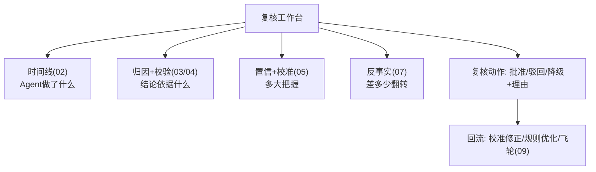

# 10-低置信 HITL 联动

> **定位**：让置信度**触发行为**而非停留在数字——**① 置信×风险 路由矩阵（自动放行/复核/拦截）② 复核工作台（解释即审核材料）③ 复核结果回流（校准+规则改进）**。呼应 [28-HITL](../../教程/28-Human-in-the-Loop与审批流.md)、[06-置信度分级](../../项目/06-金融风控Agent系统/02-置信度与风险分级.md)、[24-预算HITL](../../项目/24-企业级长任务工作流引擎/10-预算可视化与HITL暂停恢复.md)。前置阅读：[09-解释质量评估与飞轮](09-解释质量评估与飞轮.md)。
>
> **铁律 0**：路由矩阵/工作台自研「概念代码」；HITL 落点承资料库基准（ToolCallingManager/ToolCallback 层）。

---

## 一、四问

| 问 | 答 |
|----|----|
| **新增了什么需求** | ①置信×风险二维路由（高置信低风险自动/低置信或高风险复核/低置信高风险拦截）②复核工作台（把时间线+归因+置信+反事实作为审核材料）③复核结果回流（校准修正+规则优化） |
| **影响了哪些模块** | 置信产物 → 路由矩阵；新增 复核工作台；复核结果 → 05 校准/09 飞轮 |
| **架构如何演进** | 可解释平台从"事后解释"演进为"事前拦截+人机协同决策" |
| **上一版痛点** | 置信度只是展示数字；复核员审核时缺结构化材料 |

**本迭代验收**：①低置信 100% 触发复核/拦截（对照 00 验收⑤）②复核员看到完整解释材料 ③复核结果回流改进校准。

## 二、置信 × 风险路由矩阵

```java
// 概念代码：二维路由
public Action route(Confidence c, RiskLevel risk) {
    boolean highConf = c.score() >= CONF_HI;
    if (risk == HIGH  && !highConf) return Action.BLOCK_REVIEW;   // 低置信高风险: 拦截待审
    if (risk == HIGH)               return Action.HUMAN_CONFIRM;  // 高风险一律复核(呼应06铁律)
    if (highConf)                   return Action.AUTO;           // 高置信低风险: 自动
    return Action.FLAG;                                            // 低置信低风险: 标记放行
}
```

## 三、复核工作台（解释即审核材料）



**价值**：复核员不是看裸结论拍板，而是**基于解释材料裁决**——可解释平台让 HITL 从"信任人肉"升级为"有据复核"；复核结论本身又是最好的标注数据（回流校准，呼应 [19-金标挖掘](../../项目/19-企业级Agent信任与评测平台/07-飞轮与AB实验.md)）。

## 四、验收

| 测试 | 期望 |
|------|------|
| 低置信高风险 | 拦截待审 |
| 高风险高置信 | 仍人工确认 |
| 复核工作台 | 四类解释材料齐全 |
| 复核结果 | 回流校准/规则 |

> **下一步**：10 个迭代/进阶让可解释平台完整：时间线/归因/校验/置信/API/反事实/披露/质量飞轮/HITL 联动。下一步进 **11-核心代码讲解** 串讲；随后 12-ADR、13-前沿收官。
