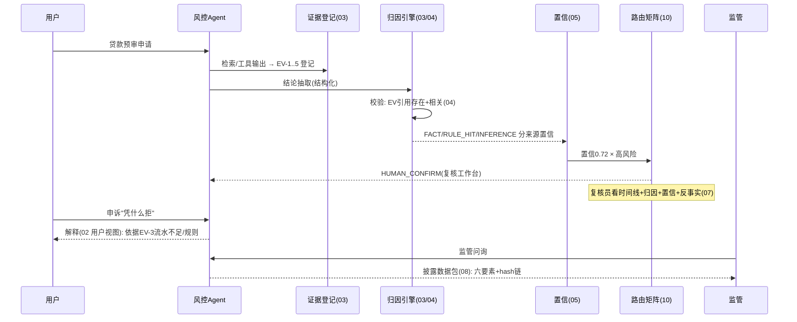

# 11-核心代码讲解

> **定位**：把项目 30 的核心实现串成主线——以**一次「贷款预审被拒 → 用户申诉 → 监管问询」**贯穿各迭代关键代码的协作。前置阅读：[01-最小Demo](01-最小Demo.md) 至 [10-低置信HITL联动](10-低置信HITL联动.md) 全部。
>
> **铁律 0**：Observation/`entity()`/`EmbeddingModel` 实证基座；投影/归因/校验/置信为「概念代码」。

---

## 一、一次拒贷决策的解释全旅程



## 二、解释流水线（串联各迭代）

```java
// 概念代码：执行后解释组装
public Mono<ExplainSnapshot> snapshot(String runId) {
    return Mono.fromCallable(() -> {
        var timeline   = renderer.render(runId, OPERATOR);        // 02 时间线(分层)
        var evidences  = evidenceStore.ofRun(runId);              // 03 证据集
        var attribs    = attributions(runId).stream()             // 03 归因
            .map(validator::validate).toList();                   // 04 校验
        var confs      = attribs.stream().map(scorer::score).toList(); // 05 置信
        var snapshot   = ExplainSnapshot.of(runId, timeline, evidences, attribs, confs);
        snapshotStore.freeze(snapshot);                           // 06 快照固化
        router.apply(confs, riskOf(runId));                       // 10 置信×风险路由
        return snapshot;
    }).subscribeOn(Schedulers.boundedElastic());
}
```

## 三、分层职责（读代码抓手）

| 类 | 迭代 | 职责 |
|----|------|------|
| `Explainer`/`Renderer` | 01/02 | 时间线投影+分层视图 |
| `AttributionEngine` | 03 | 证据登记+结论归因抽取 |
| `AttributionValidator` | 04 | 存在性+相关性校验（防伪） |
| `ConfidenceScorer`/`CalibrationJob` | 05 | 分来源置信+校准 |
| `ExplainApiController`/`SnapshotStore` | 06 | API+快照 |
| `CounterfactualEngine` | 07 | 规则精确/模型近似反事实 |
| `DisclosurePackager` | 08 | 监管数据包+hash链 |
| `ExplainQualityJob` | 09 | 四指标+飞轮 |
| `ConfidenceRiskRouter`/`ReviewDesk` | 10 | HITL 联动 |

## 四、最容易踩的三个坑

1. **直接给 Trace 当解释** → 没人看得懂。**解法**：投影+分层（02）。
2. **信任模型归因** → 伪解释。**解法**：存在性+相关性两级校验（04）。
3. **未校准的置信** → 伪信任。**解法**：实际结果回验+失准桶降级（05）。

## 五、验收自测（对照 00 量化指标）

| 指标 | 目标 | 实现 |
|------|------|------|
| 归因可校验率 | ≥98% | 04 |
| 时间线 P95 | ≤3s | 01/02 |
| 校准误差 | ≤0.1 | 05 |
| 披露完整率 | 100% | 08 |
| 低置信触发 | 100% | 10 |

> **下一步**：代码串讲完成。12-ADR 记录本项目 8 条关键决策；13-前沿做 XAI 业界对照与演进。
