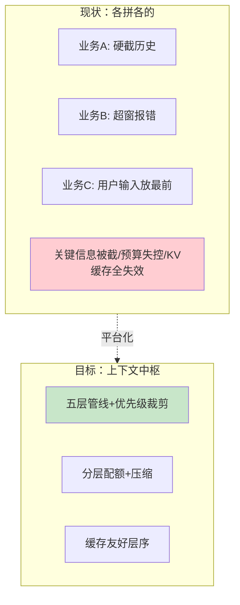
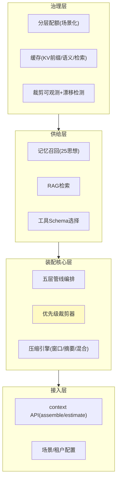

# 00-需求分析与架构设计：企业级 Agent 上下文管理平台

> **定位**：第十七旗舰·**上下文中枢视角**——第一性原理：**一个管线、一份预算、一套优先级**。各业务 Agent 各自拼 Prompt、各自截断、缓存全失效——本平台把上下文做成**统一服务**：五层拼接管线（系统提示→工具Schema→记忆→RAG→用户输入）、优先级裁剪（系统提示/用户输入永不裁）、分层 Token 配额、缓存友好层序（稳定前置最大化 KV Cache）、压缩三路径、裁剪可观测。读者画像：要回答"企业多 Agent 怎么统一管上下文、省钱提速"的架构师。前置阅读：[教程 57-上下文工程生产化]、[教程 34-上下文工程]、[教程 27-成本治理与Token计量]。
>
> **铁律 0**：装配管线/裁剪/配额自研「概念代码」；记忆层对接实证 ChatMemory 思想（25 项目独立）、Token 估算用模型 tokenizer。

---

## ★ 阅读顺序总览（序号 = 阅读顺序）

> 本子文件夹 14 个文件（00-13）：

| 阶段 | 文件 | 读者定位 |
|------|------|---------|
| ① 全貌 | 00-需求分析与架构设计 | **先读**：上下文中枢四层架构 |
| ② 起步 | 01-最小Demo | **动手**：五层管线最小装配 |
| ③ 主体迭代 | 02~07（装配管线/压缩三路径/配额/缓存/裁剪观测/场景化配额） | **严格顺序** |
| ④ 进阶 | 08~10（多租户隔离/上下文漂移检测/端侧边缘） | **严格顺序** |
| ⑤ 讲解 | 11-核心代码讲解 | **回顾** |
| ⑥ 资产 | 12-ADR / 13-前沿 | **按需/收官** |

---

## 一、为什么上下文要做成平台

**三个核心论点**：

1. **裁剪要有底线**：系统提示与用户输入永不裁——各处硬截的根源是没有全局优先级。
2. **层序即缓存**：稳定内容前置，KV/Prompt Cache 命中率是层序设计的直接收益（省钱提速的另一半）。
3. **裁剪要可观测**：每次裁了什么、剩多少——成本审计与解释（30）的素材。

## 二、总体架构（四层）

## 三、微服务清单与迭代路线

| 服务 | 职责 | 落地 |
|------|------|------|
| `context-core` | 管线+裁剪+压缩（核心） | 主体迭代 |
| `context-budget` | 配额治理 | 迭代 4+进阶7 |
| `context-cache` | 三级缓存 | 迭代 5 |
| `context-obs` | 裁剪观测/漂移 | 迭代 6+进阶9 |

**迭代路线**（每迭代回答四问，编号对应实际文件）：

| # | 迭代文件 | 核心新增 | 痛点回应 |
|---|---------|---------|---------|
| 01-最小Demo | 五层管线最小装配 | 起点 |
| 02 | 装配管线工程化（层注册/瘦身） | 层硬编码/整层丢弃粗暴 |
| 03 | 压缩三路径与历史管理（窗口/摘要/混合） | 超长历史只能丢 |
| 04 | 分层 Token 配额（固定/保税/竞争池） | 预算总包干失衡 |
| 05 | 缓存友好层序+三级缓存 | KV 全失效/重复检索 |
| 06 | 裁剪可观测与装配审计 | 裁了什么没人知道 |
| 07-场景化配额模板 | 各业务场景配额 | 一套配额不合各业务 |
| 进阶08 | 多租户上下文隔离 | 租户上下文互染风险 |
| 进阶09 | 上下文漂移检测 | 装配质量退化不可见 |
| 进阶10 | 端侧与边缘上下文 | 端侧裸拼/断网失忆 |

**量化验收**：①超预算 0 报错（裁剪兜底）②系统提示/用户输入 100% 保留 ③KV Cache 命中率提升 ≥30%（层序优化后）④Token 成本降 ≥15%（压缩+缓存合计）⑤每次装配的裁剪记录可查 100%。

---

## 四、与教程/附录的映射

| 本平台能力 | 教程 | 附录/项目 |
|-----------|------|-----------|
| 管线/裁剪/配额 | [57-上下文工程生产化](../../教程/57-上下文工程生产化.md) | [34-上下文工程](../../教程/34-上下文工程.md) |
| 缓存 | [38-性能优化](../../教程/38-Agent性能优化.md) | [10-语义缓存](../../附录/10-语义缓存与性能/00-语义缓存实现.md) |
| 记忆供给 | [52-工业级记忆架构](../../教程/52-工业级记忆架构.md) | [25-记忆中枢](../../项目/25-企业级Agent记忆中枢/00-需求分析与架构设计.md)（思想复用、项目独立） |
| 成本 | [27-成本治理](../../教程/27-成本治理与Token计量.md) | — |
| 工具选择 | [50-意图路由](../../教程/50-意图路由与路由编排.md) | [23-路由网关](../../项目/23-企业级Agent意图路由网关/03-路由表与执行链注册.md) |

> **铁律提醒**：管线/裁剪/配额为「概念代码」；与 25（记忆）思想互通但项目独立。任何新 SDK javap 实证后方可写入正文。
