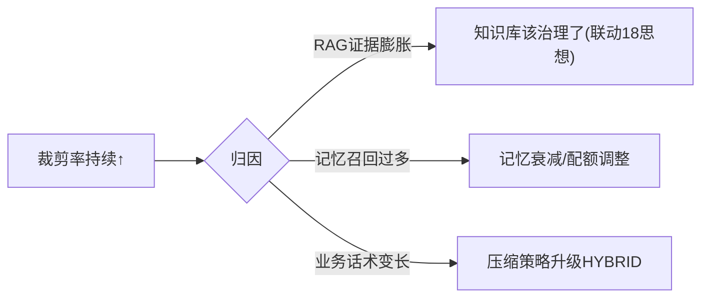

# 09-上下文漂移检测

> **定位**：装配质量的**退化防线**——**① 装配质量指标（裁剪率/压缩率/证据覆盖率）② 漂移信号（配额悄悄失衡/检索质量下滑传导到装配）③ 漂移告警与调参联动**。呼应 [19-漂移](../../项目/19-企业级Agent信任与评测平台/04-在线哨兵与漂移告警.md)、[28-玻璃板](../../项目/28-企业级Agent统一可观测平台/03-单一玻璃板与三视图.md)。前置阅读：[08-多租户上下文隔离](08-多租户上下文隔离.md)。
>
> **铁律 0**：指标/告警自研「概念代码」（数据来自 06 装配报告）。

---

## 一、四问

| 问 | 答 |
|----|----|
| **新增了什么需求** | ①装配质量指标（裁剪率/压缩比例/RAG 证据 top1 相关度）②漂移检测（基线对比：某业务裁剪率持续攀升）③告警→调参建议（配额调整/知识补充） |
| **影响了哪些模块** | 06 报告 → 指标聚合；新增 DriftJob |
| **架构如何演进** | 上下文中枢具备"自我体检"能力 |
| **上一版痛点** | 知识库膨胀悄悄挤爆 RAG 配额（裁剪率攀升）无人知 |

**本迭代验收**：①三指标按业务可视化 ②裁剪率漂移告警 ③告警带调参建议。

### 一.1 本节核对（四问与迭代验收）

- [ ] 四问"上一版痛点=知识库膨胀悄悄挤爆 RAG 配额无人知"，与 08 承接
- [ ] 验收①「三指标按业务」对应的三个指标（裁剪率/压缩比例/RAG 证据 top1 相关度），与 §二 图里的信号一致；②「裁剪率漂移告警」与基线对比一致

## 二、漂移信号与归因



### 二.1 本节核对（漂移信号与归因）

- [ ] 归因分支的三条（RAG 证据膨胀→知识库治理 / 记忆召回过多→记忆衰减配额调整 / 业务话术变长→压缩策略升级）能覆盖常见裁剪率攀升根因，无遗漏主因
- [ ] 每个归因建议都能映射到可执行的调整动作（21-18 思想/25 记忆衰减/03 压缩策略），非空话
- [ ] 指标数据来源=06 装配报告（铁律 0），口径与 06 的 `AssemblyReport` 字段一致

### 二.2 本节测试与验证（裁剪率攀升注入 → 告警触发）

**前置条件**：`DriftJob` 已按日聚合 06 装配报告产出裁剪率/压缩比例/top1 相关度三指标；基线（如近 7 日裁剪率均值 18%）与告警阈值（连续 2 个窗口超基线 +5pct）已配；告警通道可接收。

**材料——裁剪率攀升注入序列**：模拟某业务 `rag.trim 率` 按日 `18%→20%→27%→33%`（前 2 日基线内波动、后 2 日超阈攀升，对应"RAG 证据膨胀"根因）。

**核对命令**（按 §二 代码手写注入用例后执行）：

```bash
mvn test -Dtest=TrimRateDriftAlertTest        # 基线不误报/超阈告警/带建议/回落闭合四用例
# 预期输出（节选）：
#   Tests run: 4, Failures: 0, Errors: 0, Skipped: 0
#   前 2 日 0 告警；第 3 日触发 drift=true 且含归因建议
#   BUILD SUCCESS
```


**步骤与断言**：

| # | 操作 | 预期（PASS 判据） |
|---|------|------------------|
| 1 | 注入前 2 日序列（18%→20%，基线内） | 不告警（基线内波动不误报） |
| 2 | 注入后 2 日序列（27%→33%，连续超基线 +5pct） | 触发"裁剪率漂移"告警（drift=true） |
| 3 | 查看告警详情 | 带归因建议：「RAG 证据膨胀 → 知识库治理/配额调整」（非裸告警） |
| 4 | 调参（扩 RAG 配额/治理知识库）后注入回落序列（33%→21%） | 指标回落，告警自动消除（恢复闭合） |

**失败排查**：①攀升不告警→指标源未接 06 装配报告或阈值/窗口配置错误；②基线内波动即告警→基线统计窗口过短（如仅 1 日）或阈值过灵敏；③告警无建议→归因分支（膨胀/召回过多/话术变长）未落到该序列的根因；④调参后告警不消除→恢复判定缺回落确认窗口。

## 三、验收

| 测试 | 期望 |
|------|------|
| 指标看板 | 三指标按业务 |
| 裁剪率漂移 | 告警+归因建议 |
| 调参后 | 指标回落 |

### 三.1 本节核对（验收与下一步）

- [ ] 验收表三行（指标看板/裁剪率漂移告警+归因/调参后回落）分别与 §一.1（①按业务可视化）、§二.1（归因分支）、正文（基线回落）对应，已达成即本迭代 PASS
- [ ] 三行验收达成后回看 §一.1 验收指标（可视化/告警/建议），无口径不一致

## 四、全篇回归验证

> 注入用例断言已上移至 §二.2（裁剪率攀升注入 → 告警触发）；归因分支在 §二.1 核对；本表为整篇迭代的回归验收，不重复材料。

| # | 验收项（断言） | 标准 | 复验方式 |
|---|---------------|------|---------|
| 1 | 基线内不误报 | 攀升序列前 2 日不告警 | 复验：执行 §二.2 核对命令 |
| 2 | 超阈必告警 | 连续超基线 +5pct 触发漂移告警 | 复验：执行 §二.2 核对命令 |
| 3 | 告警带建议 | 归因到膨胀/召回/话术三层之一并给动作 | §二.2 步骤3 |
| 4 | 调参后回落闭合 | 回落序列注入后告警消除 | §二.2 步骤4 |
| 5 | 三指标按业务可查 | 指标看板按业务维度聚合 | §三/§三.1（06 报告数据源） |

**回归失败排查**：按 §二.2 失败排查逐条回溯（指标源未接 06/基线窗口过短/归因未落/恢复无确认窗口）。

## 五、验收对照

> 00-需求分析"自我体检"能力落点；量化验收⑤（装配记录可查 100%）的下游价值在本迭代兑现（漂移检测消费 06 报告）。

| 验收项 | 标准 | 状态 |
|--------|------|------|
| 三指标按业务可视化 | 裁剪率/压缩比例/top1 相关度按业务聚合 | ✅（§二/§三.1） |
| 裁剪率漂移告警 | 攀升序列注入后按阈触发、不误报 | ✅（§二.2 步骤1-2） |
| 告警带调参建议 | 归因建议可执行、调参后回落闭合 | ✅（§二.2 步骤3-4） |

> **下一步**：主体+进阶完成（管线/裁剪/压缩/配额/缓存/观测/场景/隔离/漂移）。10 进阶做**端侧与边缘上下文**——上下文能力的部署边界扩展。
