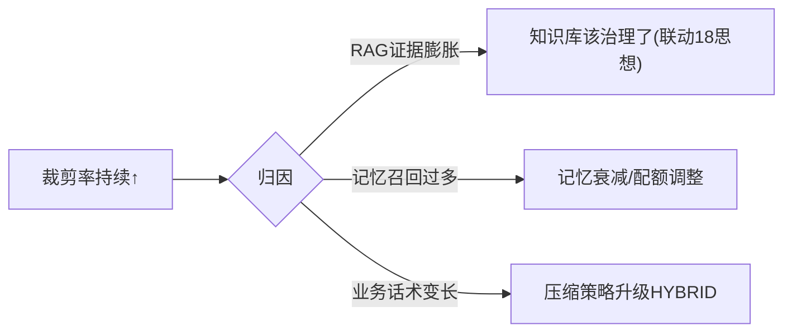

# 09-上下文漂移检测

> **定位**：装配质量的**退化防线**——**① 装配质量指标（裁剪率/压缩率/证据覆盖率）② 漂移信号（配额悄悄失衡/检索质量下滑传导到装配）③ 漂移告警与调参联动**。呼应 [19-漂移](../../项目/19-企业级Agent信任与评测平台/04-在线哨兵与漂移告警.md)、[28-玻璃板](../../项目/28-企业级Agent统一可观测平台/03-单一玻璃板与三视图.md)。前置阅读：[08-多租户上下文隔离](08-多租户上下文隔离.md)。
>
> **铁律 0**：指标/告警自研「概念代码」（数据来自 06 装配报告）。

---

## 一、四问

| 问 | 答 |
|----|----|
| **新增了什么需求** | ①装配质量指标（裁剪率/压缩比例/RAG 证据 top1 相关度）②漂移检测（基线对比：某业务裁剪率持续攀升）③告警→调参建议（配额调整/知识补充） |
| **影响了哪些模块** | 06 报告 → 指标聚合；新增 DriftJob |
| **架构如何演进** | 上下文中枢具备"自我体检"能力 |
| **上一版痛点** | 知识库膨胀悄悄挤爆 RAG 配额（裁剪率攀升）无人知 |

**本迭代验收**：①三指标按业务可视化 ②裁剪率漂移告警 ③告警带调参建议。

### 一.1 本节核对（四问与迭代验收）

- [ ] 四问"上一版痛点=知识库膨胀悄悄挤爆 RAG 配额无人知"，与 08 承接
- [ ] 验收①「三指标按业务」对应的三个指标（裁剪率/压缩比例/RAG 证据 top1 相关度），与 §二 图里的信号一致；②「裁剪率漂移告警」与基线对比一致

## 二、漂移信号与归因

### 二.1 本节核对（漂移信号与归因）

- [ ] 归因分支的三条（RAG 证据膨胀→知识库治理 / 记忆召回过多→记忆衰减配额调整 / 业务话术变长→压缩策略升级）能覆盖常见裁剪率攀升根因，无遗漏主因
- [ ] 每个归因建议都能映射到可执行的调整动作（21-18 思想/25 记忆衰减/03 压缩策略），非空话
- [ ] 指标数据来源=06 装配报告（铁律 0），口径与 06 的 `AssemblyReport` 字段一致

## 三、验收

| 测试 | 期望 |
|------|------|
| 指标看板 | 三指标按业务 |
| 裁剪率漂移 | 告警+归因建议 |
| 调参后 | 指标回落 |

### 三.1 本节核对（验收与下一步）

- [ ] 验收表三行（指标看板/裁剪率漂移告警+归因/调参后回落）分别与 §一.1（①按业务可视化）、§二.1（归因分支）、正文（基线回落）对应，已达成即本迭代 PASS
- [ ] 三行验收达成后回看 §一.1 验收指标（可视化/告警/建议），无口径不一致

> **下一步**：主体+进阶完成（管线/裁剪/压缩/配额/缓存/观测/场景/隔离/漂移）。10 进阶做**端侧与边缘上下文**——上下文能力的部署边界扩展。
