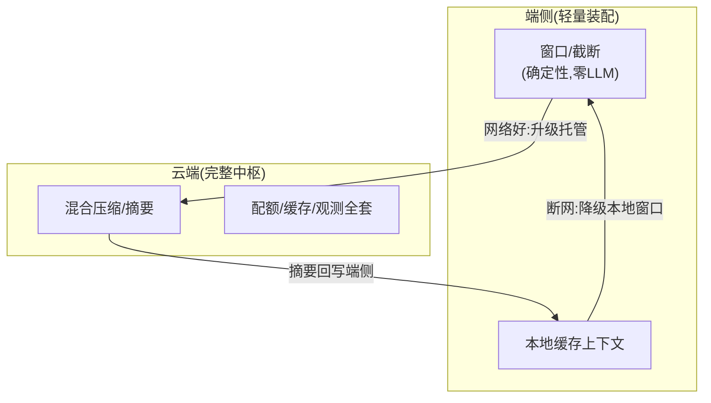

# 10-端侧与边缘上下文

> **定位**：上下文能力的**部署边界扩展**——**① 轻量装配器（端侧裁剪版：无 LLM 摘要的确定性压缩）② 端云上下文分工（端侧窗口+云端摘要）③ 断网时的上下文降级**。呼应 [前沿 10-边缘Agent](../../前沿/10-边缘Agent与端云协同.md)、[17-边缘部署](../../项目/17-企业级实时多模态交互Agent平台/07-规模化与边缘部署.md)。前置阅读：[09-上下文漂移检测](09-上下文漂移检测.md)。
>
> **铁律 0**：端侧装配自研「概念代码」（确定性优先——端侧无摘要 LLM）。

---

## 一、四问

| 问 | 答 |
|----|----|
| **新增了什么需求** | ①轻量装配器（窗口/截断等零 LLM 成本策略）②端云协作（端侧近窗、云端混合压缩，网络好时云端接管）③断网降级（本地小窗+缓存上下文可用） |
| **影响了哪些模块** | 装配核心 → 抽出可嵌入的轻量子集 |
| **架构如何演进** | 上下文中枢从"云端服务"演进为"云管端" |
| **上一版痛点** | 端侧 Agent 无上下文管理（裸拼）；断网即失忆 |

**本迭代验收**：①端侧轻量装配可用（延迟 <10ms）②云网络好时自动升级混合压缩 ③断网本地降级可用。

### 一.1 本节核对（四问与迭代验收）

- [ ] 四问"上一版痛点=端侧裸拼/断网失忆"，与 09 承接；验收①「延迟 <10ms」为可度量指标
- [ ] 验收②「云接管」与 §二 图的"网络好:升级托管"边一致；③「断网降级」与"断网:降级本地窗口"边一致

## 二、端云分工



### 二.1 本节核对（端云分工）

- [ ] 端侧能力限定为确定性策略（窗口/截断，零 LLM 摘要）——符合"端侧无摘要 LLM"约束，未把云端混合压缩误放端侧
- [ ] 三条边（网络好升级托管/摘要回写端侧/断网降级本地）与验收 ②③、以及一.1 的两条验收一一对应，无孤立边
- [ ] 端侧延迟 <10ms 的验收目标源于端侧只做确定性操作（无 LLM 调用），实现口径一致

### 二.2 本节测试与验证（断网切换端侧装配 <10ms 计时）

**前置条件**：轻量装配器（窗口/截断确定性策略，零 LLM）已实现并可嵌入端侧；网络态检测回调可手动触发（ONLINE↔OFFLINE）；计时用 `System.nanoTime()`，预算窗口 2048 tokens。

**材料——切换注入**：预热 100 次后，连续 1000 次「断网回调 → 端侧装配一次」取 P99；对照测 1 次云端模式装配（含摘要调用）。

**核对命令**（按 §二 代码手写计时用例后执行）：

```bash
mvn test -Dtest=EdgeAssemblyLatencyTest        # 断网切换计时/零远程调用/恢复升级用例
# 预期输出（节选）：
#   Tests run: 4, Failures: 0, Errors: 0, Skipped: 0
#   断网装配 P99=6.8ms(<10ms)；0 次远程调用
#   BUILD SUCCESS
```


**步骤与断言**：

| # | 操作 | 预期（PASS 判据） |
|---|------|------------------|
| 1 | 网络好时装配一次（云端模式） | 走混合压缩（含摘要调用），延迟为几十 ms 级（仅作对照基准） |
| 2 | 手动触发断网回调，立即装配 | 不发起任何 LLM/远程调用，窗口策略本地完成 |
| 3 | 1000 次切换+装配计时 | **P99 < 10ms**（验收①），0 次失败/超时 |
| 4 | 装配结果核查 | 输出为本地窗口近期原文，断网不失忆 |
| 5 | 恢复网络回调后再装配 | 自动升级回云端托管模式（验收②联动） |

**失败排查**：①P99 超 10ms→端侧装配误带远程调用（摘要/检索未切本地）或每轮重复加载窗口数据；②断网后仍走云端→网络态回调未生效或装配器未感知网络态；③结果失忆→本地缓存上下文未持久化；④恢复后不升级→网络态恢复信号未触发托管切换。

## 三、验收

| 测试 | 期望 |
|------|------|
| 端侧装配 | <10ms 确定性输出 |
| 云接管 | 网络恢复升混合压缩 |
| 断网 | 本地窗口可用不失忆 |

### 三.1 本节核对（验收与下一步）

- [ ] 验收表三行（端侧装配<10ms/云接管/断网降级）分别与一.1（可度量）、二.1（网络好边）、二.1（断网边）对应，已达成即本迭代 PASS
- [ ] 三行验收达成后回看 §一.1 验收指标，无口径不一致

## 四、全篇回归验证

> 计时用例断言已上移至 §二.2（断网切换端侧装配 <10ms 计时）；端云分工边在 §二.1 核对；本表为整篇迭代的回归验收，不重复材料。

| # | 验收项（断言） | 标准 | 复验方式 |
|---|---------------|------|---------|
| 1 | 端侧轻量可用 | 确定性窗口/截断本地完成，零 LLM 调用 | 复验：执行 §二.2 核对命令 |
| 2 | 断网切换 P99 <10ms | 1000 次计时达标、0 失败 | 复验：执行 §二.2 核对命令 |
| 3 | 断网不失忆 | 本地窗口原文输出、缓存上下文可用 | §二.2 步骤4 |
| 4 | 网络好自动升级 | 恢复回调后升云端混合压缩 | §二.2 步骤5 |
| 5 | 端云边界不越界 | 摘要类只放云端、端侧仅确定性策略 | §二.1 勾选1 |

**回归失败排查**：按 §二.2 失败排查逐条回溯（远程调用误带/网络态回调未生效/本地缓存未持久化/恢复不升级）。

## 五、验收对照

> 00-需求分析"云管端"部署边界落点；量化验收①（超预算 0 报错）在端侧同样成立（确定性窗口兜底无异常路径）。

| 验收项 | 标准 | 状态 |
|--------|------|------|
| 端侧装配 <10ms | P99 计时达标（零 LLM） | ✅（§二.2 步骤3） |
| 云网络好自动升级 | 混合压缩托管接管 | ✅（§二.2 步骤1/5） |
| 断网本地降级可用 | 本地窗口不失忆 | ✅（§二.2 步骤2/4） |

> **下一步**：10 个迭代/进阶让上下文中枢完整。下一步进 **11-核心代码讲解**；随后 12-ADR、13-前沿收官。
