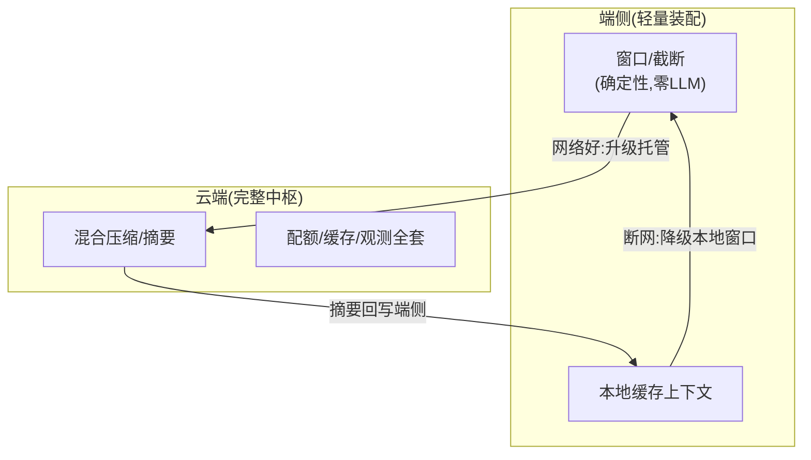

# 10-端侧与边缘上下文

> **定位**：上下文能力的**部署边界扩展**——**① 轻量装配器（端侧裁剪版：无 LLM 摘要的确定性压缩）② 端云上下文分工（端侧窗口+云端摘要）③ 断网时的上下文降级**。呼应 [前沿 10-边缘Agent](../../前沿/10-边缘Agent与端云协同.md)、[17-边缘部署](../../项目/17-企业级实时多模态交互Agent平台/07-规模化与边缘部署.md)。前置阅读：[09-上下文漂移检测](09-上下文漂移检测.md)。
>
> **铁律 0**：端侧装配自研「概念代码」（确定性优先——端侧无摘要 LLM）。

---

## 一、四问

| 问 | 答 |
|----|----|
| **新增了什么需求** | ①轻量装配器（窗口/截断等零 LLM 成本策略）②端云协作（端侧近窗、云端混合压缩，网络好时云端接管）③断网降级（本地小窗+缓存上下文可用） |
| **影响了哪些模块** | 装配核心 → 抽出可嵌入的轻量子集 |
| **架构如何演进** | 上下文中枢从"云端服务"演进为"云管端" |
| **上一版痛点** | 端侧 Agent 无上下文管理（裸拼）；断网即失忆 |

**本迭代验收**：①端侧轻量装配可用（延迟 <10ms）②云网络好时自动升级混合压缩 ③断网本地降级可用。

### 一.1 本节核对（四问与迭代验收）

- [ ] 四问"上一版痛点=端侧裸拼/断网失忆"，与 09 承接；验收①「延迟 <10ms」为可度量指标
- [ ] 验收②「云接管」与 §二 图的"网络好:升级托管"边一致；③「断网降级」与"断网:降级本地窗口"边一致

## 二、端云分工

### 二.1 本节核对（端云分工）

- [ ] 端侧能力限定为确定性策略（窗口/截断，零 LLM 摘要）——符合"端侧无摘要 LLM"约束，未把云端混合压缩误放端侧
- [ ] 三条边（网络好升级托管/摘要回写端侧/断网降级本地）与验收 ②③、以及一.1 的两条验收一一对应，无孤立边
- [ ] 端侧延迟 <10ms 的验收目标源于端侧只做确定性操作（无 LLM 调用），实现口径一致

## 三、验收

| 测试 | 期望 |
|------|------|
| 端侧装配 | <10ms 确定性输出 |
| 云接管 | 网络恢复升混合压缩 |
| 断网 | 本地窗口可用不失忆 |

### 三.1 本节核对（验收与下一步）

- [ ] 验收表三行（端侧装配<10ms/云接管/断网降级）分别与一.1（可度量）、二.1（网络好边）、二.1（断网边）对应，已达成即本迭代 PASS
- [ ] 三行验收达成后回看 §一.1 验收指标，无口径不一致

> **下一步**：10 个迭代/进阶让上下文中枢完整。下一步进 **11-核心代码讲解**；随后 12-ADR、13-前沿收官。
