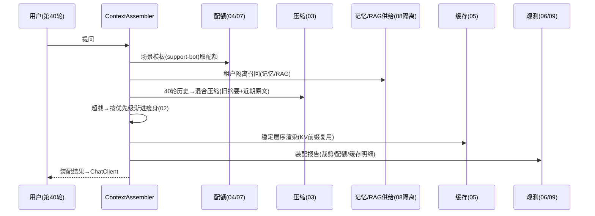

# 11-核心代码讲解

> **定位**：把项目 31 的核心实现串成主线——以**一次"客服长会话第 40 轮提问"的上下文装配**贯穿各迭代代码的协作。前置阅读：[01-最小Demo](01-最小Demo.md) 至 [10-端侧与边缘上下文](10-端侧与边缘上下文.md) 全部。
>
> **铁律 0**：Observation/ChatClient 实证基座；管线/配额/压缩为「概念代码」。

---

## 一、一次长会话装配的旅程



## 二、装配主链（串联各迭代）

```java
// 概念代码：装配主流程
public Mono<Assembled> assemble(String input) {
    return Mono.deferContextual(ctx -> {
        var policy = budget.templateOf(scene, tenant);              // 04/07/08 场景+租户
        var supplies = supply(tenantOf(ctx), input);                // 08 隔离召回
        var history = compressor.hybrid(sessionHistory(), policy);  // 03 压缩
        var layers = pipeline.assemble(supplies, history, input);   // 02 渐进瘦身
        var budgeted = allocator.allocate(policy, layers);          // 04 配额
        var rendered = renderer.cacheFriendly(budgeted);            // 05 层序+缓存
        report.record(runId, layers, budgeted, cacheStatus());      // 06/09 观测
        return rendered;
    });
}
```

## 三、分层职责（读代码抓手）

| 类 | 迭代 | 职责 |
|----|------|------|
| `ContextPipeline` | 01/02 | 五层装配+渐进瘦身 |
| `HistoryCompressor` | 03 | 窗口/摘要/混合 |
| `BudgetAllocator`/`TemplateStore` | 04/07 | 配额+场景模板 |
| `CacheFriendlyRenderer`/`CacheCluster` | 05 | 层序+三级缓存 |
| `AssemblyReport`/`DriftJob` | 06/09 | 观测+漂移 |
| `TenantGuard` | 08 | 租户隔离 |
| `EdgeAssembler` | 10 | 端侧轻量版 |

## 四、最容易踩的三个坑

1. **用户输入放中间** → 前缀变 KV 全失效。**解法**：稳定层序（05）。
2. **整层丢弃式裁剪** → 证据全丢。**解法**：渐进瘦身（02）。
3. **缓存不分租户** → 跨租户串答案。**解法**：分键（08）。

## 五、验收自测（对照 00 量化指标）

| 指标 | 目标 | 实现 |
|------|------|------|
| 超预算报错 | 0 | 03 裁剪兜底 |
| 系统/用户保留 | 100% | 01 底线 |
| KV 命中提升 | ≥30% | 05 层序 |
| 成本降 | ≥15% | 压缩+缓存 |
| 装配留痕 | 100% | 06 报告 |

> **下一步**：代码串讲完成。12-ADR 记录 8 条关键决策；13-前沿做上下文工程前沿对照与演进收官。
