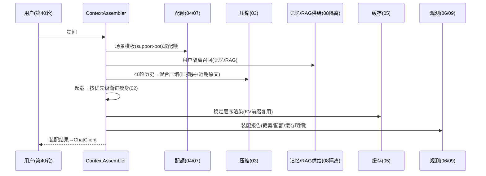

# 11-核心代码讲解

> **定位**：把项目 31 的核心实现串成主线——以**一次"客服长会话第 40 轮提问"的上下文装配**贯穿各迭代代码的协作。前置阅读：[01-最小Demo](01-最小Demo.md) 至 [10-端侧与边缘上下文](10-端侧与边缘上下文.md) 全部。
>
> **铁律 0**：Observation/ChatClient 实证基座；管线/配额/压缩为「概念代码」。

---

## 一、一次长会话装配的旅程



### 一.1 本节核对（一次长会话装配的旅程）

- [ ] 时序图每个参与者（CA/BA/HC/MT/CC/OB）都能在 §二 装配主链的代码行找到对应调用；每个 iter 标注（04/07/08/03/02/05/06/09）与各迭代文件标题一一对应
- [ ] 「40 轮历史→混合压缩」与 03 的 HYBRID 路径一致；「稳定层序渲染(KV前缀复用)」与 05 层序一致，串联无跳点
- [ ] 旅程覆盖 10 个迭代的能力全貌，无任一迭代能力缺席

## 二、装配主链（串联各迭代）

```java
// 概念代码：装配主流程
public Mono<Assembled> assemble(String input) {
    return Mono.deferContextual(ctx -> {
        var policy = budget.templateOf(scene, tenant);              // 04/07/08 场景+租户
        var supplies = supply(tenantOf(ctx), input);                // 08 隔离召回
        var history = compressor.hybrid(sessionHistory(), policy);  // 03 压缩
        var layers = pipeline.assemble(supplies, history, input);   // 02 渐进瘦身
        var budgeted = allocator.allocate(policy, layers);          // 04 配额
        var rendered = renderer.cacheFriendly(budgeted);            // 05 层序+缓存
        report.record(runId, layers, budgeted, cacheStatus());      // 06/09 观测
        return rendered;
    });
}
```

### 二.1 本节测试与验证（装配主链串联）

> 本文为代码讲解收束篇，验证以"端到端装配主链"整链路为准——各能力已在 01-10 各自验证，此处验证协作正确性。

**前置条件**：01-10 各组件已实现（`budget/compressor/pipeline/allocator/renderer/report`）；一次真实"客服长会话第 40 轮"输入。

**步骤与断言**：

| # | 操作 | 预期（PASS 判据） |
|---|------|------------------|
| 1 | 端到端 `assemble(input)`（第 40 轮） | 全链执行：取场景+租户模板→隔离召回→混合压缩→渐进瘦身→配额分配→稳定层序渲染→报告记录，返回可装配结果 |
| 2 | 顺序正确性 | 渲染发生在配额、压缩之后；报告在渲染后记录（`report.record` 有 `runId`） |
| 3 | 反复装配 40 轮历史场景 | 前缀稳定（05）、配额不越界（04）、裁剪有记录（06），各迭代能力协作无互相覆盖 |
| 4 | 配额不足联合瘦身 | 分配不足时联动 02 `shrink`，装配仍返回兜底结果不报错（00 验收①超预算 0 报错） |

**失败排查**：①顺序错乱（压缩与渲染颠倒）→主链调用未按 `pipeline→allocate→render` 编排；②某步无产出（报告空）→`report.record` 前一步抛异常未中止；③策略未联动（瘦身不救配额）→`allocator` 与 `shrink` 未接同一个信号。

## 三、分层职责（读代码抓手）

| 类 | 迭代 | 职责 |
|----|------|------|
| `ContextPipeline` | 01/02 | 五层装配+渐进瘦身 |
| `HistoryCompressor` | 03 | 窗口/摘要/混合 |
| `BudgetAllocator`/`TemplateStore` | 04/07 | 配额+场景模板 |
| `CacheFriendlyRenderer`/`CacheCluster` | 05 | 层序+三级缓存 |
| `AssemblyReport`/`DriftJob` | 06/09 | 观测+漂移 |
| `TenantGuard` | 08 | 租户隔离 |
| `EdgeAssembler` | 10 | 端侧轻量版 |

### 三.1 本节核对（分层职责）

- [ ] 职责表七个类（ContextPipeline/HistoryCompressor/BudgetAllocator/TemplateStore/CacheFriendlyRenderer/CacheCluster/AssemblyReport/DriftJob/TenantGuard/EdgeAssembler）各自的迭代归属与对应文件一致，无错置
- [ ] 每行职责一句话能对应到对应迭代的核心名词（渐进瘦身/三路径/配额/场景模板/层序三级缓存/报告漂移/租户隔离/端侧子集）
- [ ] 分层与 §二 装配主链的调用对象一一对应，读代码时能对号入座

## 四、最容易踩的三个坑

1. **用户输入放中间** → 前缀变 KV 全失效。**解法**：稳定层序（05）。
2. **整层丢弃式裁剪** → 证据全丢。**解法**：渐进瘦身（02）。
3. **缓存不分租户** → 跨租户串答案。**解法**：分键（08）。

### 四.1 本节核对（三个坑）

- [ ] 三条坑及其解法（05 稳定层序/02 渐进瘦身/08 分键）各自有对应迭代做了验证，非孤例经验
- [ ] 三条坑的确诊信号可复述（前缀变/KV 失效、证据全丢、跨租户串答案），读者能据此自查代码
- [ ] 无遗漏第四类高频坑（如裁剪不可观测已由 06 覆盖、配额无结构已由 04 覆盖）——三条已覆盖最致命三类

## 五、验收自测（对照 00 量化指标）

| 指标 | 目标 | 实现 |
|------|------|------|
| 超预算报错 | 0 | 03 裁剪兜底 |
| 系统/用户保留 | 100% | 01 底线 |
| KV 命中提升 | ≥30% | 05 层序 |
| 成本降 | ≥15% | 压缩+缓存 |
| 装配留痕 | 100% | 06 报告 |

### 五.1 本节核对（验收自测）

- [ ] 验收表五条指标（超预算 0 报错/系统用户保留 100%/KV 命中 ≥30%/成本降 ≥15%/装配留痕 100%）与 00 文件 §三 的量化验收逐条对应，目标值一致
- [ ] 每条"实现"依赖的迭代（03/01/05/压缩+缓存/06）与正文与 §三 分层职责表一致，无指标搁置
- [ ] 五条全部达标后方可判定本项目主体通过——若任一条未达成，定位到对应迭代的本章节验证回查

> **下一步**：代码串讲完成。12-ADR 记录 8 条关键决策；13-前沿做上下文工程前沿对照与演进收官。
