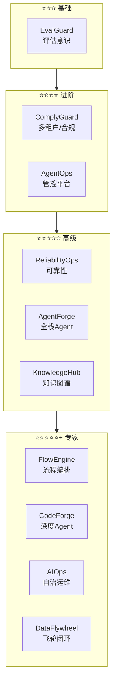
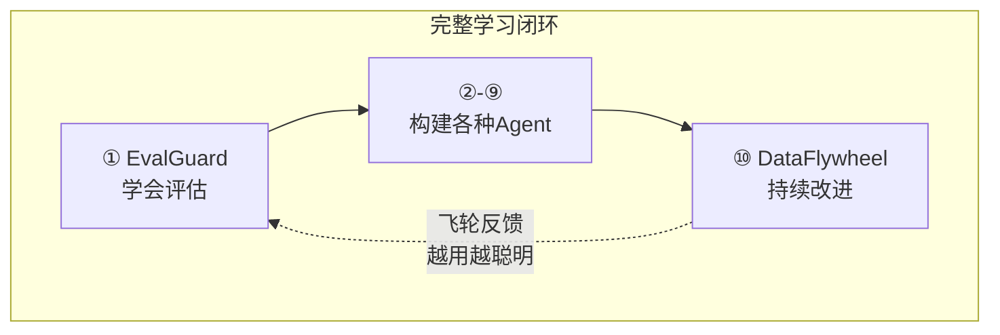

# 项目实践总览

> 十个企业级大型项目，按**内容由简入繁**排列，把所有知识点串联起来，从不同维度构建 Agent 架构师的核心能力。

---

## 十个企业项目一览（由简入繁排序）

| 序号 | 项目 | 代号 | 核心问题 | 难度 | 时间 | 推荐顺序 |
|------|------|------|---------|------|------|---------|
| ① | Agent 评估质量保障 | **EvalGuard** | 怎么知道 Agent 够好？ | ⭐⭐⭐ | 3 周 | 第 1 个 |
| ② | Agent 合规治理 | **ComplyGuard** | 怎么通过合规审计？ | ⭐⭐⭐⭐ | 3 周 | 第 2 个 |
| ③ | Agent 控制中心 | **AgentOps** | 怎么管多个 Agent？ | ⭐⭐⭐⭐ | 4 周 | 第 3 个 |
| ④ | Agent 可靠性工程 | **ReliabilityOps** | 怎么保障 Agent 可靠？ | ⭐⭐⭐⭐⭐ | 3-4 周 | 第 4 个 |
| ⑤ | AI 智能客服平台 | **AgentForge** | 怎么造一个 Agent？ | ⭐⭐⭐⭐⭐ | 8 周 | 第 5 个 |
| ⑥ | 企业知识中枢平台 | **KnowledgeHub** | 怎么让 Agent 懂企业知识？ | ⭐⭐⭐⭐⭐ | 4-5 周 | 第 6 个 |
| ⑦ | Agent 工作流引擎 | **FlowEngine** | 怎么编排复杂业务流程？ | ⭐⭐⭐⭐⭐+ | 4-5 周 | 第 7 个 |
| ⑧ | AI 代码生成平台 | **CodeForge** | 怎么造深度 Agent？ | ⭐⭐⭐⭐⭐+ | 6 周 | 第 8 个 |
| ⑨ | AI 运维自治平台 | **AIOps** | Agent 能自己运维吗？ | ⭐⭐⭐⭐⭐+ | 4 周 | 第 9 个 |
| ⑩ | 数据飞轮平台 | **DataFlywheel** | 怎么让 Agent 越用越聪明？ | ⭐⭐⭐⭐⭐+ | 4-5 周 | 第 10 个 |

### 为什么这样排序？（内容由浅入深）

| 序号 | 项目 | 为什么在这里？ |
|------|------|--------------|
| ① | EvalGuard | **最独立**。不依赖其他系统。学完基础 ChatClient 就能做。先建立"质量评估"的意识。 |
| ② | ComplyGuard | 引入**多租户、数据隔离**概念。这些是所有企业级 Agent 的基础。 |
| ③ | AgentOps | 在 Agent 基础上增加"**管控**"维度。历史持久化 + 可视化 + 配置管理。 |
| ④ | ReliabilityOps | Agent 已经跑起来了，开始考虑"**怎么保证不挂**"。混沌工程 + 故障切换。 |
| ⑤ | AgentForge | **综合性最强的基础 Agent**——多轮 + RAG + 工具 + 多租户 + 多 Agent + 生产化。 |
| ⑥ | KnowledgeHub | 在 AgentForge 的 RAG 基础上**深化**——知识图谱 + 实时数据管道 + 混合检索。 |
| ⑦ | FlowEngine | 从"对话 Agent"升级到"**业务流程编排**"——文档处理 + 审批 + DAG 引擎。 |
| ⑧ | CodeForge | 对标 Claude Code 的**深度 Agent**——Agent 循环 + 上下文工程 + 子 Agent。 |
| ⑨ | AIOps | **最复杂的 Agent 能力**——ReAct + Temporal + MCP Hub + 人在回路。 |
| ⑩ | DataFlywheel | **飞轮收尾**——把所有项目的成果串起来，形成持续改进闭环。回到 ① EvalGuard 形成循环。 |

```mermaid
flowchart LR
    P1["① EvalGuard<br/>质量评估 ⭐⭐⭐"] --> P2["② ComplyGuard<br/>合规治理 ⭐⭐⭐⭐"]
    P2 --> P3["③ AgentOps<br/>控制中心 ⭐⭐⭐⭐"]
    P3 --> P4["④ ReliabilityOps<br/>可靠性 ⭐⭐⭐⭐⭐"]
    P4 --> P5["⑤ AgentForge<br/>造Agent ⭐⭐⭐⭐⭐"]
    P5 --> P6["⑥ KnowledgeHub<br/>知识中枢 ⭐⭐⭐⭐⭐"]
    P6 --> P7["⑦ FlowEngine<br/>工作流 ⭐⭐⭐⭐⭐+"]
    P7 --> P8["⑧ CodeForge<br/>深度Agent ⭐⭐⭐⭐⭐+"]
    P8 --> P9["⑨ AIOps<br/>Agent运维 ⭐⭐⭐⭐⭐+"]
    P9 --> P10["⑩ DataFlywheel<br/>数据飞轮 ⭐⭐⭐⭐⭐+"]
    P10 -.->|"飞轮反馈"| P1

    style P1 fill:#4caf50,color:#fff
    style P2 fill:#66bb6a,color:#fff
    style P3 fill:#42a5f5,color:#fff
    style P4 fill:#ab47bc,color:#fff
    style P5 fill:#ff7043,color:#fff
    style P6 fill:#26c6da,color:#fff
    style P7 fill:#5c6bc0,color:#fff
    style P8 fill:#ec407a,color:#fff
    style P9 fill:#ef5350,color:#fff
    style P10 fill:#7e57c2,color:#fff
```



---

## 难度递进模型



---

## 目录结构

```
项目实践/
├── 00-项目实践总览.md                    ← 你在这里
│
├── 01-企业项目-Eval质量保障平台/         ← ① EvalGuard（最简单，先做）
│   ├── 00-总览.md
│   ├── Sprint1-GoldenSet引擎.md
│   ├── Sprint2-CI门禁集成.md
│   ├── Sprint3-流量回放.md
│   └── Sprint4-看板与报告.md
│
├── 02-企业项目-Agent合规治理平台/        ← ② ComplyGuard
│   ├── 00-总览.md
│   ├── Sprint1-数据分类.md
│   ├── Sprint2-多租户隔离.md
│   ├── Sprint3-审计报告.md
│   └── Sprint4-策略部署.md
│
├── 03-企业项目-Agent控制中心/            ← ③ AgentOps
│   ├── 00-总览.md
│   ├── Sprint1-历史持久化.md
│   ├── Sprint2-可视化.md
│   ├── Sprint3-配置灰度.md
│   └── Sprint4-平台化.md
│
├── 04-企业项目-Agent可靠性工程/          ← ④ ReliabilityOps
│   ├── 00-总览.md
│   ├── Sprint1-混沌引擎.md
│   ├── Sprint2-故障切换与成本.md
│   ├── Sprint3-安全与飞轮.md
│   └── Sprint4-看板与部署.md
│
├── 05-企业项目-AI客服平台/              ← ⑤ AgentForge
│   ├── 企业项目-AI客服平台-总览.md
│   ├── 企业项目-Sprint1-基础骨架.md
│   ├── 企业项目-Sprint2-多轮流式.md
│   ├── 企业项目-Sprint3-RAG工具.md
│   ├── 企业项目-Sprint4-多租户安全.md
│   ├── 企业项目-Sprint5-多Agent.md
│   ├── 企业项目-Sprint6-生产化.md
│   └── 企业项目-Sprint7-部署交付.md
│
├── 06-企业项目-知识中枢平台/             ← ⑥ KnowledgeHub
│   ├── 00-总览.md
│   ├── Sprint1-知识摄入.md
│   ├── Sprint2-知识图谱.md
│   ├── Sprint3-混合检索.md
│   └── Sprint4-质量治理.md
│
├── 07-企业项目-工作流引擎/              ← ⑦ FlowEngine
│   ├── 00-总览.md
│   ├── Sprint1-文档处理.md
│   ├── Sprint2-流程编排.md
│   ├── Sprint3-审批回路.md
│   └── Sprint4-集成监控.md
│
├── 08-企业项目-代码生成平台/             ← ⑧ CodeForge
│   ├── 00-总览.md
│   ├── Sprint1-Agent循环.md
│   ├── Sprint2-Shell权限.md
│   ├── Sprint3-上下文工程.md
│   ├── Sprint4-子Agent评审.md
│   └── Sprint5-测试部署.md
│
├── 09-企业项目-AI运维自治平台/           ← ⑨ AIOps
│   ├── 00-总览.md
│   ├── Sprint1-告警工具.md
│   ├── Sprint2-Agent循环.md
│   ├── Sprint3-DurableMCP.md
│   └── Sprint4-确认报告.md
│
└── 10-企业项目-数据飞轮平台/             ← ⑩ DataFlywheel（飞轮收尾）
    ├── 00-总览.md
    ├── Sprint1-数据采集.md
    ├── Sprint2-智能标注.md
    ├── Sprint3-评估闭环.md
    └── Sprint4-持续交付.md
```

---

## 项目知识点映射

| 知识点 | ① Eval | ② 合规 | ③ Ops | ④ Reli | ⑤ 客服 | ⑥ 知识 | ⑦ 流程 | ⑧ 代码 | ⑨ 运维 | ⑩ 飞轮 |
|--------|--------|--------|--------|---------|--------|--------|--------|--------|--------|--------|
| ChatClient 基础 | ✅ S1 | - | - | ✅ S2 | ✅ S1 | ✅ S1 | ✅ S1 | ✅ S1 | ✅ S2 | - |
| 多轮对话与记忆 | - | - | - | - | ✅ S2 | - | - | ✅ S1 | - | - |
| 工具调用 | - | - | - | - | ✅ S3 | - | ✅ S1 | ✅ S1 | ✅ S1 | - |
| RAG | - | - | - | - | ✅ S3 | ✅ S3 | - | - | - | - |
| 流式输出(SSE) | - | - | - | - | ✅ S2 | ✅ S3 | ✅ S2 | ✅ S1 | - | ✅ S1 |
| Advisor 链 | - | ✅ S1 | - | ✅ S3 | ✅ S2 | - | - | ✅ S1 | ✅ S2 | ✅ S1 |
| Agent 循环 | - | - | - | - | ✅ S5 | - | - | ✅ S1 | ✅ S2 | - |
| 安全防御 | - | ✅ S1 | - | ✅ S3 | ✅ S4 | - | - | ✅ S2 | ✅ S2 | - |
| 多租户隔离 | - | ✅ S2 | - | ✅ S2 | ✅ S4 | - | - | - | - | - |
| 数据分类脱敏 | - | ✅ S1 | - | - | - | - | - | - | - | - |
| 不可篡改审计 | - | ✅ S3 | - | - | - | - | - | - | - | - |
| 合规策略引擎 | - | ✅ S4 | - | - | - | - | - | - | - | - |
| GDPR 被遗忘权 | - | ✅ S2 | - | - | - | - | - | - | - | - |
| Golden Set 评估 | ✅ S1 | - | - | - | - | - | - | - | - | ✅ S3 |
| CI 门禁 | ✅ S2 | - | - | - | - | - | - | - | - | ✅ S3 |
| 流量回放/影子 | ✅ S3 | - | - | - | - | - | - | - | - | - |
| LLM as Judge | ✅ S1 | - | - | - | - | ✅ S4 | - | - | - | ✅ S2 |
| 可观测性 | ✅ S4 | - | ✅ S1 | ✅ S4 | ✅ S6 | ✅ S4 | ✅ S4 | ✅ S5 | - | ✅ S4 |
| 成本工程 | - | - | ✅ S1 | ✅ S2 | ✅ S6 | - | - | - | - | ✅ S1 |
| 测试工程化 | ✅ 全 | - | - | ✅ S4 | - | - | - | ✅ S5 | - | ✅ S3 |
| 多 Agent 编排 | - | - | ✅ S4 | - | ✅ S5 | - | ✅ S2 | ✅ S4 | - | - |
| 上下文工程 | - | - | - | - | - | - | - | ✅ S3 | - | - |
| 管控分离 | - | - | ✅ S4 | - | - | - | - | - | - | - |
| 历史持久化 | - | - | ✅ S1 | - | - | - | - | - | ✅ S4 | ✅ S1 |
| 配置中心 | - | - | ✅ S3 | - | - | - | - | - | - | - |
| 灰度发布 | - | - | ✅ S3 | - | - | - | - | - | - | ✅ S4 |
| 混沌工程 | - | - | - | ✅ S1 | - | - | - | - | - | - |
| 多模型故障切换 | - | - | - | ✅ S2 | - | - | - | - | - | - |
| 数据飞轮 | - | - | - | ✅ S3 | - | - | - | - | - | ✅ 全 |
| Durable Exec | - | - | - | - | - | - | - | - | ✅ S3 | - |
| MCP Hub | - | - | - | - | - | - | - | - | ✅ S3 | - |
| **知识图谱** | - | - | - | - | - | ✅ S2 | - | - | - | - |
| **混合检索(向量+BM25+图谱)** | - | - | - | - | - | ✅ S3 | - | - | - | - |
| **知识缺口检测** | - | - | - | - | - | ✅ S4 | - | - | - | - |
| **DAG 流程编排** | - | - | - | - | - | - | ✅ S2 | - | - | - |
| **人在回路审批** | - | - | - | - | - | - | ✅ S3 | - | - | - |
| **Saga 分布式事务** | - | - | - | - | - | - | ✅ S4 | - | - | - |
| **主动学习标注** | - | - | - | - | - | - | - | - | - | ✅ S2 |
| **A/B 测试** | - | - | - | - | - | - | - | - | - | ✅ S3 |
| **Prompt 自动优化** | - | - | - | - | - | - | - | - | - | ✅ S4 |
| **Prompt 注入防御** | - | - | - | - | - | - | ✅ S1 | - | - | - |
| **语义缓存/模型路由** | - | - | ✅ S1 | ✅ S2 | - | ✅ S4 | - | - | - | - |
| **决策链路审计** | - | ✅ S3 | - | - | - | ✅ S4 | ✅ S4 | - | - | ✅ S4 |
| **价值对齐评估** | - | - | - | - | - | - | - | - | - | ✅ S4 |

---

## 飞轮闭环



> ① EvalGuard 教你怎么评估 Agent → ⑩ DataFlywheel 用评估驱动持续改进 → 回到 ① 形成闭环。

---

## 做项目的纪律

1. **先读需求**——不急着写代码，先理解要做什么
2. **先画架构**——用 Mermaid 画一张图，理清模块关系
3. **分步实现**——按 V1→V2→V3 的节奏，每步完成一个可运行的版本
4. **每天测试**——写完就测，不要堆到最后
5. **Git 提交**——每完成一个 V 版本就提交
6. **记录踩坑**——遇到的问题记下来，面试时讲得出故事
