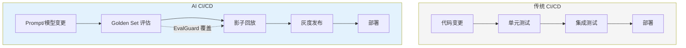

# Eval 质量保障平台（EvalGuard）· 项目总览

> **代号**：EvalGuard —— "测试驱动的 Agent 质量保障平台"
>
> **核心问题**：Agent 上线前，你怎么知道它"够好"？没有自动化评估的 Agent 上线，等于裸奔。

---

## 项目定位

**EvalGuard 是 Agent 时代的 CI 门禁系统**——让每次 Prompt 修改、模型升级都经过自动化质量评估，不达标不让上线。

---

## 四个 Sprint

| Sprint | 主题 | V1→V2→V3 演进 | 时间 |
|--------|------|--------------|------|
| 1 | Golden Set 引擎 | 手写断言 → Golden Set → LLM as Judge | 1 周 |
| 2 | CI 门禁集成 | 手动跑 → GitHub Actions → 多级门禁策略 | 1 周 |
| 3 | 流量回放 | 手动回放 → 影子模式 → 自动对比评估 | 1 周 |
| 4 | 看板与报告 | 终端输出 → Web 看板 → 趋势分析 + 告警 | 1 周 |

---

## 核心特性

- **Golden Set 管理**：分类（routine / edge-case / safety / regression），评估方式（精确/关键词/LLM Judge）
- **CI 门禁**：BLOCK / WARN / INFO 三级策略，安全类一票否决
- **流量回放**：录制生产流量，新版 Agent 离线跑，自动对比
- **影子模式**：新版暗中运行，不影响用户，评估后决定是否放量
- **趋势看板**：质量趋势可视化，回归自动告警

---

## 知识映射

| 知识点 | 对应教程 |
|--------|---------|
| Eval-Driven 开发 | [17-Eval驱动开发](../../阶段4-生产化/17-Eval驱动开发.md) |
| 流量回放与影子模式 | [20-流量回放与影子模式](../../阶段4-生产化/20-流量回放与影子模式.md) |
| Agent 性能调优 | [21-Agent性能调优](../../阶段4-生产化/21-Agent性能调优.md) |
| 数据飞轮 | [13-数据飞轮与持续改进](../../阶段4-生产化/13-数据飞轮与持续改进.md) |

---

## 下一步

→ [Sprint 1：Golden Set 引擎](Sprint1-GoldenSet引擎.md)
