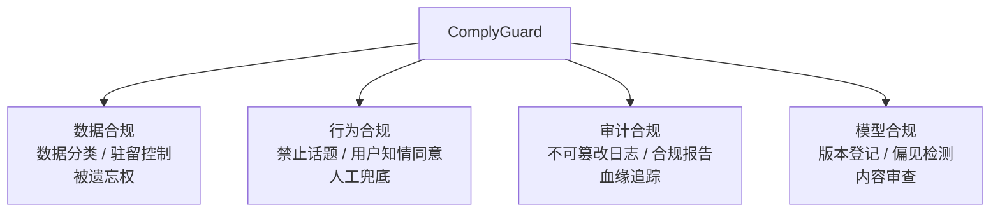

# Agent 合规治理平台（ComplyGuard）· 项目总览

> **代号**：ComplyGuard —— "让 Agent 系统通过 GDPR / SOC2 审计"
>
> **核心问题**：你的 Agent 能通过企业客户的合规审查吗？数据驻留、用户同意、审计追溯、被遗忘权——缺一项都进不了采购短名单。

---

## 项目定位

---

## 四个 Sprint

| Sprint | 主题 | V1→V2→V3 演进 | 时间 |
|--------|------|--------------|------|
| 1 | 数据分类与脱敏 | 关键词过滤 → 正则分类 → 多级敏感标注 | 1 周 |
| 2 | 多租户数据隔离 | 行级隔离 → Schema 隔离 → 被遗忘权 | 1 周 |
| 3 | 审计与合规报告 | 日志记录 → 不可篡改链 → 自动报告 | 1 周 |
| 4 | 策略引擎与部署 | 规则检查 → 多维策略 → Docker 全栈 | 1 周 |

---

## 核心特性

- **敏感数据分类**：PII / PHI / PCI / 机密 / 公开——五级标注
- **多租户隔离**：应用层 + 数据层 + 向量层三层隔离
- **不可篡改审计**：链式 Hash + 只追加表
- **GDPR 被遗忘权**：端到端删除 + 审计日志
- **合规策略引擎**：数据驻留 + 用户同意 + 跨境传输控制
- **自动合规报告**：月度报告导出（SOC2 / GDPR / HIPAA）

---

## 知识映射

| 知识点 | 对应教程 |
|--------|---------|
| 多租户数据隔离 | [18-多租户数据隔离](../../阶段4-生产化/18-多租户数据隔离.md) |
| 合规审计 | [19-合规审计与数据治理](../../阶段4-生产化/19-合规审计与数据治理.md) |
| Agent 安全审计 | [15-Agent安全审计](../../阶段4-生产化/15-Agent安全审计.md) |
| 历史持久化 | [26-历史持久化与会话广播](../../阶段4-生产化/26-历史持久化与会话广播.md) |

---

## 下一步

→ [Sprint 1：数据分类与脱敏](Sprint1-数据分类.md)
