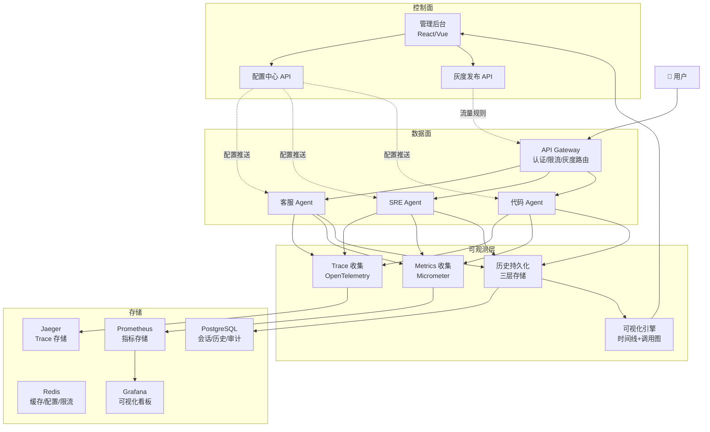

# 企业级项目三：Agent 控制中心（AgentOps）

> 一个完整的 Agent 平台管理系统——管控分离、全链路可追溯、工具调用可视化、灰度发布、配置中心。
> 前两个项目关注"怎么造 Agent"，这个项目关注"怎么管 Agent"。

---

## 为什么是这一个项目

| 项目 | 关注点 | 回答什么问题 |
|------|-------|------------|
| AgentForge（客服平台） | 怎么造一个 Agent | "我能做出 AI 应用吗？" |
| CodeForge（代码平台） | 怎么造一个深度 Agent | "我能做出 Claude Code 级的系统吗？" |
| **AgentOps**（控制中心） | **怎么管多个 Agent** | **"我能让 10 个 Agent 稳定运行吗？"** |

当企业有 3 个以上 Agent 在运行时，你面临的管理挑战：

| 问题 | 后果 |
|------|------|
| 改 Prompt 要重启服务 | 高峰期不敢调参数 |
| 不知道 Agent 每一步在做什么 | 出问题只能猜 |
| 工具调用失败率上升不知道 | 用户投诉才发现 |
| 无法对比不同 Prompt 的效果 | 改好改坏靠感觉 |
| 无法控制单租户消耗 | 一个大户拖垮全局 |

---

## 核心功能

```
1. 管控分离
   - 控制面：配置/监控/调度/灰度（管理后台）
   - 数据面：Agent 执行引擎（服务用户请求）

2. 历史记录持久化
   - 三层存储：会话 → LLM 调用 → 工具调用
   - 支持回放：从历史重建对话
   - 支持审计：谁在什么时候做了什么

3. 工具调用可视化
   - 时间线视图：每个步骤的时间/Token/延迟
   - 调用链路图：Agent → LLM → Tool 的树形关系
   - 统计面板：工具使用频率/成功率/延迟分布

4. Trace 全链路
   - OpenTelemetry 标准属性
   - 从用户请求到每一步 LLM 调用
   - 接入 Jaeger/Tempo

5. 配置中心
   - Prompt/模型/参数热更新
   - 全局/租户/会话三级覆盖
   - 版本管理 + 回滚

6. 灰度发布
   - 按租户/按流量百分比
   - 自动健康评估
   - 自动回滚
```

---

## 架构设计



---

## 项目目录结构

```
agent-ops/
├── src/main/java/com/agentops/
│   ├── AgentOpsApplication.java
│   │
│   ├── platform/                     # 控制面
│   │   ├── config/
│   │   │   ├── AgentConfigCenter.java
│   │   │   └── ConfigSnapshot.java
│   │   ├── canary/
│   │   │   ├── CanaryReleaseManager.java
│   │   │   └── CanaryHealth.java
│   │   ├── registry/
│   │   │   ├── AgentRegistry.java
│   │   │   └── AgentDescriptor.java
│   │   ├── manager/
│   │   │   ├── AgentPlatformManager.java
│   │   │   └── PlatformOverview.java
│   │   └── lifecycle/
│   │       ├── AgentLifecycleManager.java
│   │       ├── AgentState.java
│   │       └── AgentRateLimiter.java
│   │
│   ├── history/                      # 历史持久化
│   │   ├── HistoryPersistenceService.java
│   │   ├── SessionHistory.java
│   │   └── ToolUsageStat.java
│   │
│   ├── trace/                        # 全链路 Trace
│   │   ├── AgentTracer.java
│   │   └── TraceCollector.java
│   │
│   ├── visualization/                # 可视化
│   │   ├── ToolCallVisualizer.java
│   │   ├── Timeline.java
│   │   └── CallGraph.java
│   │
│   ├── events/                       # 事件驱动
│   │   ├── AgentEventBus.java
│   │   └── AgentEvent.java
│   │
│   └── controller/                   # API
│       ├── PlatformController.java   # 管理 API
│       ├── SessionController.java    # 会话查询
│       ├── ConfigController.java     # 配置管理
│       ├── TraceController.java      # Trace 查询
│       └── StatsController.java      # 统计分析
│
├── src/main/resources/
│   ├── static/
│   │   ├── admin.html                # 管理后台
│   │   └── dashboard.html            # 监控看板
│   ├── db/
│   │   └── schema.sql                # DDL
│   └── application.yml
│
├── docker-compose.yml
└── pom.xml
```

---

## 分阶段构建计划（4 周）

### Sprint 1（第 1 周）：历史持久化 + Trace

**目标**：所有 Agent 调用都有完整记录和全链路 Trace。

| 交付物 | 说明 |
|--------|------|
| DDL 建表 | sessions / agent_llm_calls / agent_tool_calls |
| HistoryPersistenceService | 三层存储 + 查询接口 |
| AgentTracer | OpenTelemetry 全链路 Trace |
| Trace 集成 | 与 Spring AI Advisor 链集成 |

### Sprint 2（第 1-2 周）：工具调用可视化

**目标**：管理后台能看到每个会话的完整执行时间线。

| 交付物 | 说明 |
|--------|------|
| ToolCallVisualizer | 时间线数据生成 |
| CallGraph | Mermaid 调用链路图 |
| 管理后台可视化页面 | 时间线 + 调用图 + 统计面板 |

### Sprint 3（第 2-3 周）：配置中心 + 灰度发布

**目标**：Prompt/模型/参数热更新，支持灰度发布。

| 交付物 | 说明 |
|--------|------|
| AgentConfigCenter | 全局/租户/会话三级配置 |
| CanaryReleaseManager | 五阶段灰度发布 |
| 版本管理 | Prompt/Tool/Config 版本化 |
| 配置管理 UI | 在线编辑/对比/回滚 |

### Sprint 4（第 3-4 周）：Agent 生命周期 + 平台化

**目标**：完整的多 Agent 平台管理。

| 交付物 | 说明 |
|--------|------|
| AgentLifecycleManager | 10 状态生命周期 |
| AgentRegistry | Agent 注册/发现/路由 |
| AgentRateLimiter | 三级限流 |
| AgentPlatformManager | 平台概览/暂停/恢复 |
| 管理后台完整 UI | 平台仪表盘 |

---

## 验收标准

### 历史记录
- [ ] 每个 Agent 请求都有三层记录（会话→LLM→工具）
- [ ] 支持从历史重建对话（回放）
- [ ] 支持审计查询

### 可视化
- [ ] 时间线视图正常显示
- [ ] 调用链路图正确生成 Mermaid
- [ ] 工具统计准确

### Trace
- [ ] OpenTelemetry 标准属性完整
- [ ] Jaeger 中能看到完整链路
- [ ] Span 包含 LLM 和工具调用

### 配置中心
- [ ] 配置变更后 Agent 热更新
- [ ] 支持三级覆盖
- [ ] 变更历史可查、可回滚

### 灰度发布
- [ ] 按租户灰度路由正确
- [ ] 按流量百分比路由正确
- [ ] 自动健康评估和回滚

### 生命周期
- [ ] 状态转换全部合法
- [ ] 空闲超时自动回收
- [ ] 错误自动重试
- [ ] 限流生效

---

## 详细实现文档索引

| Sprint | 文档 | 核心内容 |
|--------|------|---------|
| Sprint 1 | [历史持久化 + Trace](Sprint1-历史持久化.md) | 三层存储 + OpenTelemetry |
| Sprint 2 | [工具调用可视化](Sprint2-可视化.md) | 时间线 + 调用图 + 统计面板 |
| Sprint 3 | [配置中心 + 灰度](Sprint3-配置灰度.md) | 配置热更新 + 灰度发布 |
| Sprint 4 | [生命周期 + 平台化](Sprint4-平台化.md) | 状态机 + 注册中心 + 限流 |
