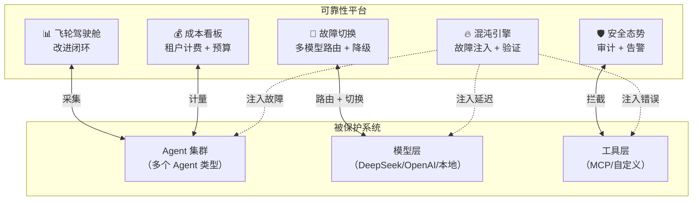

# 企业项目 5 · Agent 可靠性工程平台（ReliabilityOps）

> **定位**：整合阶段 4 所有生产化知识，构建一个 Agent 可靠性工程平台
> **前置知识**：管控分离、故障切换、成本归因、安全审计、数据飞轮、Prompt 管理
> **难度**：⭐⭐⭐⭐⭐ · **预计**：3-4 周

---

## 项目愿景

构建一个 **Agent 可靠性工程平台**，为企业级 AI Agent 系统提供：

1. **混沌实验**——主动注入故障，验证系统韧性
2. **多模型故障切换**——模型 Provider 宕机时自动降级
3. **成本看板**——精确到租户/Agent/会话的成本追踪
4. **安全态势**——实时监控安全事件和攻击趋势
5. **飞轮驾驶舱**——数据驱动的 Agent 持续改进

---

## 架构总览



---

## 4 Sprint 计划

| Sprint | 主题 | 核心交付 |
|--------|------|---------|
| Sprint 1 | 混沌实验引擎 | ChaosExperiment 定义、故障注入器、韧性验证报告 |
| Sprint 2 | 故障切换 + 成本 | 多模型路由器、三级降级、成本追踪 Advisor、租户预算 |
| Sprint 3 | 安全 + 飞轮 | 输入过滤、注入检测、审计日志、交互采集、Golden Set |
| Sprint 4 | 看板 + 部署 | 综合看板、Docker Compose、端到端测试 |

---

## 知识点映射

| 本项目 Sprint | 对应教程 |
|-------------|---------|
| Sprint 1 混沌引擎 | 阶段4-15 安全审计 |
| Sprint 2 故障切换 | 阶段4-11 多模型故障切换 |
| Sprint 2 成本追踪 | 阶段4-12 成本归因与计费 |
| Sprint 3 安全 | 阶段4-15 安全审计 |
| Sprint 3 飞轮 | 阶段4-13 数据飞轮 |
| Sprint 4 Prompt 管理 | 阶段4-14 Prompt 工程化管理 |

---

## 目录结构

```
企业项目-Agent可靠性工程/
├── 00-总览.md
├── Sprint1-混沌引擎.md
├── Sprint2-故障切换与成本.md
├── Sprint3-安全与飞轮.md
└── Sprint4-看板与部署.md
```

---

## 与其他项目的关系

| 项目 | 侧重点 | 与本项目的关系 |
|------|-------|-------------|
| CodeForge | Agent 功能完整性 | CodeForge 可以接入本平台获得可靠性保障 |
| AgentOps | 管控分离 | AgentOps 的控制面是本平台的基础 |
| AIOps | 运维自治 | 本平台可以接入 AIOps 作为监控源 |

---

## 下一步

→ [Sprint 1：混沌实验引擎](Sprint1-混沌引擎.md)
