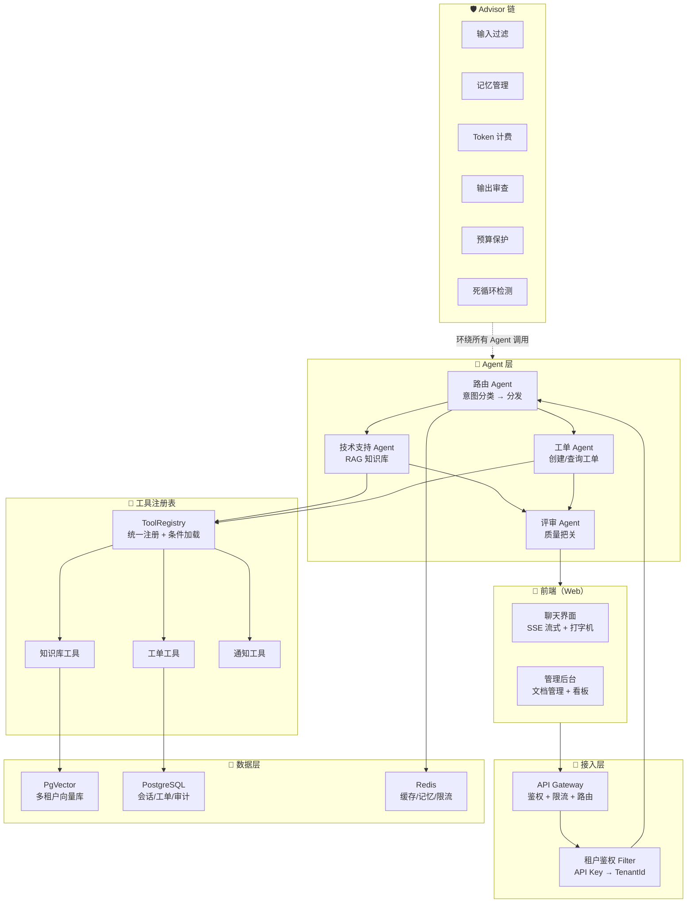

# 企业级项目：AI 智能客服平台（AgentForge）

> 一个从零到生产的企业级 AI Agent Web 项目，借鉴 Claude Code 架构精髓，串联全部知识点。

---

## 为什么是这一个项目

这个项目**不是 Demo，不是小工具**——它是一个完整的、可部署的企业级 Web 应用，你在构建它的过程中会用到所有阶段学到的每一个知识点。

### 借鉴 Claude Code 的 7 个架构模式

| Claude Code 模式 | 在本项目中的落地 |
|----------------|-----------------|
| **Agent 循环模式** | 基于 Spring AI 的 ToolCallingAdvisor 实现 Agent 循环，配 maxTurns + 预算 + 死循环检测 |
| **工具注册表模式** | 统一 ToolRegistry，声明式工具注册，条件注册（按租户权限动态加载工具） |
| **权限中间件模式** | Advisor 链实现多层权限：输入过滤 → 租户隔离 → 工具权限 → 输出审查 |
| **上下文预算模式** | Context Engineering 全套：Prompt Cache + 历史裁剪 + 语义压缩 |
| **多 Agent 委派模式** | 路由 Agent → 工人 Agent（技术/工单/运维）→ 评审 Agent |
| **流式处理模式** | 全链路 SSE 流式：API → Advisor → 工具 → 前端打字机 |
| **渐进降级模式** | LLM 超时降级到缓存、工具失败返回错误给 LLM 而非崩溃 |

---

## 项目全景

### 用户视角

```
企业管理员：
  1. 注册企业账号 → 获得独立租户空间
  2. 上传企业文档（PDF/Word/Markdown）→ 自动建知识库
  3. 配置客服工具（工单系统/邮件/通知）
  4. 查看数据分析看板（问答量/满意度/成本）

终端客户：
  1. 打开客服聊天窗口（Web/移动端）
  2. 用自然语言提问 → AI 流式回答
  3. 复杂问题自动路由到专业 Agent
  4. 高危操作（退款/投诉）需人工确认

运维工程师：
  1. 查看全链路 Trace（每次问答的完整链路）
  2. 查看 Token 成本看板
  3. 查看审计日志（合规报告）
  4. 评估集回归 + A/B 测试
```

### 技术视角

```
前端：React/Vue + SSE 流式聊天界面 + 管理后台
后端：Spring Boot 3 + Spring AI 2.0
数据：PostgreSQL + Redis + 向量库(PgVector)
基础设施：Docker Compose / K8s + Langfuse(可选)
```

---

## 架构设计



---

## 项目目录结构

```
agent-forge/                           # 项目根目录
├── docs/                              # 项目文档（不是教程文档）
│   ├── README.md                      # 项目说明
│   ├── architecture.md                # 架构设计文档
│   ├── api-spec.md                    # API 规范
│   ├── deployment.md                  # 部署指南
│   └── adr/                           # 架构决策记录
│       ├── 001-为什么用SpringAI.md
│       ├── 002-为什么用PgVector.md
│       └── 003-多Agent编排选型.md
│
├── src/main/java/com/agentforge/
│   ├── AgentForgeApplication.java     # 启动类
│   │
│   ├── config/                        # 配置层
│   │   ├── ChatClientConfig.java      # ChatClient + Advisor 链配置
│   │   ├── VectorStoreConfig.java     # 向量库配置
│   │   ├── RedisConfig.java           # Redis 配置
│   │   └── SecurityConfig.java        # 安全配置
│   │
│   ├── controller/                    # 接入层
│   │   ├── ChatController.java        # 聊天接口（SSE 流式）
│   │   ├── DocumentController.java    # 文档管理接口
│   │   ├── TicketController.java      # 工单管理接口
│   │   ├── EvalController.java        # 评估接口
│   │   └── AdminController.java       # 管理后台接口
│   │
│   ├── agent/                         # Agent 层
│   │   ├── RouterAgent.java           # 路由 Agent（意图分类）
│   │   ├── TechSupportAgent.java      # 技术支持 Agent
│   │   ├── TicketAgent.java           # 工单处理 Agent
│   │   ├── ReviewAgent.java           # 评审 Agent
│   │   └── AgentOrchestrator.java     # 多 Agent 编排器
│   │
│   ├── tool/                          # 工具注册表（借鉴 Claude Code）
│   │   ├── ToolRegistry.java          # 统一注册 + 条件加载
│   │   ├── SafeTool.java              # 工具基类（安全 + 验证）
│   │   ├── KnowledgeBaseTool.java     # 知识库检索工具
│   │   ├── TicketTool.java            # 工单 CRUD 工具
│   │   ├── NotificationTool.java      # 通知工具（幂等）
│   │   └── AnalyticsTool.java         # 数据分析工具
│   │
│   ├── advisor/                       # Advisor 链（横切关注点）
│   │   ├── InputFilterAdvisor.java    # 输入过滤（Prompt Injection 防御）
│   │   ├── TenantIsolationAdvisor.java# 多租户隔离
│   │   ├── MemoryAdvisor.java         # 会话记忆管理
│   │   ├── TokenBillingAdvisor.java   # Token 计费
│   │   ├── OutputSanitizerAdvisor.java# 输出脱敏
│   │   ├── BudgetGuardAdvisor.java    # 预算保护
│   │   └── LoopDetectionAdvisor.java  # 死循环检测
│   │
│   ├── rag/                           # RAG 管道
│   │   ├── DocumentIngestService.java # 文档加载 + 分块 + 入库
│   │   ├── RagSearchService.java      # 检索（多租户隔离）
│   │   └── ChunkingStrategy.java      # 分块策略
│   │
│   ├── guard/                         # 防护层
│   │   ├── BudgetManager.java         # 预算管理
│   │   ├── RateLimiter.java           # 速率限制
│   │   └── AuditLogger.java           # 审计日志（append-only）
│   │
│   ├── cost/                          # 成本工程
│   │   ├── SemanticCache.java         # 语义缓存
│   │   ├── ModelRouter.java           # 模型路由
│   │   └── CostDashboard.java         # 成本看板
│   │
│   ├── eval/                          # 评估系统
│   │   ├── EvalRunner.java            # 评估运行器
│   │   ├── EvalTestSet.java           # 测试集
│   │   └── LlmAsJudge.java            # LLM-as-Judge
│   │
│   ├── entity/                        # 实体
│   │   ├── Session.java               # 会话
│   │   ├── Message.java               # 消息
│   │   ├── Tenant.java                # 租户
│   │   ├── Document.java              # 文档
│   │   ├── Ticket.java                # 工单
│   │   └── AuditLog.java              # 审计日志
│   │
│   ├── mapper/                        # 数据访问
│   │   ├── SessionMapper.java
│   │   ├── TenantMapper.java
│   │   ├── TicketMapper.java
│   │   └── AuditLogMapper.java
│   │
│   ├── obs/                           # 可观测性
│   │   ├── AiMetrics.java             # Micrometer 指标
│   │   ├── TraceConfig.java           # OpenTelemetry 配置
│   │   └── HealthController.java      # 健康检查
│   │
│   └── util/                          # 工具类
│       ├── IdUtil.java                # ID 生成
│       ├── JsonUtil.java              # JSON 处理
│       └── TenantContext.java         # 租户上下文（ThreadLocal）
│
├── src/main/resources/
│   ├── application.yml                # 主配置
│   ├── application-dev.yml            # 开发环境
│   ├── application-prod.yml           # 生产环境
│   ├── static/                        # 前端静态文件
│   │   ├── index.html                 # 聊天页面
│   │   ├── admin.html                 # 管理后台
│   │   └── assets/                    # CSS/JS
│   └── db/migration/                  # 数据库迁移脚本
│       ├── V1__create_tables.sql
│       └── V2__seed_data.sql
│
├── src/test/java/                     # 测试
│   ├── unit/                          # 单元测试
│   ├── integration/                   # 集成测试
│   └── eval/                          # 评估测试
│
├── docker-compose.yml                 # 一键启动
├── Dockerfile                         # 容器构建
├── pom.xml                            # Maven 配置
└── README.md                          # 项目说明
```

---

## 分阶段构建计划（8 周）

每个阶段产出可运行的版本，逐步叠加能力。

### Sprint 1（第 1-2 周）：基础骨架 + 单轮对话

**目标**：Spring Boot 项目跑起来，能调 LLM，有基础聊天界面。

**涉及知识点**：阶段 0（Java/Spring）+ 阶段 1（ChatClient）

**交付物**：
- [ ] 项目初始化（pom.xml + 基本结构）
- [ ] ChatController 单轮对话接口
- [ ] System Prompt 设定客服角色
- [ ] 前端 chat.html 基础聊天界面
- [ ] 错误处理 + 超时配置

**验证**：curl 能调通，前端能聊天。

---

### Sprint 2（第 2-3 周）：多轮对话 + 记忆 + 流式

**目标**：支持多轮对话（记住上下文），流式输出（打字机效果）。

**涉及知识点**：阶段 1（记忆 + 工具）+ 阶段 2（流式 + Advisor）

**交付物**：
- [ ] ChatMemory + 会话隔离（sessionId）
- [ ] SSE 流式输出接口
- [ ] 前端打字机效果
- [ ] TokenBillingAdvisor（计费统计）
- [ ] 会话持久化（Redis 存历史）

**验证**：同一 session 能多轮对话，流式效果流畅，能看到 token 统计。

---

### Sprint 3（第 3-4 周）：RAG 知识库 + 工具调用

**目标**：上传文档建知识库，AI 基于文档回答 + 能调工具（查工单/发通知）。

**涉及知识点**：阶段 2（RAG + 评估 + 工具体系）

**交付物**：
- [ ] 文档上传 + 分块 + 入库（PgVector）
- [ ] RAG 检索 + 相似度阈值过滤
- [ ] KnowledgeBaseTool / TicketTool / NotificationTool
- [ ] 工具错误处理（返回错误而非崩溃）
- [ ] 评估集（30 条）+ Recall@K + Faithfulness

**验证**：上传 PDF → 能问答；问工单 → 能查询；评估集通过率 > 80%。

---

### Sprint 4（第 4-5 周）：多租户 + 安全 + 审计

**目标**：多企业客户隔离，Prompt Injection 防御，全链路审计。

**涉及知识点**：阶段 3（安全）+ 阶段 5（多租户 + 审计）

**交付物**：
- [ ] 租户注册 + API Key 鉴权
- [ ] TenantContext（ThreadLocal 传递）
- [ ] 向量库多租户隔离（filterExpression）
- [ ] InputFilterAdvisor（注入防御）
- [ ] OutputSanitizerAdvisor（输出脱敏）
- [ ] AuditLogger（append-only 审计日志）
- [ ] 高危操作确认机制

**验证**：租户 A 看不到租户 B 数据；注入攻击被拦截；审计日志完整。

---

### Sprint 5（第 5-6 周）：多 Agent 编排 + Workflow

**目标**：路由 Agent + 工人 Agent + 评审 Agent，五大 Workflow 全用上。

**涉及知识点**：阶段 3（Agent + Workflow + MCP）

**交付物**：
- [ ] RouterAgent（意图分类 → 路由）
- [ ] TechSupportAgent（RAG 回答技术问题）
- [ ] TicketAgent（创建/查询/更新工单）
- [ ] ReviewAgent（质量评估 → 通过/打回）
- [ ] SharedContext（多 Agent 共享会话状态）
- [ ] Parallelization（多维度同时分析）

**验证**：复杂问题自动路由；评审 Agent 能打回低质量回答；多 Agent 协作链路 trace 可查。

---

### Sprint 6（第 6-7 周）：生产化（可靠性 + 成本 + 可观测）

**目标**：Agent 敢上线——有可靠性保护、成本优化、全链路可观测。

**涉及知识点**：阶段 4（全部）

**交付物**：
- [ ] 幂等工具（所有写操作）
- [ ] Resilience4j 三层熔断
- [ ] BudgetGuardAdvisor + LoopDetectionAdvisor
- [ ] SemanticCache（语义缓存）
- [ ] ModelRouter（简单/复杂问题路由）
- [ ] Context Engineering（历史裁剪 + 语义压缩）
- [ ] Micrometer 指标 + OpenTelemetry trace
- [ ] 四层测试（单元/集成/eval/契约）

**验证**：Agent 有三重保护不失控；语义缓存命中率 > 20%；熔断器可验证。

---

### Sprint 7（第 7-8 周）：部署 + 管理后台 + 文档

**目标**：Docker 一键部署，管理后台看数据，完整文档。

**交付物**：
- [ ] Docker Compose（App + PostgreSQL + Redis）
- [ ] 管理后台（文档管理 + 会话查看 + 看板）
- [ ] 成本看板（Token/费用/趋势）
- [ ] CI/CD pipeline（含 eval 门禁）
- [ ] README + 架构文档 + ADR
- [ ] 简历版项目描述（3 个量化指标）

**验证**：`docker compose up` 一键启动；管理后台能看数据；CI 有 eval 门禁。

---

## 验收标准（最终毕业）

### 功能完整性
- [ ] 多租户：不同企业数据互不可见
- [ ] RAG：上传文档 → 自动问答
- [ ] 多 Agent：至少 3 个 Agent 协作
- [ ] 流式：聊天界面打字机效果
- [ ] 工具：至少 4 个可用工具（知识库/工单/通知/分析）

### 工程质量
- [ ] 可靠性：幂等 + 熔断 + 持久化恢复
- [ ] 安全性：注入防御 + 输出脱敏 + 审计日志
- [ ] 可观测：全链路 trace + 成本看板 + 告警
- [ ] 成本优化：语义缓存 + 模型路由
- [ ] 测试覆盖：四层测试 + eval 回归

### 部署能力
- [ ] Docker Compose 一键启动
- [ ] CI/CD pipeline
- [ ] 文档齐全（README + 架构 + ADR）

---

## 详细实现文档索引

每个 Sprint 的详细实现指南：

| Sprint | 文档 | 核心内容 |
|--------|------|---------|
| Sprint 1 | [详细实现 - Sprint 1](企业项目-Sprint1-基础骨架.md) | 项目初始化 + 单轮对话 + 前端骨架 |
| Sprint 2 | [详细实现 - Sprint 2](企业项目-Sprint2-多轮流式.md) | 记忆 + SSE 流式 + Advisor |
| Sprint 3 | [详细实现 - Sprint 3](企业项目-Sprint3-RAG工具.md) | RAG 管道 + 工具注册表 + 评估 |
| Sprint 4 | [详细实现 - Sprint 4](企业项目-Sprint4-多租户安全.md) | 租户隔离 + 安全防御 + 审计 |
| Sprint 5 | [详细实现 - Sprint 5](企业项目-Sprint5-多Agent.md) | Agent 编排 + Workflow 模式 |
| Sprint 6 | [详细实现 - Sprint 6](企业项目-Sprint6-生产化.md) | 可靠性 + 成本 + 可观测 |
| Sprint 7 | [详细实现 - Sprint 7](企业项目-Sprint7-部署交付.md) | Docker + 管理后台 + 文档 |
