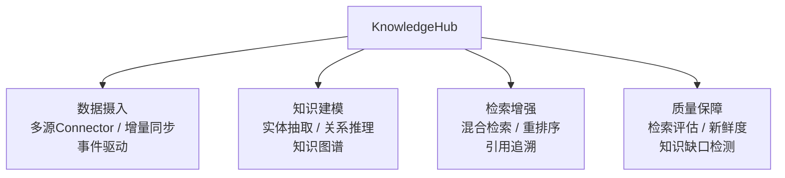

# 企业知识中枢平台（KnowledgeHub）· 项目总览

> **代号**：KnowledgeHub —— "让 Agent 基于企业真实知识回答，而不是编造"
>
> **核心问题**：你的 Agent 回答问题靠什么？如果没有企业知识图谱 + 实时数据管道 + 质量评估，Agent 只是一个会编故事的 LLM。

---

## 项目定位

---

## 四个 Sprint

| Sprint | 主题 | V1→V2→V3 演进 | 时间 |
|--------|------|--------------|------|
| 1 | 知识摄入与建模 | 手动导入 → 多源Connector → 事件驱动实时同步 | 1.5 周 |
| 2 | 知识图谱构建 | 实体抽取 → 关系推理 → 图谱合并与消歧 | 1 周 |
| 3 | 混合检索增强 | 向量检索 → 混合检索 + 重排序 + 引用追溯 | 1 周 |
| 4 | 知识质量与治理 | 质量报告 → 知识缺口检测 → 自动补全 + 看板 | 1 周 |

---

## 核心特性

- **多源知识摄入**：文件 / 数据库 / API / Wiki / Confluence——统一 Connector 抽象
- **事件驱动实时同步**：Kafka / CDC 监听，Agent 能拿到"最新"知识
- **实体关系图谱**：LLM 抽取实体 + 关系，构建企业知识图谱
- **混合检索**：向量语义检索 + 关键词 BM25 + 知识图谱路径推理——三路融合
- **引用追溯**：每个回答标注来源文档 + 置信度，审计可追溯
- **知识新鲜度**：FRESH / AGING / STALE / OUTDATED 自动标注，过期知识自动标记
- **知识缺口检测**：用户问了但知识库覆盖不足的问题，自动发现并通知

---

## 知识映射

| 知识点 | 对应教程 |
|--------|---------|
| RAG 基础 | [10-RAG知识增强](../../阶段3-工程化/10-RAG知识增强.md) |
| 知识管理与 RAG 评估 | [25-知识管理与RAG评估](../../阶段4-生产化/25-知识管理与RAG评估.md) |
| Agent 性能调优 | [21-Agent性能调优](../../阶段4-生产化/21-Agent性能调优.md) |
| LLM 成本工程 | [28-LLM成本工程深入](../../阶段4-生产化/28-LLM成本工程深入.md) |
| 多租户数据隔离 | [18-多租户数据隔离](../../阶段4-生产化/18-多租户数据隔离.md) |
| Agent 可解释性 | [30-Agent可解释性与对齐](../../阶段4-生产化/30-Agent可解释性与对齐.md) |

---

## 技术选型说明

| 决策 | 选择 | 原因 |
|------|------|------|
| 流式输出 | **SSE** | 企业级标准，原生 EventSource 自动重连，HTTP 兼容 |
| 向量数据库 | pgvector / Milvus | pgvector 易部署，Milvus 大规模 |
| 知识图谱 | Neo4j / Apache AGE | 成熟图数据库，Cypher 查询 |
| 事件驱动 | Kafka / Debezium CDC | 增量同步，解耦 |
| 全文检索 | Elasticsearch / Postgres FTS | BM25 打分 |

---

## 下一步

→ [Sprint 1：知识摄入与建模](Sprint1-知识摄入.md)
