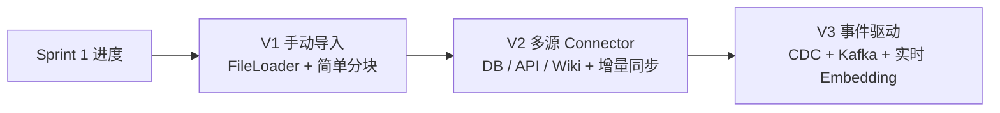
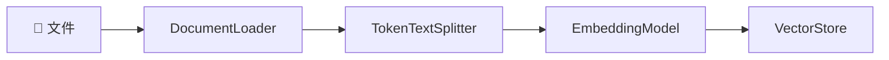
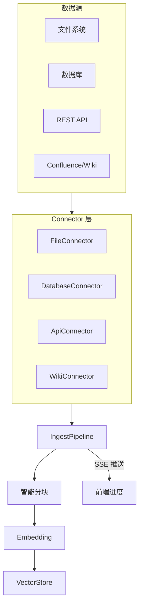
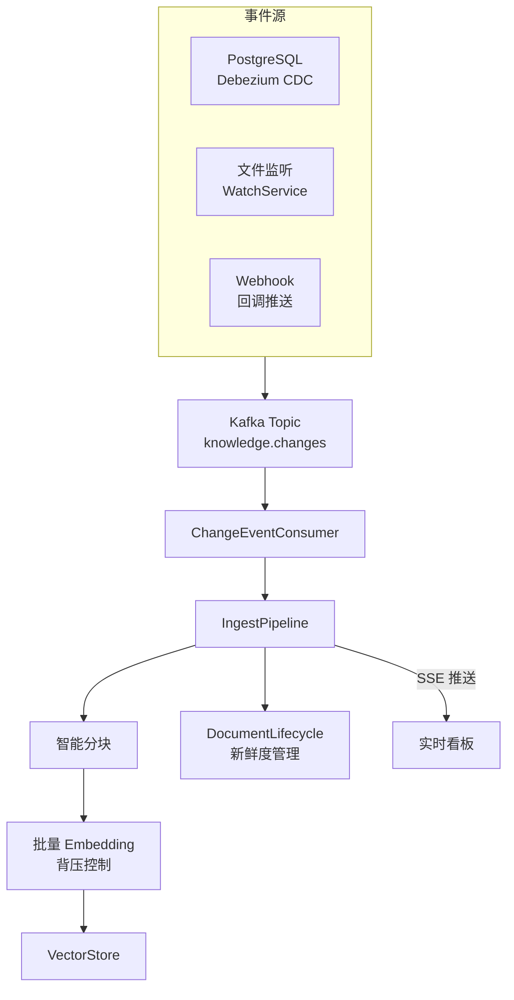
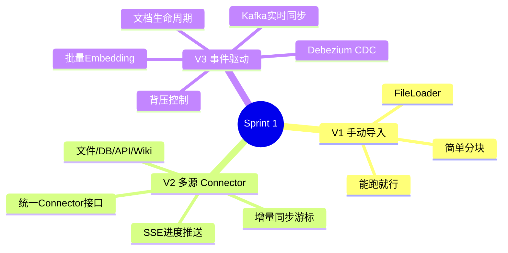

# Sprint 1：知识摄入与建模

> **目标**：把企业散落的知识（文档 / 数据库 / Wiki）统一摄入到知识库，建立文档生命周期管理。
>
> **SSE 约束**：摄入进度推送使用 SSE（而非 WebSocket），因为摄入是单向通知场景。

---

## Sprint 概览



---

## V1：手动文件导入（~40 行）

### 需求

用户上传一个 PDF / Markdown，系统自动分块、Embedding、存入向量库。

### 架构



### 代码

```java
// V1: 最简知识导入 — 30行能跑
@RestController
public class IngestController {

    private final ChatClient chatClient;
    private final VectorStore vectorStore; // Spring AI 自动配置的 pgvector

    public IngestController(ChatClient chatClient, VectorStore vectorStore) {
        this.chatClient = chatClient;
        this.vectorStore = vectorStore;
    }

    @PostMapping("/ingest/file")
    public String ingestFile(@RequestParam("file") MultipartFile file) throws IOException {
        // 1. 读取文档
        var docs = new TokenTextSplitter().apply(
            List.of(new Document(file.getOriginalFilename(),
                new String(file.getBytes()),
                Map.of("source", file.getOriginalFilename(),
                       "uploadedAt", Instant.now().toString())))
        );
        // 2. 写入向量库
        vectorStore.add(docs);
        return "已导入 " + docs.size() + " 个分块";
    }

    @GetMapping("/chat")
    public String chat(@RequestParam String q) {
        return chatClient.prompt()
            .user(q)
            .advisors(new QuestionAnswerAdvisor(vectorStore)) // RAG 自动注入
            .call()
            .content();
    }
}
```

### 运行效果

```
POST /ingest/file  → 上传 company-handbook.pdf → "已导入 47 个分块"
GET  /chat?q=年假政策 → "根据《员工手册》第 3.2 节，年假天数为..."
```

### V1 的局限

- ❌ 只能手动上传文件，不能从数据库/API 同步
- ❌ 没有增量更新——改了文档要重新全量导入
- ❌ 没有进度反馈——大文件导入时用户只能等

---

## V2：多源 Connector + 增量同步

### 改进点

| 维度 | V1 | V2 |
|------|----|----|
| 数据源 | 仅文件 | 文件 + 数据库 + API + Wiki |
| 同步方式 | 手动触发 | 定时增量同步 |
| 进度反馈 | 无 | SSE 实时推送 |
| 文档管理 | 无 | 文档生命周期（FRESH / AGING / STALE） |

### 架构



### 核心：Connector 抽象

```java
/**
 * 统一知识源连接器接口
 */
public interface KnowledgeConnector {
    /** 连接器唯一标识 */
    String getId();
    /** 拉取文档（支持增量游标） */
    Flux<SourceDocument> fetch(DeltaCursor cursor);
    /** 当前游标位置（用于增量同步） */
    DeltaCursor currentCursor();
}

/**
 * 源文档：统一中间表示
 */
public record SourceDocument(
    String sourceId,       // 源系统文档ID
    String connectorId,    // 哪个Connector拉取的
    String title,
    String content,
    Map<String, Object> metadata,
    Instant updatedAt      // 用于增量同步
) {}

/**
 * 增量游标：记录上次同步位置
 */
public record DeltaCursor(
    String connectorId,
    Instant lastSyncAt,
    String lastDocumentId,
    int documentsProcessed
) {
    public DeltaCursor advance(SourceDocument doc) {
        return new DeltaCursor(connectorId, doc.updatedAt(),
            doc.sourceId(), documentsProcessed + 1);
    }
}
```

### 核心：文件 Connector

```java
@Component
public class FileConnector implements KnowledgeConnector {

    private final Path baseDir;
    private final DocumentReader reader;

    @Override
    public String getId() { return "file-connector"; }

    @Override
    public Flux<SourceDocument> fetch(DeltaCursor cursor) {
        try (var paths = Files.walk(baseDir)) {
            return Flux.fromStream(
                paths.filter(Files::isRegularFile)
                     .filter(p -> isModifiedAfter(p, cursor.lastSyncAt()))
                     .map(this::toSourceDocument)
            );
        } catch (IOException e) {
            return Flux.error(e);
        }
    }

    private SourceDocument toSourceDocument(Path path) {
        var doc = reader.read(path);
        return new SourceDocument(
            path.toString(), getId(), path.getFileName().toString(),
            doc.getText(),
            Map.of("path", path.toString(),
                   "size", path.toFile().length()),
            Files.getLastModifiedTime(path).toInstant()
        );
    }
}
```

### 核心：数据库 Connector（增量 CDC）

```java
@Component
public class DatabaseConnector implements KnowledgeConnector {

    private final JdbcTemplate jdbc;
    private final String query;  // SELECT id, title, content, updated_at FROM articles

    @Override
    public Flux<SourceDocument> fetch(DeltaCursor cursor) {
        // 增量查询：只拉取上次同步后有更新的记录
        return Flux.fromStream(
            jdbc.queryForStream(query + " WHERE updated_at > ?",
                (rs, rowNum) -> new SourceDocument(
                    "db-" + rs.getString("id"),
                    getId(),
                    rs.getString("title"),
                    rs.getString("content"),
                    Map.of("table", "articles"),
                    rs.getTimestamp("updated_at").toInstant()
                ),
                Timestamp.from(cursor.lastSyncAt())
            )
        );
    }
}
```

### 核心：IngestPipeline（带 SSE 进度推送）

```java
@Service
public class IngestPipeline {

    private final List<KnowledgeConnector> connectors;
    private final TokenTextSplitter splitter;
    private final VectorStore vectorStore;
    private final EmbeddingModel embeddingModel;

    /**
     * 全量同步：遍历所有 Connector
     * @return SSE 流，每处理完一个文档推送一次进度
     */
    public Flux<IngestProgress> syncAll() {
        return Flux.fromIterable(connectors)
            .flatMap(this::syncConnector);
    }

    private Flux<IngestProgress> syncConnector(KnowledgeConnector connector) {
        var cursor = DeltaCursor.initial(connector.getId());
        return connector.fetch(cursor)
            .map(this::processDocument)
            .map(doc -> new IngestProgress(
                connector.getId(), doc.sourceId(), "processed"))
            .onErrorResume(e -> Flux.just(
                new IngestProgress(connector.getId(), null, "error: " + e.getMessage())));
    }

    private SourceDocument processDocument(SourceDocument source) {
        var chunks = splitter.apply(
            List.of(new Document(source.title() + "\n" + source.content(),
                source.metadata())));
        var documents = chunks.stream()
            .map(c -> new Document(c.getText(),
                enrichMetadata(c.getMetadata(), source)))
            .toList();
        vectorStore.add(documents);
        return source;
    }

    private Map<String, Object> enrichMetadata(
            Map<String, Object> original, SourceDocument source) {
        var enriched = new HashMap<>(original);
        enriched.put("sourceId", source.sourceId());
        enriched.put("connectorId", source.connectorId());
        enriched.put("freshness", "FRESH");
        enriched.put("ingestedAt", Instant.now().toString());
        return enriched;
    }
}

public record IngestProgress(String connectorId, String documentId, String status) {}
```

### 核心：SSE 进度推送 Controller

```java
@RestController
@RequestMapping("/api/knowledge")
public class IngestController {

    private final IngestPipeline pipeline;

    @GetMapping(value = "/ingest/stream", produces = MediaType.TEXT_EVENT_STREAM_VALUE)
    public Flux<ServerSentEvent<IngestProgress>> streamIngest() {
        return pipeline.syncAll()
            .map(p -> ServerSentEvent.<IngestProgress>builder()
                .id(p.connectorId() + ":" + p.documentId())
                .event("progress")
                .data(p)
                .build());
    }
}
```

### V2 的局限

- ❌ 没有事件驱动——仍然是定时/手动触发
- ❌ 大规模数据导入时没有批处理优化
- ❌ 没有文档新鲜度自动管理

---

## V3：事件驱动实时同步 + 文档生命周期

### 改进点

| 维度 | V2 | V3 |
|------|----|----|
| 触发方式 | 定时/手动 | CDC 事件驱动（Debezium / Kafka） |
| 实时性 | 分钟级 | 秒级 |
| 文档管理 | 手动标记新鲜度 | 自动新鲜度 + 过期检测 + 看板 |
| 批处理 | 无 | 批量 Embedding + 背压控制 |

### 架构



### 核心：CDC 事件监听

```java
@Component
public class ChangeEventConsumer {

    private final IngestPipeline pipeline;
    private final DocumentLifecycleManager lifecycle;

    @KafkaListener(topics = "knowledge.changes")
    public void handleChange(ChangeEnvelope envelope) {
        switch (envelope.op()) {
            case INSERT, UPDATE -> pipeline.ingestIncremental(envelope);
            case DELETE -> pipeline.removeDocument(envelope.documentId());
        }
        lifecycle.touchDocument(envelope.documentId());
    }
}

public record ChangeEnvelope(
    String connectorId,
    String documentId,
    Op op,  // INSERT / UPDATE / DELETE
    Map<String, Object> before,
    Map<String, Object> after,
    Instant timestamp
) {
    public enum Op { INSERT, UPDATE, DELETE }
}
```

### 核心：文档生命周期管理

```java
@Service
public class DocumentLifecycleManager {

    private final VectorStore vectorStore;
    private final Clock clock;

    /**
     * 评估文档新鲜度
     * FRESH:    < 30天
     * AGING:    30-90天
     * STALE:    90-180天
     * OUTDATED: > 180天
     */
    public FreshnessLevel evaluateFreshness(String documentId) {
        var docs = vectorStore.similaritySearch(
            SearchRequest.builder()
                .query("__metadata__")
                .topK(1)
                .filterExpression("sourceId == '" + documentId + "'")
                .build());

        if (docs.isEmpty()) return FreshnessLevel.UNKNOWN;

        var ingestedAt = Instant.parse(
            docs.get(0).getMetadata().get("ingestedAt").toString());
        var ageDays = Duration.between(ingestedAt, clock.instant()).toDays();

        if (ageDays < 30) return FreshnessLevel.FRESH;
        if (ageDays < 90) return FreshnessLevel.AGING;
        if (ageDays < 180) return FreshnessLevel.STALE;
        return FreshnessLevel.OUTDATED;
    }

    /**
     * 批量扫描过期文档
     */
    public Flux<StaleDocument> scanStaleDocuments() {
        // 定时任务调用：每天扫描一次
        return vectorStore.search(SearchRequest.builder()
                .query("*")
                .topK(10000)
                .build())
            .filter(this::isStale)
            .map(doc -> new StaleDocument(
                doc.getMetadata().get("sourceId").toString(),
                evaluateFreshness(doc.getMetadata().get("sourceId").toString()),
                doc.getMetadata().get("sourceId").toString()));
    }

    private boolean isStale(Document doc) {
        return evaluateFreshness(
            doc.getMetadata().get("sourceId").toString())
            .ordinal() >= FreshnessLevel.STALE.ordinal();
    }
}

public enum FreshnessLevel {
    FRESH, AGING, STALE, OUTDATED, UNKNOWN
}
```

### 核心：批量 Embedding + 背压

```java
@Service
public class BatchEmbeddingService {

    private final EmbeddingModel embeddingModel;
    private final int batchSize = 100; // 每批100条

    /**
     * 批量 Embedding + 背压控制
     * 使用 Reactor 的 buffer + concatMap 控制并发
     */
    public Flux<Document> batchEmbed(Flux<SourceDocument> source) {
        return source
            .buffer(batchSize)
            .concatMap(this::processBatch);
    }

    private Flux<Document> processBatch(List<SourceDocument> batch) {
        var texts = batch.stream()
            .map(s -> s.title() + "\n" + s.content())
            .toList();

        // 批量 Embedding，减少 API 调用
        var embeddings = embeddingModel.embedForResponse(texts);

        return Flux.fromStream(
            IntStream.range(0, batch.size()).mapToObj(i ->
                new Document(texts.get(i),
                    Map.of("embedding_model", embeddings.getMetadata().model(),
                           "sourceId", batch.get(i).sourceId(),
                           "connectorId", batch.get(i).connectorId(),
                           "ingestedAt", Instant.now().toString(),
                           "freshness", "FRESH")))
        );
    }
}
```

---

## 完整 Sprint 回顾



---

## 下一步

→ [Sprint 2：知识图谱构建](Sprint2-知识图谱.md)
