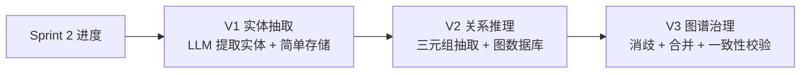
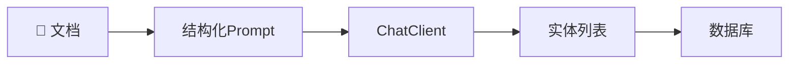
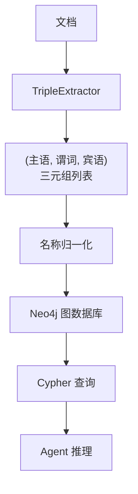
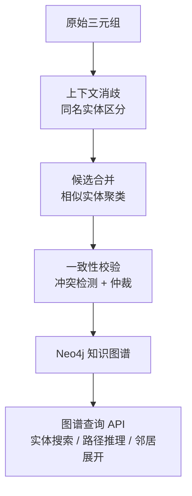
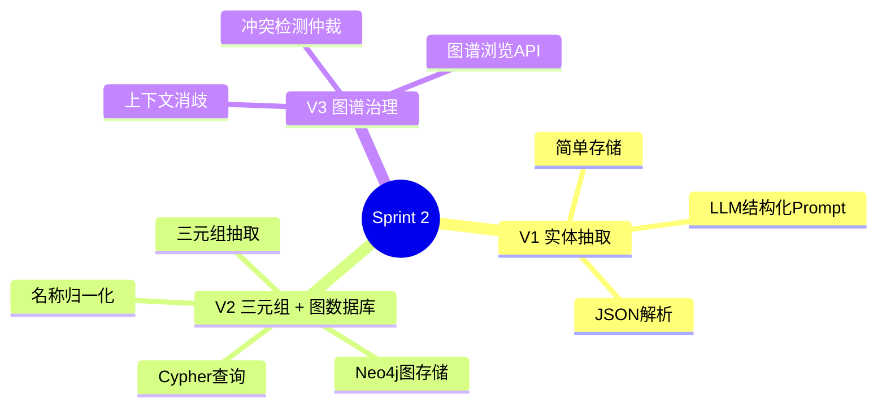

# Sprint 2：知识图谱构建

> **目标**：从非结构化文档中抽取实体和关系，构建企业知识图谱，让 Agent 能做关系推理。
>
> **技术选型**：使用 Neo4j（或 Apache AGE for Postgres）作为图数据库。

---

## Sprint 概览



---

## V1：LLM 实体抽取（~50 行）

### 需求

给定一段文档，用 LLM 抽取关键实体（人名、公司名、项目名等），存入数据库。

### 架构



### 代码

```java
// V1: LLM 抽取实体
@Service
public class EntityExtractionService {

    private final ChatClient chatClient;

    private static final String EXTRACTION_PROMPT = """
        从以下文档中抽取关键实体。

        文档内容：
        {content}

        请返回 JSON 数组，每个实体包含：
        - name: 实体名称
        - type: 实体类型（PERSON / ORGANIZATION / PROJECT / TECHNOLOGY / LOCATION）
        - mentions: 文中提及次数

        只返回 JSON，不要其他文字。
        """;

    public List<ExtractedEntity> extract(Document doc) {
        var json = chatClient.prompt()
            .user(u -> u.text(EXTRACTION_PROMPT).param("content", doc.getText()))
            .call()
            .content();

        return parseEntities(json);
    }

    private List<ExtractedEntity> parseEntities(String json) {
        try {
            return new ObjectMapper().readValue(json,
                new TypeReference<List<ExtractedEntity>>() {});
        } catch (Exception e) {
            return List.of();
        }
    }
}

public record ExtractedEntity(String name, String type, int mentions) {}
```

### V1 的局限

- ❌ 只抽取实体，没有关系
- ❌ 没有去重——同一个人在不同文档中会被重复抽取
- ❌ 没有存入图数据库——无法做关系推理

---

## V2：三元组抽取 + 图数据库

### 改进点

| 维度 | V1 | V2 |
|------|----|----|
| 抽取内容 | 仅实体 | 实体 + 关系（三元组） |
| 存储 | 关系型数据库 | Neo4j 图数据库 |
| 查询 | SQL 模糊匹配 | Cypher 图查询 |
| 去重 | 无 | 基础名称归一化 |

### 架构



### 核心：三元组抽取

```java
@Service
public class TripleExtractor {

    private final ChatClient chatClient;

    private static final String TRIPLE_PROMPT = """
        从以下文档中抽取知识三元组（主语-谓词-宾语）。

        文档内容：
        {content}

        规则：
        1. 每个三元组描述一个事实
        2. 谓词使用统一格式：WORKS_AT / MANAGES / DEVELOPED / USES / LOCATED_IN 等
        3. 主语和宾语附带类型标注

        返回 JSON 数组：
        [{"subject": {"name": "...", "type": "..."},
          "predicate": "...",
          "object": {"name": "...", "type": "..."},
          "confidence": 0.95}]

        只返回 JSON。
        """;

    public List<KnowledgeTriple> extractTriples(Document doc) {
        var json = chatClient.prompt()
            .user(u -> u.text(TRIPLE_PROMPT).param("content", doc.getText()))
            .call()
            .content();

        return parseTriples(json);
    }
}

public record KnowledgeTriple(
    EntityRef subject,
    String predicate,
    EntityRef object,
    double confidence
) {}

public record EntityRef(String name, String type) {}
```

### 核心：Neo4j 图存储

```java
@Repository
public class KnowledgeGraphRepository {

    private final Neo4jClient neo4j;

    /**
     * 写入三元组到图数据库
     * 使用 MERGE 避免重复创建节点和关系
     */
    public void saveTriple(KnowledgeTriple triple) {
        var cypher = """
            MERGE (s:Entity {name: $subjectName, type: $subjectType})
            MERGE (o:Entity {name: $objectName, type: $objectType})
            MERGE (s)-[r:RELATES {predicate: $predicate}]->(o)
            ON CREATE SET r.confidence = $confidence,
                          r.createdAt = datetime(),
                          r.source = $source
            ON MATCH SET r.confidence = CASE WHEN $confidence > r.confidence
                                    THEN $confidence ELSE r.confidence END,
                        r.updatedAt = datetime()
            """;

        neo4j.query(cypher)
            .bind(triple.subject().name()).to("subjectName")
            .bind(triple.subject().type()).to("subjectType")
            .bind(triple.object().name()).to("objectName")
            .bind(triple.object().type()).to("objectType")
            .bind(triple.predicate()).to("predicate")
            .bind(triple.confidence()).to("confidence")
            .run();
    }

    /**
     * 图查询：查找实体的所有关系
     */
    public List<Map<String, Object>> findRelations(String entityName, int depth) {
        var cypher = """
            MATCH path = (e:Entity {name: $name})-[:RELATES*1..%d]-(related)
            RETURN nodes(path) as nodes, relationships(path) as rels
            """.formatted(depth);

        return neo4j.query(cypher)
            .bind(entityName).to("name")
            .fetch()
            .all()
            .stream().toList();
    }

    /**
     * 路径推理：从 A 到 B 的关系路径
     */
    public List<Map<String, Object>> findPath(String fromEntity, String toEntity) {
        var cypher = """
            MATCH path = shortestPath(
                (a:Entity {name: $from})-[:RELATES*..5]-(b:Entity {name: $to})
            )
            RETURN [n IN nodes(path) | n.name] as entityPath,
                   [r IN relationships(path) | r.predicate] as relationPath
            """;

        return neo4j.query(cypher)
            .bind(fromEntity).to("from")
            .bind(toEntity).to("to")
            .fetch()
            .all()
            .stream().toList();
    }
}
```

### 核心：名称归一化

```java
@Service
public class EntityNormalizer {

    /**
     * 归一化实体名称：
     * "张三（架构师）" → "张三"
     * "AI客服平台" / "客服平台" → 映射到同一实体
     */
    public EntityRef normalize(EntityRef raw) {
        var normalizedName = raw.name()
            .replaceAll("[（(].*?[)）]", "")    // 去括号注释
            .replaceAll("\\s+", "")              // 去空白
            .trim();

        // 查别名表
        var canonical = aliasMap.getOrDefault(normalizedName, normalizedName);
        return new EntityRef(canonical, raw.type());
    }

    // 别名映射（可从数据库加载）
    private final Map<String, String> aliasMap = Map.of(
        "客服平台", "AgentForge",
        "知识中枢", "KnowledgeHub",
        "DeepSeek", "DeepSeek AI"
    );
}
```

### V2 的局限

- ❌ 不同文档抽取的三元组可能有冲突
- ❌ 实体消歧不够智能——"李四"可能是不同的人
- ❌ 没有一致性校验

---

## V3：图谱治理——消歧 + 合并 + 一致性

### 改进点

| 维度 | V2 | V3 |
|------|----|----|
| 消歧 | 名称匹配 | 上下文感知消歧（同名不同实体） |
| 合并 | 手动 | 自动检测候选合并 + 人工确认 |
| 一致性 | 无 | 冲突检测 + 置信度仲裁 |
| 可视化 | 无 | 图谱浏览 + 关系搜索 API |

### 架构



### 核心：上下文感知消歧

```java
@Service
public class EntityDisambiguator {

    private final ChatClient chatClient;
    private final KnowledgeGraphRepository graphRepo;

    /**
     * 消歧：判断这个"张三"是数据库里的哪个"张三"
     * 通过上下文线索区分同名实体
     */
    public String disambiguate(EntityRef entity, String documentContext) {
        // 查找图数据库中所有同名实体
        var candidates = graphRepo.findByName(entity.name());

        if (candidates.size() <= 1) return entity.name(); // 无歧义

        // 用 LLM 根据文档上下文判断最可能的实体
        var prompt = """
            文档上下文：{context}
            同名实体候选（含各自关联实体）：
            {candidates}

            请判断这段文档中的"{name}"最可能指哪个实体。
            返回实体ID。如果无法确定，返回 "AMBIGUOUS"。
            """;

        var result = chatClient.prompt()
            .user(u -> u.text(prompt)
                .param("context", documentContext)
                .param("candidates", formatCandidates(candidates))
                .param("name", entity.name()))
            .call()
            .content()
            .trim();

        return "AMBIGUOUS".equals(result) ? entity.name() : result;
    }
}
```

### 核心：冲突检测

```java
@Service
public class GraphConsistencyChecker {

    /**
     * 检测冲突关系
     * 例：A WORKS_AT CompanyX (confidence=0.9) vs A WORKS_AT CompanyY (confidence=0.6)
     */
    public List<GraphConflict> detectConflicts() {
        var cypher = """
            MATCH (s:Entity)-[r1:RELATES]->(o1:Entity),
                  (s)-[r2:RELATES]->(o2:Entity)
            WHERE r1.predicate = r2.predicate
              AND o1.name <> o2.name
              AND r1.predicate IN ['WORKS_AT', 'MANAGES', 'CEO_OF',
                                   'LOCATED_IN', 'BORN_IN']
            RETURN s.name as entity,
                   r1.predicate as predicate,
                   o1.name as value1, r1.confidence as conf1,
                   o2.name as value2, r2.confidence as conf2
            """;

        return neo4j.query(cypher)
            .fetch()
            .all()
            .map(row -> new GraphConflict(
                (String) row.get("entity"),
                (String) row.get("predicate"),
                row.get("value1") + " (" + row.get("conf1") + ")",
                row.get("value2") + " (" + row.get("conf2") + ")"
            ))
            .stream()
            .toList();
    }

    /**
     * 仲裁：保留高置信度的关系，标记低置信度的为已废弃
     */
    public void resolveConflict(GraphConflict conflict) {
        // 保留 confidence 更高的，删除或降低另一个
        // 实现省略...
    }
}
```

### 核心：图谱浏览 API

```java
@RestController
@RequestMapping("/api/graph")
public class GraphController {

    private final KnowledgeGraphRepository graphRepo;

    @GetMapping("/search")
    public List<Map<String, Object>> search(
            @RequestParam String q,
            @RequestParam(defaultValue = "3") int depth) {
        return graphRepo.findRelations(q, depth);
    }

    @GetMapping("/path")
    public List<Map<String, Object>> path(
            @RequestParam String from,
            @RequestParam String to) {
        return graphRepo.findPath(from, to);
    }

    @GetMapping("/neighbors/{entity}")
    public List<Map<String, Object>> neighbors(@PathVariable String entity) {
        return graphRepo.findRelations(entity, 1);
    }
}
```

---

## 完整 Sprint 回顾



---

## 下一步

→ [Sprint 3：混合检索增强](Sprint3-混合检索.md)
