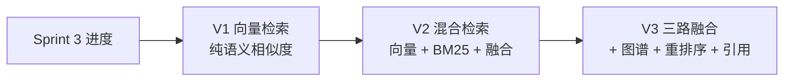
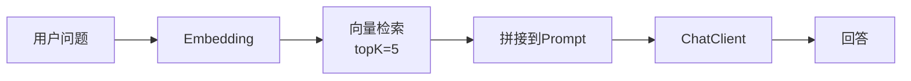
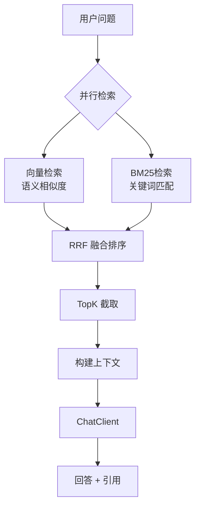
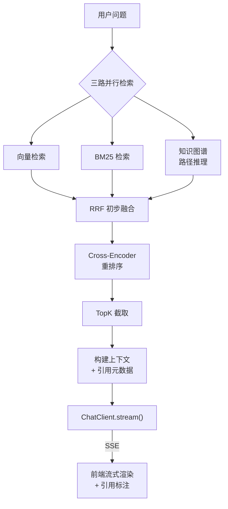
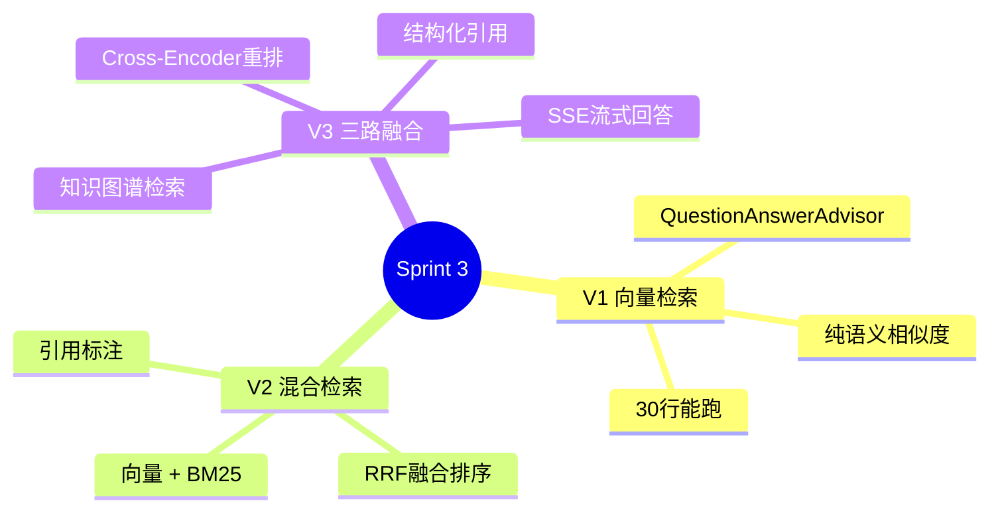

# Sprint 3：混合检索增强

> **目标**：在向量语义检索的基础上，融合关键词检索（BM25）和知识图谱路径推理，实现三路融合检索 + 重排序 + 引用追溯。
>
> **SSE 约束**：检索过程流式返回使用 SSE。

---

## Sprint 概览



---

## V1：纯向量检索（~30 行）

### 架构



### 代码

```java
// V1: 最简 RAG — 纯向量检索
@RestController
public class SimpleRagController {

    private final ChatClient chatClient;
    private final VectorStore vectorStore;

    @GetMapping("/ask")
    public String ask(@RequestParam String question) {
        return chatClient.prompt()
            .user(question)
            .advisors(new QuestionAnswerAdvisor(vectorStore,
                SearchRequest.builder().topK(5).build()))
            .call()
            .content();
    }
}
```

### V1 的局限

- ❌ 纯语义检索，关键词精确匹配差（如产品型号 "SKU-12345"）
- ❌ 没有引用——用户不知道答案从哪来
- ❌ 单路检索，召回率有限

---

## V2：混合检索（向量 + BM25）

### 改进点

| 维度 | V1 | V2 |
|------|----|----|
| 检索路径 | 纯向量 | 向量 + BM25 关键词 |
| 融合策略 | 无 | Reciprocal Rank Fusion (RRF) |
| 引用追溯 | 无 | 每个回答标注来源 |
| 可解释性 | 无 | 检索调试 API |

### 架构



### 核心：BM25 检索器

```java
@Service
public class BM25Searcher {

    private final ElasticsearchClient esClient;

    /**
     * BM25 关键词检索
     * 适合精确匹配：产品型号、人名、错误码等
     */
    public List<SearchHit> search(String query, int topK) {
        var response = esClient.search(s -> s
            .index("knowledge")
            .query(q -> q.multiMatch(m -> m
                .query(query)
                .fields("title^3", "content")
                .fuzziness("AUTO")))
            .size(topK),
            Map.class);

        return response.hits().hits().stream()
            .map(hit -> new SearchHit(
                hit.id(),
                hit.source().get("content").toString(),
                hit.score().doubleValue()))
            .toList();
    }
}

public record SearchHit(String id, String content, double score) {}
```

### 核心：RRF 融合排序

```java
@Service
public class HybridRetriever {

    private final VectorStore vectorStore;   // 向量检索
    private final BM25Searcher bm25Searcher;  // 关键词检索

    /**
     * Reciprocal Rank Fusion
     * 将多路检索结果按排名融合，避免不同打分体系的差异
     */
    public List<RetrievedDoc> hybridSearch(String query, int topK) {
        // 1. 并行检索
        var vectorResults = vectorSearch(query, topK * 2);
        var bm25Results = bm25Searcher.search(query, topK * 2);

        // 2. RRF 融合
        var k = 60; // RRF 常数
        var fusedScores = new HashMap<String, Double>();
        var docMap = new HashMap<String, RetrievedDoc>();

        // 向量结果按排名计分
        for (int i = 0; i < vectorResults.size(); i++) {
            var doc = vectorResults.get(i);
            var score = 1.0 / (k + i + 1);
            fusedScores.merge(doc.id(), score, Double::sum);
            docMap.put(doc.id(), doc);
        }

        // BM25 结果按排名计分
        for (int i = 0; i < bm25Results.size(); i++) {
            var doc = bm25Results.get(i);
            var score = 1.0 / (k + i + 1);
            fusedScores.merge(doc.id(), score, Double::sum);
            // 如果向量检索没找到，也要加入
            docMap.putIfAbsent(doc.id(), doc);
        }

        // 3. 按融合分数排序，取 topK
        return fusedScores.entrySet().stream()
            .sorted(Map.Entry.<String, Double>comparingByValue().reversed())
            .limit(topK)
            .map(e -> {
                var doc = docMap.get(e.getKey());
                return doc.withFusedScore(e.getValue());
            })
            .toList();
    }

    private List<RetrievedDoc> vectorSearch(String query, int topK) {
        return vectorStore.similaritySearch(
                SearchRequest.builder().query(query).topK(topK).build())
            .stream()
            .map(doc -> new RetrievedDoc(
                doc.getMetadata().get("sourceId").toString(),
                doc.getText(),
                doc.getMetadata(),
                "vector"))
            .toList();
    }
}

public record RetrievedDoc(
    String id, String content,
    Map<String, Object> metadata,
    String source) {
    public RetrievedDoc withFusedScore(double score) {
        var meta = new HashMap<>(metadata);
        meta.put("fusedScore", score);
        return new RetrievedDoc(id, content, meta, source);
    }
}
```

### 核心：带引用的回答

```java
@Service
public class CitedAnswerService {

    private final ChatClient chatClient;
    private final HybridRetriever retriever;

    private static final String CITED_PROMPT = """
        根据以下检索到的知识回答问题。

        知识来源：
        {context}

        问题：{question}

        要求：
        1. 只基于提供的知识回答，不要编造
        2. 在回答中用 [1]、[2] 等标注引用来源
        3. 如果知识不足以回答，说"根据现有知识库，我无法回答这个问题"

        来源列表：
        {sources}
        """;

    public CitedAnswer answer(String question) {
        // 1. 混合检索
        var docs = retriever.hybridSearch(question, 5);

        // 2. 构建带编号的上下文
        var context = new StringBuilder();
        var sources = new StringBuilder();
        for (int i = 0; i < docs.size(); i++) {
            context.append(String.format("[%d] %s\n\n", i + 1, docs.get(i).content()));
            sources.append(String.format("[%d] %s (score=%.4f)\n",
                i + 1,
                docs.get(i).metadata().get("sourceId"),
                docs.get(i).metadata().get("fusedScore")));
        }

        // 3. 生成回答
        var answer = chatClient.prompt()
            .user(u -> u.text(CITED_PROMPT)
                .param("context", context)
                .param("question", question)
                .param("sources", sources))
            .call()
            .content();

        return new CitedAnswer(answer, docs);
    }
}

public record CitedAnswer(String answer, List<RetrievedDoc> sources) {}
```

### V2 的局限

- ❌ 只有两路检索，缺少关系推理
- ❌ 没有重排序模型——RRF 是排序融合，不是语义重排
- ❌ 检索质量没有量化评估

---

## V3：三路融合 + 重排序 + 引用追溯

### 改进点

| 维度 | V2 | V3 |
|------|----|----|
| 检索路径 | 向量 + BM25 | 向量 + BM25 + **知识图谱路径** |
| 重排序 | RRF 融合 | RRF + **Cross-Encoder 重排序** |
| 引用 | 文本标注 | 结构化引用 + 置信度 + 片段定位 |
| 流式 | 同步返回 | SSE 流式返回 |

### 架构



### 核心：知识图谱检索

```java
@Service
public class GraphRetriever {

    private final KnowledgeGraphRepository graphRepo;
    private final ChatClient chatClient;

    /**
     * 从问题中提取实体，然后在知识图谱中查找关系路径
     */
    public List<RetrievedDoc> search(String query, int topK) {
        // 1. LLM 从问题中提取查询实体
        var entities = extractQueryEntities(query);

        // 2. 在图谱中查找每个实体的一跳邻居
        var results = new ArrayList<RetrievedDoc>();
        for (var entity : entities) {
            var relations = graphRepo.findRelations(entity, 2);
            for (var rel : relations) {
                var content = formatGraphRelation(rel);
                results.add(new RetrievedDoc(
                    "graph:" + entity,
                    content,
                    Map.of("source", "knowledge_graph",
                           "entity", entity,
                           "fusedScore", 0.5),
                    "graph"
                ));
            }
        }

        return results.stream().limit(topK).toList();
    }

    private List<String> extractQueryEntities(String query) {
        var prompt = """
            从问题中提取关键实体名称（用于知识图谱查询）。
            问题：{query}
            只返回实体名称列表，JSON 数组格式。
            """;
        var json = chatClient.prompt()
            .user(u -> u.text(prompt).param("query", query))
            .call().content();
        return parseEntityList(json);
    }
}
```

### 核心：Cross-Encoder 重排序

```java
@Service
public class Reranker {

    private final ChatClient chatClient;

    /**
     * Cross-Encoder 重排序
     * LLM 直接对每个 (query, doc) 对打相关性分数
     */
    public List<RetrievedDoc> rerank(String query,
            List<RetrievedDoc> candidates, int topK) {

        var scored = candidates.stream()
            .map(doc -> {
                var score = scoreRelevance(query, doc);
                return Map.entry(doc, score);
            })
            .sorted(Map.Entry.<RetrievedDoc, Double>comparingByValue()
                .reversed())
            .limit(topK)
            .map(e -> e.getKey().withFusedScore(e.getValue()))
            .toList();

        return scored;
    }

    /**
     * 用 LLM 评估 query 与 doc 的相关性（0-1）
     */
    private double scoreRelevance(String query, RetrievedDoc doc) {
        var prompt = """
            评估以下文档与问题的相关性。

            问题：{query}
            文档：{doc}

            返回一个 0 到 1 的数字：
            - 1.0 = 完全相关，文档直接回答了问题
            - 0.5 = 部分相关，文档提供了一些线索
            - 0.0 = 不相关

            只返回数字。
            """;
        var result = chatClient.prompt()
            .user(u -> u.text(prompt)
                .param("query", query)
                .param("doc", truncate(doc.content(), 500)))
            .call().content().trim();

        try { return Double.parseDouble(result); }
        catch (NumberFormatException e) { return 0.0; }
    }

    private String truncate(String s, int max) {
        return s.length() > max ? s.substring(0, max) + "..." : s;
    }
}
```

### 核心：三路融合 + 流式回答

```java
@Service
public class HybridRagService {

    private final HybridRetriever hybridRetriever;  // 向量 + BM25
    private final GraphRetriever graphRetriever;     // 知识图谱
    private final Reranker reranker;
    private final ChatClient chatClient;

    /**
     * 三路融合检索 + 重排序
     */
    public List<RetrievedDoc> retrieve(String query, int topK) {
        // 1. 三路并行检索
        var hybridResults = hybridRetriever.hybridSearch(query, topK * 3);
        var graphResults = graphRetriever.search(query, topK);

        // 2. 合并
        var merged = new ArrayList<>(hybridResults);
        merged.addAll(graphResults);

        // 3. Cross-Encoder 重排序
        return reranker.rerank(query, merged, topK);
    }

    /**
     * 流式回答（SSE）
     */
    public Flux<ServerSentEvent<String>> streamAnswer(String question) {
        var docs = retrieve(question, 5);
        var context = buildContextWithCitations(docs);
        var sources = buildSourceList(docs);

        var flux = chatClient.prompt()
            .user(u -> u.text("""
                根据以下知识回答问题。用 [1] [2] 标注引用。

                知识来源：
                {context}

                问题：{question}
                """)
                .param("context", context)
                .param("question", question))
            .stream()
            .content();

        // 先推送引用来源，再流式推送回答
        return Flux.concat(
            Flux.just(ServerSentEvent.<String>builder()
                .event("sources").data(sources).build()),
            flux.map(chunk -> ServerSentEvent.<String>builder()
                .event("answer").data(chunk).build()),
            Flux.just(ServerSentEvent.<String>builder()
                .event("done").data("[DONE]").build())
        );
    }
}
```

---

## 完整 Sprint 回顾



---

## 下一步

→ [Sprint 4：知识质量与治理](Sprint4-质量治理.md)
