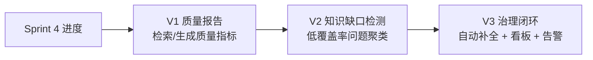
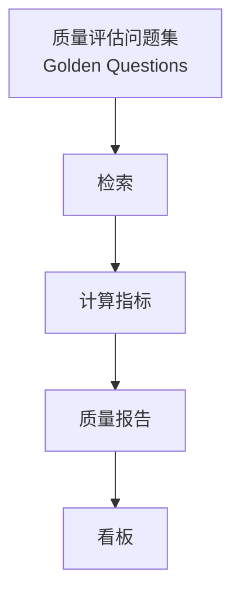
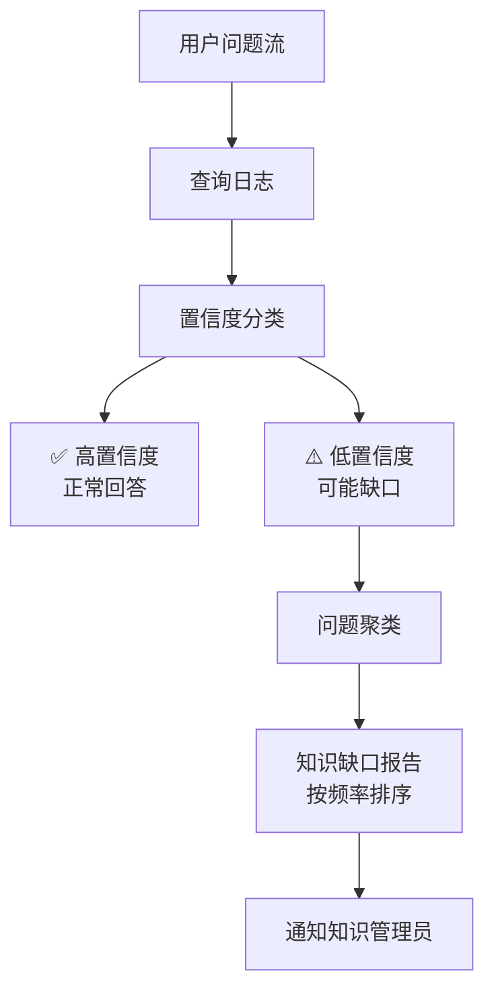
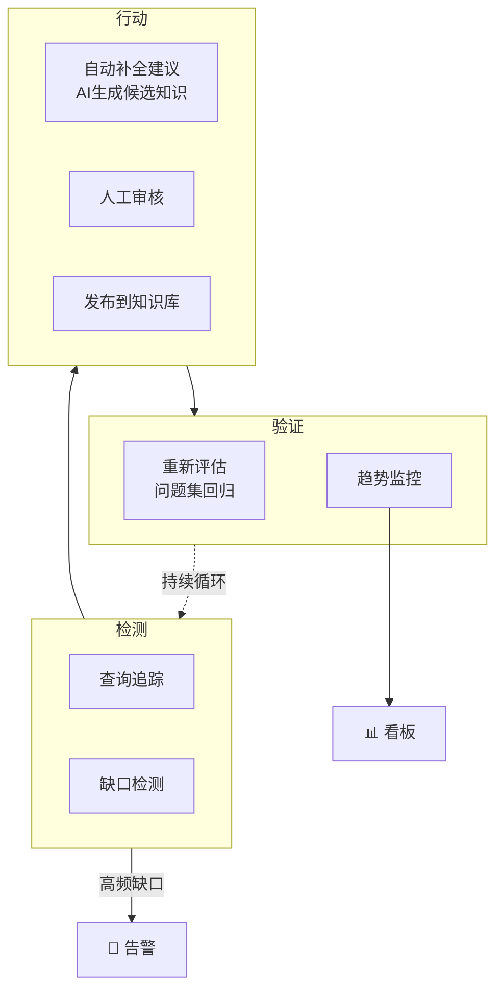
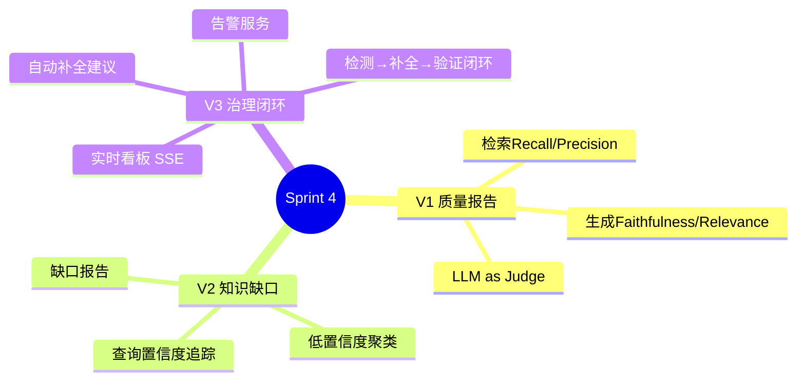
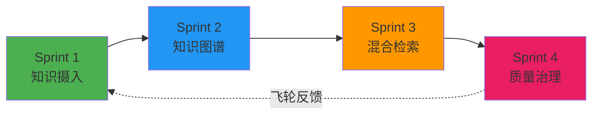

# Sprint 4：知识质量与治理

> **目标**：量化评估知识库质量，自动发现知识缺口，推动知识持续改进。
>
> **核心理念**：知识库不是"建一次就行"——它需要持续维护、评估、补全。

---

## Sprint 概览



---

## V1：RAG 质量评估

### 需求

每周生成知识库质量报告：检索精度、召回率、生成保真度。

### 架构



### 核心：RAG 质量评估器

```java
@Service
public class RagQualityEvaluator {

    private final HybridRagService ragService;
    private final ChatClient chatClient;

    /**
     * 评估检索质量：
     * - Recall@K: 相关文档是否在 topK 中
     * - Precision@K: topK 中有多少相关
     */
    public RetrievalMetrics evaluateRetrieval(
            List<QaPair> goldenSet, int k) {
        int hits = 0;
        int totalRelevant = 0;

        for (var qa : goldenSet) {
            var retrieved = ragService.retrieve(qa.question(), k);
            var relevantIds = new HashSet<>(qa.relevantDocIds());

            totalRelevant += relevantIds.size();
            hits += (int) retrieved.stream()
                .filter(d -> relevantIds.contains(d.id()))
                .count();
        }

        return new RetrievalMetrics(
            (double) hits / totalRelevant,           // recall
            (double) hits / (goldenSet.size() * k),  // precision
            k);
    }

    /**
     * 评估生成质量（LLM as Judge）：
     * - Faithfulness: 回答是否忠于检索到的知识（不编造）
     * - Relevance: 回答是否切题
     */
    public GenerationMetrics evaluateGeneration(List<QaPair> goldenSet) {
        double totalFaithfulness = 0;
        double totalRelevance = 0;

        for (var qa : goldenSet) {
            var answer = ragService.generateAnswer(qa.question());

            var scores = judgeWithLlm(qa.question(), answer, qa.expectedAnswer());
            totalFaithfulness += scores.faithfulness();
            totalRelevance += scores.relevance();
        }

        var n = goldenSet.size();
        return new GenerationMetrics(totalFaithfulness / n, totalRelevance / n);
    }

    private JudgeScore judgeWithLlm(String question,
            String answer, String expected) {
        var prompt = """
            评估以下回答：

            问题：{question}
            回答：{answer}
            参考答案：{expected}

            请从两个维度打分（0-1）：
            1. faithfulness: 回答是否忠于事实，没有编造
            2. relevance: 回答是否切题

            返回 JSON：{{"faithfulness": 0.9, "relevance": 0.8}}
            """;
        var json = chatClient.prompt()
            .user(u -> u.text(prompt)
                .param("question", question)
                .param("answer", answer)
                .param("expected", expected))
            .call().content();
        return parseScore(json);
    }
}

public record QaPair(String question, String expectedAnswer,
                     List<String> relevantDocIds) {}
public record RetrievalMetrics(double recall, double precision, int k) {}
public record GenerationMetrics(double faithfulness, double relevance) {}
public record JudgeScore(double faithfulness, double relevance) {}
```

### V1 的局限

- ❌ 只能评估"已知问题"——用户问的新问题没有被评估
- ❌ 没有知识缺口检测——不知道哪些话题覆盖不足
- ❌ 报告是静态的——不能实时监控

---

## V2：知识缺口检测

### 改进点

| 维度 | V1 | V2 |
|------|----|----|
| 评估范围 | 预设问题集 | 真实用户问题流 |
| 缺口发现 | 无 | 自动聚类低置信度问题 |
| 优先级 | 无 | 按频率 + 影响排序 |
| 反馈 | 无 | 缺口报告通知知识管理员 |

### 架构



### 核心：查询置信度追踪

```java
@Service
public class QueryConfidenceTracker {

    private final List<QueryRecord> recentQueries =
        Collections.synchronizedList(new ArrayList<>());

    /**
     * 记录每次检索的置信度
     */
    public void record(String question,
            List<RetrievedDoc> retrieved, String answer) {
        var avgScore = retrieved.stream()
            .mapToDouble(d -> (Double) d.metadata().get("fusedScore"))
            .average().orElse(0);

        recentQueries.add(new QueryRecord(
            question,
            avgScore,
            retrieved.size(),
            Instant.now(),
            isLowConfidence(avgScore, retrieved.size())
        ));

        // 滑动窗口：保留最近 10000 条
        if (recentQueries.size() > 10000) {
            recentQueries.subList(0, recentQueries.size() - 10000).clear();
        }
    }

    private boolean isLowConfidence(double avgScore, int retrievedCount) {
        return avgScore < 0.3 || retrievedCount == 0;
    }

    /**
     * 获取所有低置信度查询（潜在知识缺口）
     */
    public List<QueryRecord> getLowConfidenceQueries() {
        return recentQueries.stream()
            .filter(QueryRecord::lowConfidence)
            .toList();
    }
}

public record QueryRecord(
    String question, double avgScore,
    int retrievedCount, Instant timestamp,
    boolean lowConfidence
) {}
```

### 核心：问题聚类 + 缺口报告

```java
@Service
public class KnowledgeGapDetector {

    private final ChatClient chatClient;
    private final QueryConfidenceTracker tracker;

    /**
     * 将低置信度问题聚类，发现知识缺口
     */
    public List<KnowledgeGap> detectGaps() {
        var lowConfidenceQueries = tracker.getLowConfidenceQueries();

        if (lowConfidenceQueries.size() < 10) {
            return List.of(); // 数据太少，跳过
        }

        // 用 LLM 对问题聚类
        var clusterPrompt = """
            以下是用户提出但知识库未能很好回答的问题。
            请将它们聚类为知识缺口主题。

            问题列表：
            {questions}

            返回 JSON 数组，每个缺口包含：
            - topic: 缺口主题名称
            - description: 主题描述
            - sampleQuestions: 代表性问题（最多5个）
            - frequency: 这个主题下的问题数量
            - priority: HIGH / MEDIUM / LOW（基于频率和业务价值）
            """;

        var questions = lowConfidenceQueries.stream()
            .map(QueryRecord::question)
            .collect(Collectors.joining("\n"));

        var json = chatClient.prompt()
            .user(u -> u.text(clusterPrompt).param("questions", questions))
            .call().content();

        return parseGaps(json);
    }
}

public record KnowledgeGap(
    String topic,
    String description,
    List<String> sampleQuestions,
    int frequency,
    String priority  // HIGH / MEDIUM / LOW
) {}
```

### V2 的局限

- ❌ 只检测缺口，不能推动补全
- ❌ 没有实时告警
- ❌ 没有可视化看板

---

## V3：治理闭环 + 看板 + 告警

### 改进点

| 维度 | V2 | V3 |
|------|----|----|
| 补全 | 人工 | 自动生成补全建议 + 人工审核 |
| 告警 | 无 | 高频缺口实时告警（Slack / 邮件） |
| 看板 | 无 | 实时 Dashboard + 趋势图 |
| 闭环 | 检测 | 检测 → 补全 → 验证 → 上线 |

### 架构



### 核心：自动补全建议

```java
@Service
public class KnowledgeGapFiller {

    private final ChatClient chatClient;
    private final VectorStore vectorStore;

    /**
     * 为知识缺口自动生成补全建议
     */
    public List<KnowledgeSuggestion> suggestFillers(KnowledgeGap gap) {
        var prompt = """
            知识库在以下主题存在缺口：

            主题：{topic}
            描述：{description}
            用户问题示例：
            {sampleQuestions}

            请生成知识库补全建议：
            1. 针对每个问题，给出一个标准答案草稿
            2. 标注需要人工确认的部分
            3. 建议知识来源（文档类型、系统位置）

            返回 JSON 数组。
            """;

        var json = chatClient.prompt()
            .user(u -> u.text(prompt)
                .param("topic", gap.topic())
                .param("description", gap.description())
                .param("sampleQuestions",
                    String.join("\n", gap.sampleQuestions())))
            .call().content();

        return parseSuggestions(json);
    }
}

public record KnowledgeSuggestion(
    String question,
    String suggestedAnswer,
    String needsReview,    // 需要人工确认的部分
    String suggestedSource // 建议来源
) {}
```

### 核心：看板 API + SSE 实时推送

```java
@RestController
@RequestMapping("/api/knowledge/dashboard")
public class KnowledgeDashboardController {

    private final RagQualityEvaluator evaluator;
    private final KnowledgeGapDetector gapDetector;
    private final QueryConfidenceTracker tracker;

    @GetMapping("/health")
    public KnowledgeHealth health() {
        return new KnowledgeHealth(
            tracker.totalQueries(),
            tracker.lowConfidenceRate(),
            gapDetector.detectGaps().size(),
            // 最新评估分数
            evaluator.evaluateRetrieval(getGoldenSet(), 5)
        );
    }

    @GetMapping("/gaps")
    public List<KnowledgeGap> gaps() {
        return gapDetector.detectGaps();
    }

    /**
     * 实时监控流（SSE）
     * 每分钟推送一次知识库健康指标
     */
    @GetMapping(value = "/stream",
            produces = MediaType.TEXT_EVENT_STREAM_VALUE)
    public Flux<ServerSentEvent<KnowledgeHealth>> stream() {
        return Flux.interval(Duration.ofMinutes(1))
            .map(i -> ServerSentEvent.<KnowledgeHealth>builder()
                .id(String.valueOf(i))
                .event("health")
                .data(health())
                .build());
    }
}
```

### 核心：告警服务

```java
@Service
public class KnowledgeAlertService {

    private final QueryConfidenceTracker tracker;

    /**
     * 检查是否需要告警
     * 触发条件：
     * - 低置信度率 > 20%
     * - 某个缺口主题 frequency > 50（高频率）
     */
    public List<Alert> checkAlerts() {
        var alerts = new ArrayList<Alert>();

        // 低置信度率告警
        if (tracker.lowConfidenceRate() > 0.2) {
            alerts.add(new Alert(
                AlertLevel.WARNING,
                "知识库低置信度率过高",
                "当前低置信度率: " +
                    String.format("%.1f%%", tracker.lowConfidenceRate() * 100),
                "建议检查近期知识缺口报告"
            ));
        }

        return alerts;
    }
}
```

---

## 完整 Sprint 回顾



---

## 项目总结



KnowledgeHub 到此完成。你拥有的能力：
- ✅ 多源知识摄入 + 事件驱动实时同步
- ✅ 企业知识图谱（实体关系推理）
- ✅ 三路融合检索 + 重排序 + 引用追溯
- ✅ 知识质量评估 + 缺口检测 + 治理闭环
