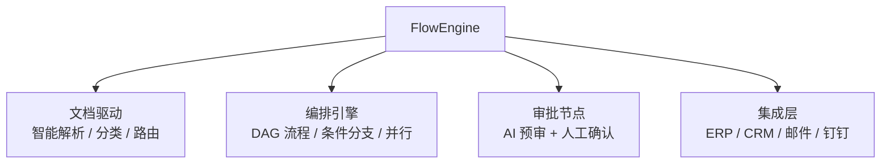

# Agent 工作流引擎（FlowEngine）· 项目总览

> **代号**：FlowEngine —— "让 Agent 编排复杂业务流程：文档处理 → 审批 → 通知 → 归档"
>
> **核心问题**：一个 Agent 能回答问题，但企业需要的是**编排多个步骤、跨系统协作、有人工审批环节**的复杂工作流。怎么用 Agent 驱动业务流程？

---

## 项目定位

---

## 四个 Sprint

| Sprint | 主题 | V1→V2→V3 演进 | 时间 |
|--------|------|--------------|------|
| 1 | 文档智能处理 | 单文档解析 → 批量分类 → 智能路由 | 1 周 |
| 2 | 流程编排引擎 | 线性流程 → 条件分支 → 并行 DAG | 1.5 周 |
| 3 | 审批与人工回路 | 硬编码审批 → AI 预审 → 人在回路 | 1 周 |
| 4 | 集成与监控 | 单系统集成 → 多系统编排 → 全链路追踪 | 1 周 |

---

## 核心特性

- **智能文档处理**：PDF / Word / 扫描件 → 自动分类 → 字段抽取 → 校验
- **DAG 流程编排**：可视化定义工作流，支持条件分支、并行、循环
- **AI 预审 + 人工回路**：Agent 先做初审，复杂决策提交人工
- **跨系统集成**：通过工具调用连接 ERP / CRM / 邮件 / 钉钉
- **全链路追踪**：每个步骤耗时、状态、异常可视化
- **SSE 流式通知**：流程进度实时推送（不用 WebSocket）

---

## 知识映射

| 知识点 | 对应教程 |
|--------|---------|
| 工具调用 | [06-工具调用与Function Maping](../../阶段2-核心机制/06-工具调用与FunctionMaping.md) |
| Agent 循环 | [09-Agent循环与自主决策](../../阶段3-工程化/09-Agent循环与自主决策.md) |
| Advisor 链 | [08-Advisor链与管道注入](../../阶段3-工程化/08-Advisor链与管道注入.md) |
| SSE 流式 | [26-历史持久化与会话广播](../../阶段4-生产化/26-历史持久化与会话广播.md) |
| Agent 安全防护 | [27-Agent安全防护深入](../../阶段4-生产化/27-Agent安全防护深入.md) |
| Prompt 工程化 | [29-Prompt工程化管理](../../阶段4-生产化/29-Prompt工程化管理.md) |
| 可解释性与对齐 | [30-Agent可解释性与对齐](../../阶段4-生产化/30-Agent可解释性与对齐.md) |

---

## 技术选型

| 决策 | 选择 | 原因 |
|------|------|------|
| 流程定义 | JSON DAG（而非 BPMN/BPEL） | 简洁、可代码生成、Agent 友好 |
| 流程通知 | **SSE** | 单向流推送，原生重连，HTTP 兼容 |
| 人工回路 | 异步回调 + 超时升级 | 不阻塞 Agent 线程 |
| 状态存储 | Postgres + 事件溯源 | 可回放、可审计 |

---

## 下一步

→ [Sprint 1：文档智能处理](Sprint1-文档处理.md)
