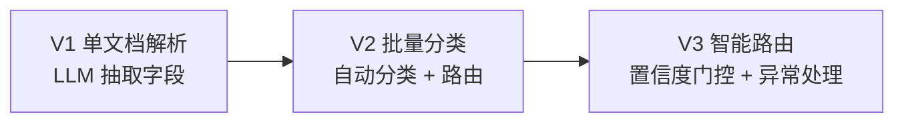
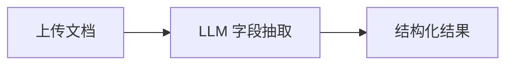
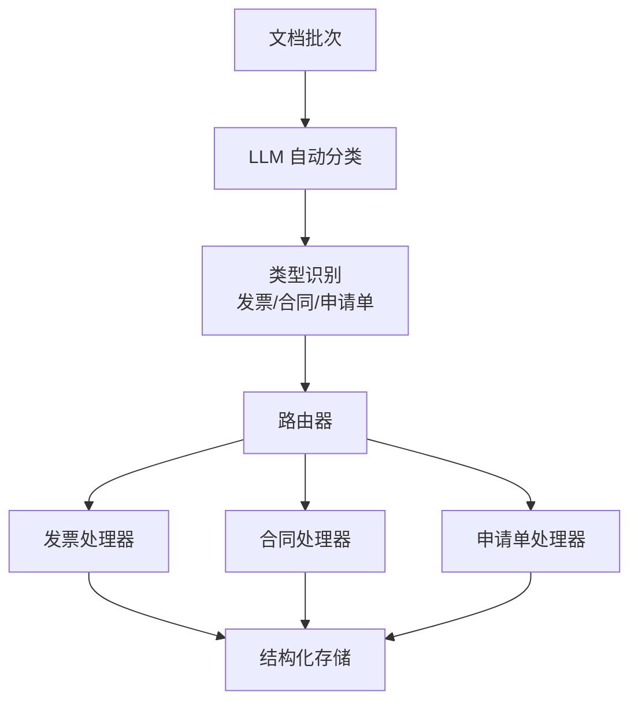
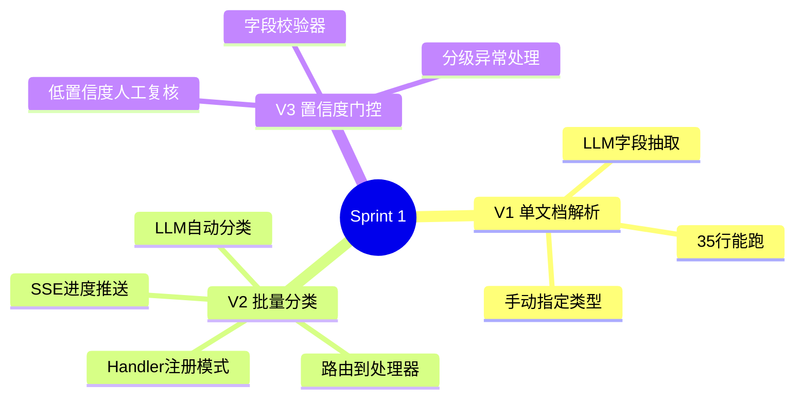

# Sprint 1：文档智能处理

> **目标**：把企业文档（发票、合同、申请单）自动分类、抽取字段、校验合规。
>
> **SSE 约束**：批量处理进度通过 SSE 推送。

---

## Sprint 概览



---

## V1：单文档解析（~35 行）

### 架构



### 代码

```java
// V1: 单文档解析
@RestController
@RequestMapping("/api/doc")
public class DocController {

    private final ChatClient chatClient;

    @PostMapping("/parse")
    public Map<String, Object> parse(@RequestBody ParseRequest req) {
        var result = chatClient.prompt()
            .user(u -> u.text("""
                解析以下文档，抽取关键字段。
                类型：{type}
                文档内容：{content}

                返回 JSON，包含所有相关字段。
                """)
                .param("type", req.type())
                .param("content", req.content()))
            .call()
            .entity(new ParameterizedTypeReference<Map<String, Object>>() {});

        return result;
    }
}

public record ParseRequest(String type, String content) {}
```

### 运行效果

```
POST /api/doc/parse
{ "type": "发票", "content": "发票号码: INV-2024-001, 金额: ¥12,800..." }
→ { "invoiceNumber": "INV-2024-001", "amount": 12800, "currency": "CNY" }
```

### V1 的局限

- ❌ 需要人工指定文档类型
- ❌ 单文档处理，没有批量
- ❌ 没有校验——抽取结果可能是错的

---

## V2：批量分类 + 路由

### 架构



### 核心：文档分类器

```java
@Service
public class DocumentClassifier {

    private final ChatClient chatClient;

    private static final String CLASSIFY_PROMPT = """
        将以下文档分类到最合适的类型。

        文档内容（前500字）：
        {preview}

        可选类型：
        - INVOICE（发票/收据）
        - CONTRACT（合同/协议）
        - APPLICATION（申请单/审批单）
        - REPORT（报告/报告附件）
        - OTHER（其他）

        返回 JSON：
        {"type": "...", "confidence": 0.95, "reason": "..."}
        """;

    public Classification classify(String content) {
        var json = chatClient.prompt()
            .user(u -> u.text(CLASSIFY_PROMPT)
                .param("preview", content.substring(0,
                    Math.min(500, content.length()))))
            .call().content();
        return parseClassification(json);
    }
}

public record Classification(
    String type, double confidence, String reason) {}
```

### 核心：路由 + 处理器注册

```java
@Service
public class DocumentRouter {

    private final Map<String, DocumentHandler> handlers;
    private final DocumentClassifier classifier;

    public DocumentRouter(DocumentClassifier classifier,
            List<DocumentHandler> handlerList) {
        this.classifier = classifier;
        this.handlers = handlerList.stream()
            .collect(Collectors.toMap(
                DocumentHandler::supportedType, h -> h));
    }

    public DocumentResult route(String content) {
        // 1. 分类
        var classification = classifier.classify(content);

        // 2. 路由到对应处理器
        var handler = handlers.get(classification.type());
        if (handler == null) {
            return DocumentResult.unsupported(classification);
        }

        // 3. 处理
        return handler.handle(content, classification);
    }

    /**
     * 批量处理 + SSE 进度推送
     */
    public Flux<ServerSentEvent<BatchProgress>> routeBatch(
            List<String> documents) {
        return Flux.fromIterable(documents)
            .index()
            .map(t -> {
                var result = route(t.getT2());
                return ServerSentEvent.<BatchProgress>builder()
                    .id(String.valueOf(t.getT1()))
                    .event("progress")
                    .data(new BatchProgress(
                        t.getT1().intValue() + 1,
                        documents.size(),
                        result.classification().type(),
                        result.success()))
                    .build();
            });
    }
}

public interface DocumentHandler {
    String supportedType();
    DocumentResult handle(String content, Classification classification);
}

public record BatchProgress(int processed, int total,
                            String type, boolean success) {}
```

### 核心：发票处理器（示例）

```java
@Component
public class InvoiceHandler implements DocumentHandler {

    private final ChatClient chatClient;

    @Override
    public String supportedType() { return "INVOICE"; }

    @Override
    public DocumentResult handle(String content,
            Classification classification) {
        var fields = chatClient.prompt()
            .user(u -> u.text("""
                从发票文档中抽取以下字段，返回 JSON：
                - invoiceNumber: 发票号码
                - issueDate: 开票日期
                - amount: 金额（数字）
                - currency: 币种
                - vendor: 供应商
                - taxId: 税号

                文档：{content}
                """)
                .param("content", content))
            .call()
            .entity(new ParameterizedTypeReference<Map<String, Object>>() {});

        return DocumentResult.success(classification, fields);
    }
}
```

### V2 的局限

- ❌ 低置信度分类也直接路由——可能导致错误处理
- ❌ 没有字段校验
- ❌ 异常处理不够健壮

---

## V3：置信度门控 + 异常处理

### 改进点

| 维度 | V2 | V3 |
|------|----|----|
| 分类门控 | 无 | 低置信度 → 人工复核 |
| 字段校验 | 无 | 必填校验 + 格式校验 + 业务校验 |
| 异常处理 | 抛异常 | 分级处理（重试/降级/告警） |
| 批处理 | 同步 | 异步队列 + SSE 推送 |

### 核心：置信度门控

```java
@Service
public class GatedDocumentRouter extends DocumentRouter {

    private static final double CONFIDENCE_THRESHOLD = 0.75;

    @Override
    public DocumentResult route(String content) {
        var classification = classifier.classify(content);

        // 置信度门控
        if (classification.confidence() < CONFIDENCE_THRESHOLD) {
            return DocumentResult.needsReview(classification,
                "置信度 %.0f%% 低于阈值 %d%%，需人工确认类型".formatted(
                    classification.confidence() * 100,
                    (int)(CONFIDENCE_THRESHOLD * 100)));
        }

        return super.route(content);
    }
}
```

### 核心：字段校验器

```java
@Service
public class DocumentValidator {

    /**
     * 校验抽取的字段
     */
    public ValidationResult validate(String type,
            Map<String, Object> fields) {
        var errors = new ArrayList<String>();

        switch (type) {
            case "INVOICE" -> validateInvoice(fields, errors);
            case "CONTRACT" -> validateContract(fields, errors);
            // ...
        }

        return errors.isEmpty()
            ? ValidationResult.valid()
            : ValidationResult.invalid(errors);
    }

    private void validateInvoice(Map<String, Object> fields,
            List<String> errors) {
        // 必填校验
        requireField(fields, "invoiceNumber", errors);
        requireField(fields, "amount", errors);

        // 格式校验
        var amount = fields.get("amount");
        if (amount != null) {
            try {
                var value = Double.parseDouble(amount.toString());
                if (value < 0) errors.add("金额不能为负数");
                if (value > 10_000_000) errors.add("金额异常大，请人工核实");
            } catch (NumberFormatException e) {
                errors.add("金额格式无效：" + amount);
            }
        }

        // 日期校验
        var dateStr = (String) fields.get("issueDate");
        if (dateStr != null) {
            try {
                var date = LocalDate.parse(dateStr);
                if (date.isAfter(LocalDate.now()))
                    errors.add("开票日期不能是未来日期");
            } catch (DateTimeParseException e) {
                errors.add("日期格式无效：" + dateStr);
            }
        }
    }

    private void requireField(Map<String, Object> fields,
            String key, List<String> errors) {
        if (!fields.containsKey(key) || fields.get(key) == null) {
            errors.add("缺少必填字段：" + key);
        }
    }
}

public record ValidationResult(boolean valid, List<String> errors) {
    public static ValidationResult valid() { return new ValidationResult(true, List.of()); }
    public static ValidationResult invalid(List<String> errors) {
        return new ValidationResult(false, errors);
    }
}
```

---

## 完整 Sprint 回顾



---

## 下一步

→ [Sprint 2：流程编排引擎](Sprint2-流程编排.md)
