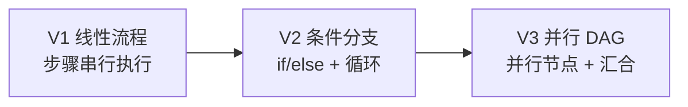
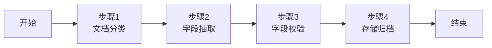
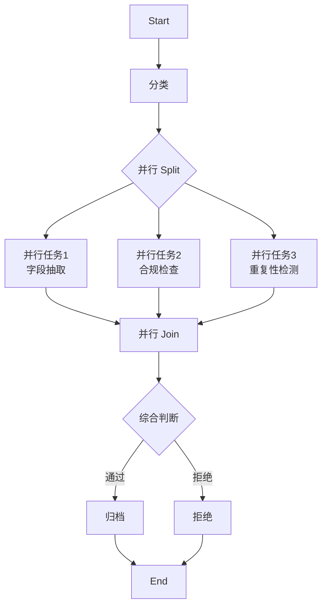
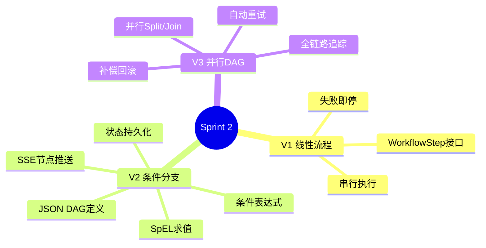

# Sprint 2：流程编排引擎

> **目标**：构建一个 DAG（有向无环图）流程编排引擎，支持条件分支、并行执行、流程定义可序列化。

---

## Sprint 概览



---

## V1：线性流程（~50 行）

### 架构



### 代码

```java
// V1: 线性流程定义
public class LinearWorkflow {

    private final List<WorkflowStep> steps;

    public LinearWorkflow(List<WorkflowStep> steps) {
        this.steps = steps;
    }

    public WorkflowResult execute(WorkflowContext ctx) {
        for (var step : steps) {
            try {
                var result = step.execute(ctx);
                ctx.put(step.name(), result);
                if (result.status() == StepStatus.FAILED) {
                    return WorkflowResult.failed(step.name(),
                        result.errorMessage());
                }
            } catch (Exception e) {
                return WorkflowResult.failed(step.name(), e.getMessage());
            }
        }
        return WorkflowResult.success(ctx);
    }
}

public interface WorkflowStep {
    String name();
    StepResult execute(WorkflowContext ctx);
}

public record StepResult(StepStatus status, Object data,
                         String errorMessage) {
    public static StepResult success(Object data) {
        return new StepResult(StepStatus.SUCCESS, data, null);
    }
    public static StepResult failed(String error) {
        return new StepResult(StepStatus.FAILED, null, error);
    }
}

public enum StepStatus { SUCCESS, FAILED, SKIPPED }
```

### V1 的局限

- ❌ 只能线性执行，没有条件分支
- ❌ 一步失败就整体失败，没有容错
- ❌ 流程定义硬编码，不能动态配置

---

## V2：条件分支 + 流程定义

### 改进点

| 维度 | V1 | V2 |
|------|----|----|
| 流程结构 | 线性 | 有向图 + 条件分支 |
| 定义方式 | Java 代码 | JSON 序列化 |
| 容错 | 失败即停 | 重试 / 降级 / 补偿 |
| 状态追踪 | 无 | 每步状态持久化 |

### 核心：流程定义（JSON DAG）

```java
/**
 * 流程定义：可序列化为 JSON
 */
public record WorkflowDefinition(
    String id,
    String name,
    List<NodeDef> nodes,
    List<EdgeDef> edges
) {
    /**
     * 示例 JSON：
     * {
     *   "id": "invoice-processing",
     *   "name": "发票处理流程",
     *   "nodes": [
     *     {"id": "start", "type": "START"},
     *     {"id": "classify", "type": "TASK", "handler": "classifyHandler"},
     *     {"id": "check", "type": "CONDITION", "expression": "type == 'INVOICE'"},
     *     {"id": "parse", "type": "TASK", "handler": "invoiceHandler"},
     *     {"id": "reject", "type": "TASK", "handler": "rejectHandler"},
     *     {"id": "end", "type": "END"}
     *   ],
     *   "edges": [
     *     {"from": "start", "to": "classify"},
     *     {"from": "classify", "to": "check"},
     *     {"from": "check", "to": "parse"},         // 条件为true
     *     {"from": "check", "to": "reject"},         // 条件为false
     *     {"from": "parse", "to": "end"},
     *     {"from": "reject", "to": "end"}
     *   ]
     * }
     */
}

public record NodeDef(String id, NodeType type,
                      String handler, String expression) {}
public record EdgeDef(String from, String to,
                      String condition) {} // null = 无条件

public enum NodeType { START, END, TASK, CONDITION, PARALLEL_JOIN }
```

### 核心：DAG 执行引擎

```java
@Service
public class DagWorkflowEngine {

    private final Map<String, WorkflowHandler> handlers;
    private final WorkflowStateRepository stateRepo;

    /**
     * 执行工作流
     */
    public Flux<ServerSentEvent<NodeResult>> execute(
            WorkflowDefinition def, Map<String, Object> input) {
        var ctx = new WorkflowContext(input);
        var visited = new HashSet<String>();
        var queue = new ArrayDeque<>(List.of(findStartNode(def)));

        return Flux.create(sink -> {
            executeDfs(def, ctx, visited, findStartNode(def), sink);
            sink.complete();
        });
    }

    private void executeDfs(WorkflowDefinition def,
            WorkflowContext ctx, Set<String> visited,
            String nodeId, FluxSink<ServerSentEvent<NodeResult>> sink) {

        if (visited.contains(nodeId)) return;
        visited.add(nodeId);

        var node = findNode(def, nodeId);
        if (node.type() == NodeType.END) {
            sink.next(ServerSentEvent.<NodeResult>builder()
                .event("workflow-complete").build());
            return;
        }

        // 执行节点
        var result = executeNode(node, ctx);
        sink.next(ServerSentEvent.<NodeResult>builder()
            .id(nodeId).event("node-complete").data(result).build());

        // 持久化状态
        stateRepo.save(nodeId, result);

        // 遍历后继节点
        for (var edge : getOutgoingEdges(def, nodeId)) {
            if (shouldTraverse(edge, ctx)) {
                executeDfs(def, ctx, visited, edge.to(), sink);
            }
        }
    }

    private NodeResult executeNode(NodeDef node, WorkflowContext ctx) {
        return switch (node.type()) {
            case TASK -> {
                var handler = handlers.get(node.handler());
                yield handler != null ? handler.execute(ctx) :
                    NodeResult.error(node.id(), "Handler not found");
            }
            case CONDITION -> {
                var met = evaluateExpression(node.expression(), ctx);
                ctx.put("__condition__", met);
                yield NodeResult.success(node.id(), Map.of("result", met));
            }
            default -> NodeResult.success(node.id(), null);
        };
    }

    private boolean shouldTraverse(EdgeDef edge, WorkflowContext ctx) {
        if (edge.condition() == null) return true;
        return evaluateExpression(edge.condition(), ctx);
    }

    private boolean evaluateExpression(String expr, WorkflowContext ctx) {
        // 简单表达式求值：type == 'INVOICE' → ctx.get("type").equals("INVOICE")
        // 生产环境可使用 SpEL / Aviator / JEXL
        return SpelEvaluator.eval(expr, ctx.asMap());
    }
}

public interface WorkflowHandler {
    NodeResult execute(WorkflowContext ctx);
}

public record NodeResult(String nodeId, StepStatus status,
                         Object data, String error) {
    public static NodeResult success(String id, Object data) {
        return new NodeResult(id, StepStatus.SUCCESS, data, null);
    }
    public static NodeResult error(String id, String error) {
        return new NodeResult(id, StepStatus.FAILED, null, error);
    }
}
```

### V2 的局限

- ❌ 没有并行执行——所有节点串行 DFS
- ❌ 没有重试 / 补偿机制
- ❌ 流程定义不能热更新

---

## V3：并行 DAG + 重试 + 补偿

### 改进点

| 维度 | V2 | V3 |
|------|----|----|
| 并行执行 | 无 | 并行节点 + JOIN 汇合 |
| 容错 | 无 | 自动重试 + 补偿回滚 |
| 定义热更新 | 无 | 版本化 + 热部署 |
| 可观测 | SSE 节点状态 | 全链路追踪 + 每步耗时 |

### 架构



### 核心：并行执行 + JOIN

```java
@Service
public class ParallelDagEngine extends DagWorkflowEngine {

    /**
     * 并行执行多个分支，等待全部完成后再继续
     */
    @Override
    protected void executeDfs(WorkflowDefinition def,
            WorkflowContext ctx, Set<String> visited,
            String nodeId, FluxSink<ServerSentEvent<NodeResult>> sink) {

        var node = findNode(def, nodeId);
        var outgoing = getOutgoingEdges(def, nodeId);

        // 如果有多个无条件出边 → 并行执行
        var unconditionalEdges = outgoing.stream()
            .filter(e -> e.condition() == null).toList();

        if (unconditionalEdges.size() > 1 &&
                node.type() != NodeType.CONDITION) {
            executeParallel(def, ctx, visited, unconditionalEdges, sink);
        } else {
            super.executeDfs(def, ctx, visited, nodeId, sink);
        }
    }

    private void executeParallel(WorkflowDefinition def,
            WorkflowContext ctx, Set<String> visited,
            List<EdgeDef> edges, FluxSink<ServerSentEvent<NodeResult>> sink) {

        // 并行执行所有分支
        var futures = edges.stream()
            .map(edge -> CompletableFuture.runAsync(() ->
                executeDfs(def, ctx,
                    Collections.synchronizedSet(visited),
                    edge.to(), sink)))
            .toArray(CompletableFuture[]::new);

        // 等待所有分支完成
        CompletableFuture.allOf(futures).join();
    }
}
```

### 核心：重试 + 补偿

```java
@Service
public class ResilientNodeExecutor {

    private final int maxRetries = 3;
    private final Duration retryDelay = Duration.ofSeconds(2);

    /**
     * 带重试的节点执行
     */
    public NodeResult executeWithRetry(NodeDef node,
            WorkflowContext ctx, WorkflowHandler handler) {
        Exception lastError = null;

        for (int attempt = 1; attempt <= maxRetries; attempt++) {
            try {
                var result = handler.execute(ctx);
                if (result.status() == StepStatus.SUCCESS) return result;

                // 可重试错误
                if (attempt < maxRetries) {
                    Thread.sleep(retryDelay.toMillis() * attempt);
                }
            } catch (Exception e) {
                lastError = e;
                if (attempt < maxRetries) {
                    try { Thread.sleep(retryDelay.toMillis() * attempt); }
                    catch (InterruptedException ie) { Thread.currentThread().interrupt(); }
                }
            }
        }

        // 所有重试失败，尝试补偿
        compensate(node, ctx);
        return NodeResult.error(node.id(),
            "Failed after " + maxRetries + " retries: " +
            (lastError != null ? lastError.getMessage() : "unknown"));
    }

    /**
     * 补偿：执行已成功节点的回滚操作
     */
    private void compensate(NodeDef failedNode, WorkflowContext ctx) {
        var executedNodes = ctx.getExecutedNodes();
        // 逆序执行补偿
        for (var node : executedNodes) {
            var compensable = handlers.get(node.handler());
            if (compensable instanceof CompensableHandler ch) {
                ch.compensate(ctx);
            }
        }
    }
}

public interface CompensableHandler extends WorkflowHandler {
    void compensate(WorkflowContext ctx);
}
```

---

## 完整 Sprint 回顾



---

## 下一步

→ [Sprint 3：审批与人工回路](Sprint3-审批回路.md)
