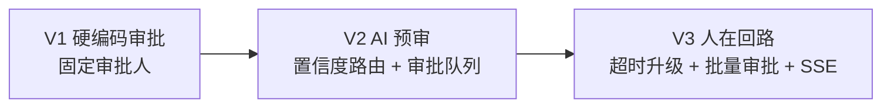
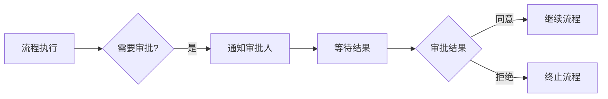
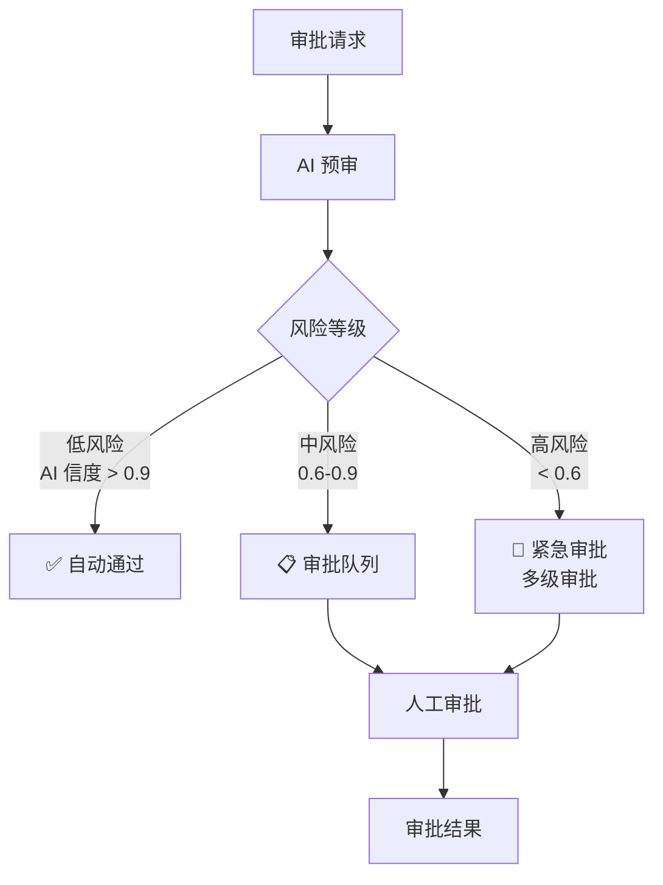
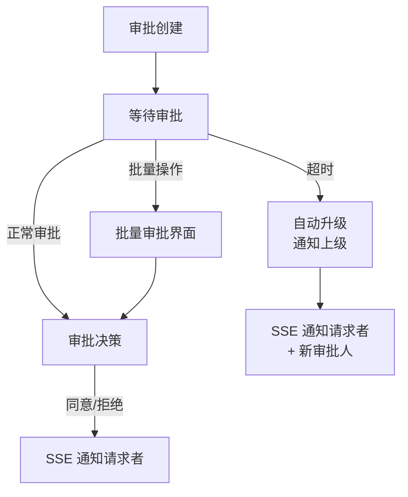
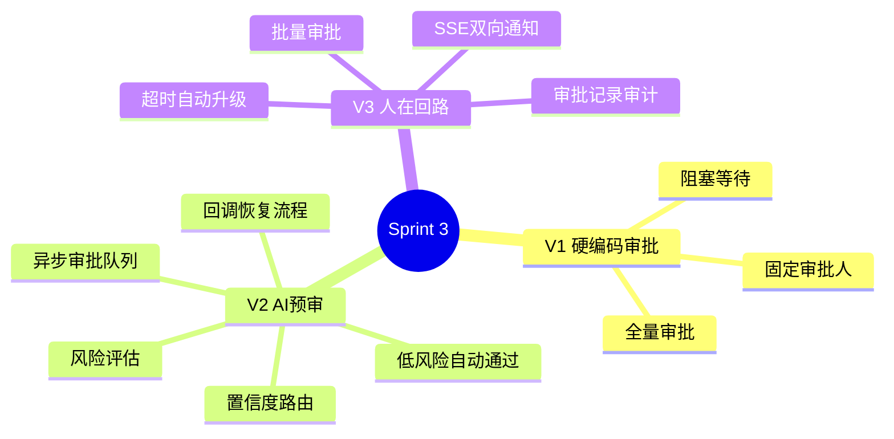

# Sprint 3：审批与人工回路

> **目标**：在自动化流程中加入人工审批节点——AI 先做预审，复杂决策提交人工确认。
>
> **核心概念**：Human-in-the-Loop（人在回路）——不是全自动，也不是全人工，而是 AI + 人协作。

---

## Sprint 概览



---

## V1：硬编码审批（~40 行）

### 架构



### 代码

```java
// V1: 硬编码审批节点
@Component
public class ApprovalNode implements WorkflowHandler {

    private final ApprovalService approvalService;

    @Override
    public String handlerName() { return "approval"; }

    @Override
    public NodeResult execute(WorkflowContext ctx) {
        var requester = ctx.get("requester").toString();
        var approver = ctx.get("approver").toString(); // 硬编码
        var description = ctx.get("summary").toString();

        // 创建审批任务
        var taskId = approvalService.createApproval(
            requester, approver, description, ctx);

        // 阻塞等待审批结果（V1 简化版）
        var result = approvalService.waitForApproval(taskId,
            Duration.ofHours(24));

        return result.approved()
            ? NodeResult.success("approval", Map.of("taskId", taskId))
            : NodeResult.error("approval", "审批被拒绝: " + result.reason());
    }
}
```

### V1 的局限

- ❌ 审批人硬编码，不能动态路由
- ❌ 阻塞等待——线程被卡住
- ❌ 每个 API 调用都走审批——效率极低

---

## V2：AI 预审 + 审批队列

### 改进点

| 维度 | V1 | V2 |
|------|----|----|
| 预审 | 无 | AI 先做初审，给出建议 |
| 路由 | 硬编码 | 根据类型/金额/风险动态选审批人 |
| 等待方式 | 阻塞 | 异步审批队列 + 回调 |
| 审批量 | 全量 | 仅高风险才走人工 |

### 架构



### 核心：AI 预审

```java
@Service
public class AiPreApprovalService {

    private final ChatClient chatClient;

    /**
     * AI 预审：分析请求，给出风险评估和建议
     */
    public PreApprovalResult preApprove(WorkflowContext ctx) {
        var prompt = """
            作为审批助手，分析以下请求：

            请求类型：{type}
            请求摘要：{summary}
            相关数据：{data}

            请给出：
            1. riskLevel: LOW / MEDIUM / HIGH
            2. recommendation: APPROVE / REJECT / REVIEW
            3. confidence: 0-1
            4. reason: 理由

            返回 JSON。
            """;

        var json = chatClient.prompt()
            .user(u -> u.text(prompt)
                .param("type", ctx.get("type"))
                .param("summary", ctx.get("summary"))
                .param("data", ctx.asMap()))
            .call().content();

        return parsePreApproval(json);
    }
}

public record PreApprovalResult(
    RiskLevel riskLevel,
    String recommendation, // APPROVE / REJECT / REVIEW
    double confidence,
    String reason
) {}

public enum RiskLevel { LOW, MEDIUM, HIGH }
```

### 核心：审批路由 + 异步队列

```java
@Service
public class ApprovalRouter {

    private final AiPreApprovalService aiPreApproval;
    private final ApprovalQueueService queueService;

    /**
     * 智能路由审批
     */
    public ApprovalDecision route(WorkflowContext ctx) {
        // 1. AI 预审
        var preApproval = aiPreApproval.preApprove(ctx);

        return switch (preApproval.riskLevel()) {
            case LOW -> {
                // 低风险 + 高置信度 → 自动通过
                if (preApproval.confidence() > 0.9) {
                    yield ApprovalDecision.autoApproved(preApproval);
                }
                yield submitToQueue(ctx, preApproval, "normal");
            }
            case MEDIUM -> submitToQueue(ctx, preApproval, "normal");
            case HIGH -> submitToQueue(ctx, preApproval, "urgent");
        };
    }

    private ApprovalDecision submitToQueue(WorkflowContext ctx,
            PreApprovalResult preApproval, String priority) {
        // 根据类型选择审批人
        var approver = selectApprover(ctx, preApproval.riskLevel());

        var task = queueService.enqueue(ApprovalTask.builder()
            .requester(ctx.get("requester").toString())
            .approver(approver)
            .summary(ctx.get("summary").toString())
            .aiRecommendation(preApproval)
            .priority(priority)
            .context(ctx)
            .expiresAt(Instant.now().plus(Duration.ofHours(48)))
            .build());

        return ApprovalDecision.pending(task);
    }

    private String selectApprover(WorkflowContext ctx, RiskLevel risk) {
        // 根据风险等级和金额选择审批人
        var amount = (Double) ctx.getOrDefault("amount", 0.0);
        if (risk == RiskLevel.HIGH || amount > 100000) {
            return "director@" + ctx.get("department");
        }
        return "manager@" + ctx.get("department");
    }
}

public sealed interface ApprovalDecision {
    record AutoApproved(PreApprovalResult preApproval) implements ApprovalDecision {}
    record Pending(ApprovalTask task) implements ApprovalDecision {}
}
```

### 核心：审批回调（非阻塞）

```java
@RestController
@RequestMapping("/api/approval")
public class ApprovalController {

    private final ApprovalQueueService queueService;
    private final DagWorkflowEngine engine;

    /**
     * 审批人通过 SSE 接收待审批任务
     */
    @GetMapping(value = "/pending/{approver}",
            produces = MediaType.TEXT_EVENT_STREAM_VALUE)
    public Flux<ServerSentEvent<ApprovalTask>> pending(
            @PathVariable String approver) {
        return Flux.interval(Duration.ofSeconds(10))
            .flatMap(i -> Flux.fromIterable(
                queueService.getPendingTasks(approver)))
            .map(task -> ServerSentEvent.<ApprovalTask>builder()
                .id(task.id())
                .event("approval-request")
                .data(task)
                .build());
    }

    /**
     * 审批结果回调——恢复流程执行
     */
    @PostMapping("/{taskId}/decide")
    public String decide(@PathVariable String taskId,
            @RequestBody DecisionRequest req) {
        var task = queueService.complete(taskId, req.approved(), req.reason());
        if (req.approved()) {
            engine.resume(task.workflowId(), "approval-passed");
        } else {
            engine.terminate(task.workflowId(), "审批被拒绝: " + req.reason());
        }
        return req.approved() ? "流程已继续" : "流程已终止";
    }
}

public record DecisionRequest(boolean approved, String reason) {}
```

### V2 的局限

- ❌ 没有超时升级——审批人如果不响应，流程永远卡住
- ❌ 不能批量审批——一个一个点太低效
- ❌ 审批结果没有 SSE 实时通知请求者

---

## V3：超时升级 + 批量审批 + SSE 通知

### 架构



### 核心：超时升级

```java
@Service
public class ApprovalTimeoutEscalator {

    private final ApprovalQueueService queueService;
    private final NotificationService notifier;

    /**
     * 定时扫描超时审批，自动升级
     */
    @Scheduled(fixedDelay = 60000) // 每分钟检查
    public void checkTimeouts() {
        var overdue = queueService.findOverdueTasks();

        for (var task : overdue) {
            // 升级到上级
            var escalatedApprover = getSuperior(task.approver());
            var escalatedTask = task.toBuilder()
                .approver(escalatedApprover)
                .priority("escalated")
                .escalatedFrom(task.id())
                .expiresAt(Instant.now().plus(Duration.ofHours(24)))
                .build();

            queueService.enqueue(escalatedTask);

            // 通知相关方
            notifier.notify(task.requester(),
                "您的审批已升级，新审批人：" + escalatedApprover);
            notifier.notify(escalatedApprover,
                "升级审批任务：" + task.summary());
        }
    }

    private String getSuperior(String approver) {
        // 查组织架构：manager@xxx → director@xxx
        // 实现省略
        return approver.replace("manager", "director");
    }
}
```

### 核心：批量审批

```java
@RestController
@RequestMapping("/api/approval")
public class BatchApprovalController {

    /**
     * 批量审批——一次性处理多个相似请求
     */
    @PostMapping("/batch-decide")
    public BatchResult batchDecide(@RequestBody BatchDecisionRequest req) {
        var results = new ArrayList<SingleResult>();

        for (var taskId : req.taskIds()) {
            try {
                var task = queueService.complete(taskId,
                    req.approved(), req.reason());
                if (req.approved()) {
                    engine.resume(task.workflowId(), "approval-passed");
                } else {
                    engine.terminate(task.workflowId(),
                        "批量审批拒绝: " + req.reason());
                }
                results.add(SingleResult.ok(taskId));
            } catch (Exception e) {
                results.add(SingleResult.error(taskId, e.getMessage()));
            }
        }

        return new BatchResult(results);
    }
}
```

### 核心：审批结果 SSE 通知

```java
@Service
public class ApprovalNotifier {

    private final Map<String, Set<SseEmitter>> subscribers =
        new ConcurrentHashMap<>();

    /**
     * 请求者订阅审批结果
     */
    public SseEmitter subscribe(String requester) {
        var emitter = new SseEmitter(0L);
        subscribers.computeIfAbsent(requester,
            k -> ConcurrentHashMap.newKeySet()).add(emitter);
        emitter.onCompletion(() -> removeSubscriber(requester, emitter));
        emitter.onTimeout(() -> removeSubscriber(requester, emitter));
        return emitter;
    }

    /**
     * 审批结果出来后，推送给请求者
     */
    public void notify(String requester, ApprovalResult result) {
        var emitters = subscribers.get(requester);
        if (emitters == null) return;

        for (var emitter : emitters) {
            try {
                emitter.send(SseEmitter.event()
                    .id(result.taskId())
                    .name("approval-result")
                    .data(result));
            } catch (IOException e) {
                emitter.complete();
            }
        }
    }
}
```

---

## 完整 Sprint 回顾



---

## 下一步

→ [Sprint 4：集成与监控](Sprint4-集成监控.md)
