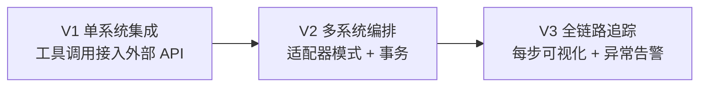
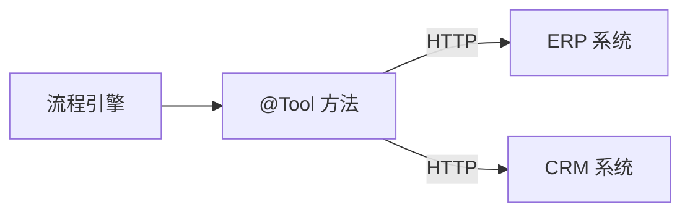
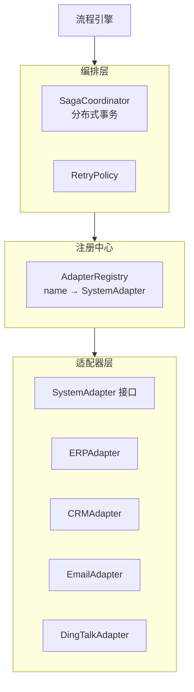
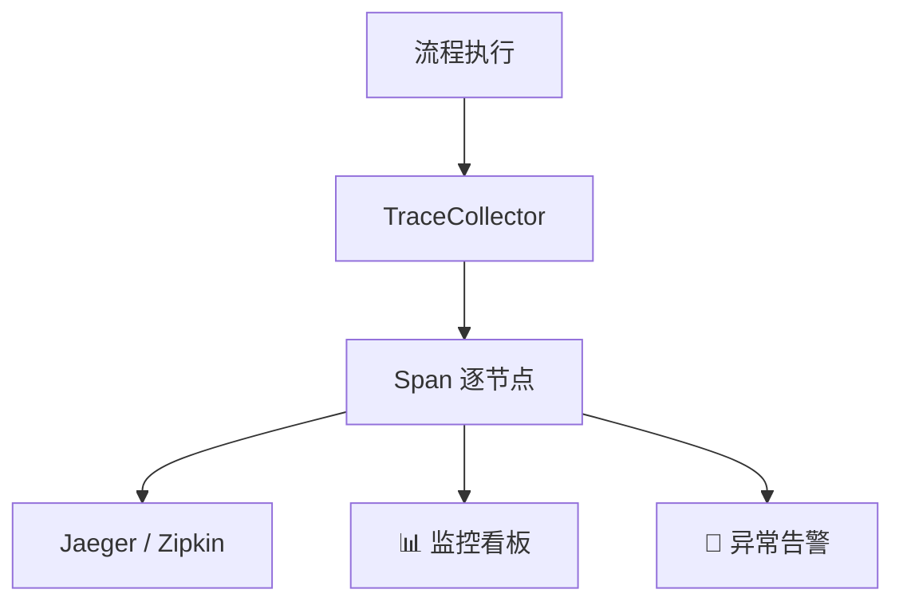
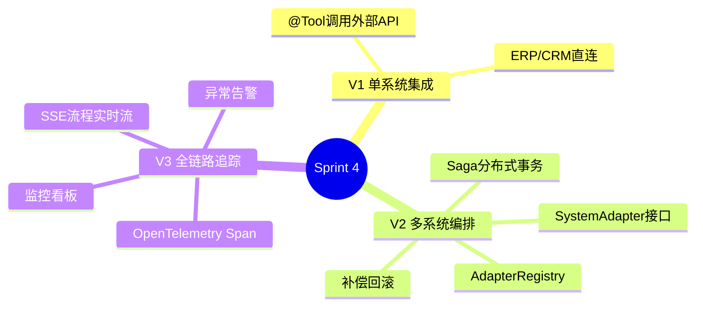
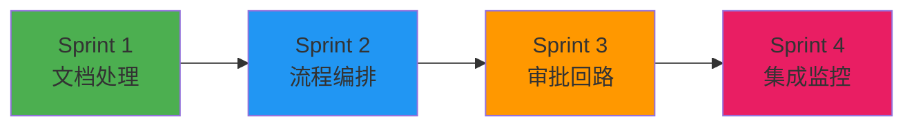

# Sprint 4：集成与监控

> **目标**：把工作流引擎接入企业真实系统（ERP / CRM / 邮件 / 钉钉），实现全链路追踪和监控。

---

## Sprint 概览



---

## V1：单系统集成

### 需求

工作流需要调用外部系统（如 ERP 查询库存、CRM 更新客户信息）。

### 架构



### 代码

```java
// V1: 工具调用集成外部系统
@Service
public class ErpIntegrationTools {

    private final RestClient erpClient;

    @Tool(description = "查询 ERP 系统中的库存数量")
    public int checkStock(String sku) {
        return erpClient.get()
            .uri("/api/inventory/{sku}", sku)
            .retrieve()
            .body(StockResponse.class)
            .quantity();
    }

    @Tool(description = "在 ERP 系统中创建采购订单")
    public String createPurchaseOrder(String sku, int quantity,
            String department) {
        return erpClient.post()
            .uri("/api/purchase-orders")
            .body(new PurchaseOrderRequest(sku, quantity, department))
            .retrieve()
            .body(OrderResponse.class)
            .orderId();
    }
}

@Service
public class CrmIntegrationTools {

    private final RestClient crmClient;

    @Tool(description = "更新 CRM 客户信息")
    public String updateCustomer(String customerId,
            Map<String, Object> updates) {
        return crmClient.patch()
            .uri("/api/customers/{id}", customerId)
            .body(updates)
            .retrieve()
            .body(Map.class)
            .get("status").toString();
    }
}
```

### V1 的局限

- ❌ 每个系统单独写集成代码，重复
- ❌ 没有事务——跨系统操作失败后无法回滚
- ❌ 没有统一的错误处理

---

## V2：多系统编排 + 适配器

### 改进点

| 维度 | V1 | V2 |
|------|----|----|
| 集成模式 | 直接调用 | 适配器模式 + 注册中心 |
| 事务 | 无 | Saga 分布式事务 |
| 错误处理 | 各自处理 | 统一错误码 + 重试策略 |
| 配置 | 硬编码 | 动态配置中心 |

### 架构



### 核心：统一适配器接口

```java
public interface SystemAdapter {
    String systemName();

    /**
     * 执行操作
     */
    AdapterResponse execute(AdapterRequest request);

    /**
     * 补偿操作（用于 Saga 回滚）
     */
    default AdapterResponse compensate(AdapterRequest request) {
        return AdapterResponse.skipped("No compensation needed");
    }

    /**
     * 健康检查
     */
    boolean isHealthy();
}

public record AdapterRequest(
    String operation,  // CREATE / UPDATE / DELETE / QUERY
    String resource,   // /customers/123, /orders/456
    Map<String, Object> payload
) {}

public record AdapterResponse(
    boolean success,
    String externalId,
    Map<String, Object> data,
    String error
) {
    public static AdapterResponse ok(String id, Map<String, Object> data) {
        return new AdapterResponse(true, id, data, null);
    }
    public static AdapterResponse failed(String error) {
        return new AdapterResponse(false, null, null, error);
    }
    public static AdapterResponse skipped(String reason) {
        return new AdapterResponse(true, null, Map.of("reason", reason), null);
    }
}
```

### 核心：Saga 分布式事务

```java
@Service
public class SagaCoordinator {

    private final AdapterRegistry registry;

    /**
     * Saga 事务：一系列操作要么全部成功，要么全部补偿
     *
     * 示例：
     * 1. ERP: 创建采购订单
     * 2. CRM: 更新客户记录
     * 3. Email: 发送通知
     *
     * 如果步骤3失败 → 补偿步骤2 → 补偿步骤1
     */
    public SagaResult execute(List<SagaStep> steps) {
        var executed = new ArrayList<SagaStep>();

        for (var step : steps) {
            try {
                var adapter = registry.get(step.system());
                var response = adapter.execute(step.request());

                if (!response.success()) {
                    // 当前步骤失败 → 补偿已执行步骤
                    compensate(executed);
                    return SagaResult.failed(step, response.error());
                }

                executed.add(step);
            } catch (Exception e) {
                compensate(executed);
                return SagaResult.failed(step, e.getMessage());
            }
        }

        return SagaResult.success(executed.size());
    }

    private void compensate(List<SagaStep> executed) {
        // 逆序补偿
        Collections.reverse(executed);
        for (var step : executed) {
            try {
                var adapter = registry.get(step.system());
                adapter.compensate(step.request());
            } catch (Exception e) {
                // 补偿失败 → 记录告警，人工介入
                log.error("补偿失败: system={}, step={}",
                    step.system(), step, e);
            }
        }
    }
}

public record SagaStep(String system, AdapterRequest request) {}
```

### V2 的局限

- ❌ 看不到流程执行的详细追踪
- ❌ 异常没有告警
- ❌ 没有性能瓶颈分析

---

## V3：全链路追踪 + 异常告警

### 架构



### 核心：全链路追踪

```java
@Service
public class WorkflowTracer {

    /**
     * 记录每个节点的执行追踪
     */
    public NodeResult trace(NodeDef node, WorkflowContext ctx,
            Supplier<NodeResult> executor) {
        var startTime = Instant.now();

        var span = tracer.nextSpan().name("workflow:" + node.id()).start();
        span.tag("node.type", node.type().toString());
        span.tag("node.handler", node.handler() != null ?
            node.handler() : "none");
        span.tag("workflow.id", ctx.getWorkflowId());

        try {
            var result = executor.get();

            span.tag("node.status", result.status().toString());
            if (result.status() == StepStatus.FAILED) {
                span.tag("error", result.error());
            }

            return result;
        } catch (Exception e) {
            span.error(e);
            throw e;
        } finally {
            var duration = Duration.between(startTime, Instant.now());
            span.tag("duration.ms", String.valueOf(duration.toMillis()));
            span.end();
        }
    }
}
```

### 核心：监控看板 API + SSE

```java
@RestController
@RequestMapping("/api/workflow/dashboard")
public class WorkflowDashboardController {

    private final WorkflowStateRepository stateRepo;
    private final WorkflowMetrics metrics;

    @GetMapping("/active")
    public List<WorkflowInstance> activeWorkflows() {
        return stateRepo.findByStatus(WorkflowStatus.RUNNING);
    }

    @GetMapping("/metrics")
    public WorkflowMetricsSummary metrics() {
        return metrics.getSummary();
    }

    /**
     * 流程执行实时流（SSE）
     */
    @GetMapping(value = "/stream/{workflowId}",
            produces = MediaType.TEXT_EVENT_STREAM_VALUE)
    public Flux<ServerSentEvent<NodeResult>> streamWorkflow(
            @PathVariable String workflowId) {
        return stateRepo.watchNodeUpdates(workflowId)
            .map(result -> ServerSentEvent.<NodeResult>builder()
                .id(workflowId + ":" + result.nodeId())
                .event("node-update")
                .data(result)
                .build());
    }
}

public record WorkflowMetricsSummary(
    int totalExecuted,
    int activeCount,
    double successRate,
    double avgDurationMs,
    Map<String, Double> avgDurationByNode  // 每个节点的平均耗时
) {}
```

### 核心：异常告警

```java
@Service
public class WorkflowAlertService {

    /**
     * 检查告警条件
     */
    @Scheduled(fixedDelay = 30000)
    public void checkAlerts() {
        // 1. 流程失败率告警
        var failRate = metrics.getFailureRate(Duration.ofMinutes(5));
        if (failRate > 0.1) { // > 10%
            sendAlert(AlertLevel.CRITICAL,
                "流程失败率过高: " +
                String.format("%.1f%%", failRate * 100));
        }

        // 2. 节点执行超时告警
        var slowNodes = metrics.getSlowNodes(Duration.ofSeconds(30));
        for (var node : slowNodes) {
            sendAlert(AlertLevel.WARNING,
                "节点执行缓慢: " + node.nodeId() +
                " 平均耗时: " + node.avgDurationMs() + "ms");
        }

        // 3. 补偿触发告警
        var recentCompensations = metrics.getRecentCompensations(
            Duration.ofMinutes(10));
        if (!recentCompensations.isEmpty()) {
            sendAlert(AlertLevel.HIGH,
                "触发了 " + recentCompensations.size() + " 次补偿操作");
        }
    }

    private void sendAlert(AlertLevel level, String message) {
        // 发送到钉钉 / 邮件 / Slack
        notifier.send(level, message);
    }
}
```

---

## 完整 Sprint 回顾



---

## 项目总结



FlowEngine 到此完成。你拥有的能力：
- ✅ 智能文档处理（分类 + 抽取 + 校验）
- ✅ DAG 流程编排（条件分支 + 并行 + 重试 + 补偿）
- ✅ 人在回路审批（AI 预审 + 异步队列 + 超时升级）
- ✅ 跨系统集成（适配器模式 + Saga 事务 + 全链路追踪）
