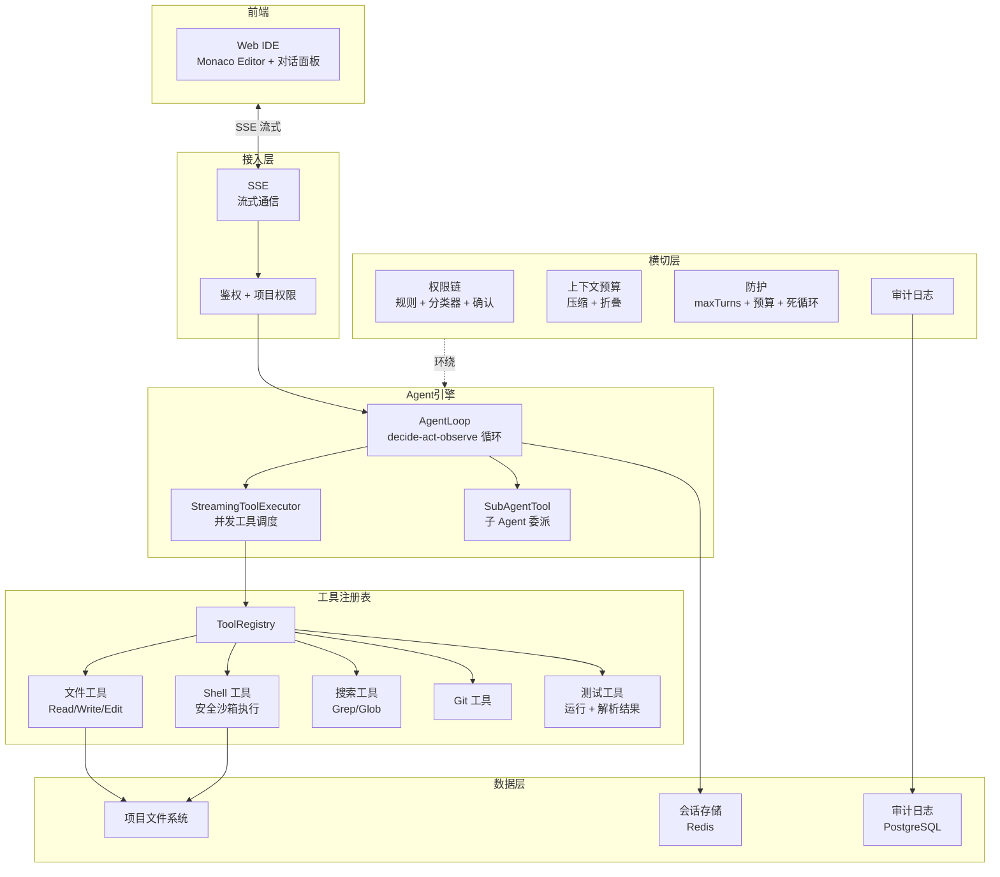

# 企业级项目二：AI 代码生成与审查平台（CodeForge）

> 对标 Claude Code 的 Java 版实现——用 Spring AI 构建一个能读写代码、执行命令、管理项目的 AI Agent 平台。

---

## 为什么是这一个项目

项目一（AgentForge 客服平台）让你掌握了企业级 AI 应用的全栈能力。项目二让你**深入 Agent 系统的内核**——直接借鉴 Claude Code 的架构精髓，用 Java 实现一个真正的 AI 编程助手。

### 与项目一的关系

| 维度 | 项目一 AgentForge | 项目二 CodeForge |
|------|------------------|------------------|
| 领域 | 客服（非技术用户） | 编程（开发者） |
| Agent 深度 | 3 个 Agent 协作 | Agent 循环 + 子 Agent 委派 |
| 工具复杂度 | 4 个工具（KB/工单/通知/分析） | 10+ 个工具（文件/Shell/搜索/Git/测试） |
| 安全 | Prompt Injection 防御 | 沙箱 + 权限模型 + 命令分类 |
| 上下文 | 历史裁剪 + 压缩 | 上下文预算 + 折叠 + CLAUDE.md 式指令 |
| 核心挑战 | 多租户 + 合规 | **Agent 循环可靠性 + 工具调度并发** |

---

## 借鉴 Claude Code 的 7 个架构模式

| Claude Code 模式 | 在 CodeForge 中的 Java 实现 |
|-----------------|---------------------------|
| **Agent 循环** | `AgentLoop` 类，基于 ToolCallingAdvisor，配三重保护 |
| **工具注册表** | `ToolRegistry` + `@Tool` 声明式注册 + 条件加载（按权限/项目类型） |
| **权限中间件** | `PermissionAdvisor` 链：规则匹配 → 分类器 → 交互确认 |
| **上下文预算** | `ContextBudgetManager`：保留 → 压缩 → 折叠 → 截断 |
| **子 Agent 委派** | `SubAgentTool`：主 Agent 创建子 Agent 处理独立子任务 |
| **流式管道** | 全链路 Flux：LLM → 工具 → 前端 SSE |
| **渐进降级** | 工具失败 → 返回错误给 LLM；LLM 超时 → 返回缓存 |

---

## 项目全景

### 用户视角

```
开发者：
  1. 打开 CodeForge Web IDE
  2. 选择项目目录
  3. 用自然语言描述任务："给 UserService 加上分页查询"
  4. Agent 自主：读取代码 → 分析结构 → 修改代码 → 运行测试 → 汇报
  5. 流式展示 Agent 的每一步思考和行动
  6. 危险操作（删文件/执行 rm）弹出确认

技术负责人：
  1. 上传代码评审规范文档
  2. 提交 PR → Agent 自动审查 → 生成评审报告
  3. 查看审查历史和统计数据
```

### 核心功能

```
1. AI 对话编程（Agent 模式）
   - 读写文件、搜索代码、执行 Shell
   - 多轮对话 + 流式输出
   - 危险操作确认

2. 自动代码评审（Workflow 模式）
   - 提交代码 → 自动触发评审
   - Parallelization：bug/风格/安全/性能 并行分析
   - Evaluator-Optimizer：评估报告质量 → 改进

3. 项目上下文管理
   - 类似 CLAUDE.md 的项目指令文件
   - 上下文预算：自动压缩长对话
   - 代码库摘要：Agent 理解项目结构

4. 安全沙箱
   - 文件系统白名单
   - Shell 命令分类（只读/写/危险）
   - 操作审计日志
```

---

## 架构设计



---

## 项目目录结构

```
code-forge/
├── docs/
│   ├── README.md
│   ├── architecture.md               # 架构设计
│   └── adr/
│       ├── 001-Agent循环设计.md
│       ├── 002-工具注册表设计.md
│       └── 003-沙箱安全模型.md
│
├── src/main/java/com/codeforge/
│   ├── CodeForgeApplication.java
│   │
│   ├── agent/                         # Agent 引擎
│   │   ├── AgentLoop.java             # Agent 循环核心
│   │   ├── AgentContext.java          # 循环状态（闭包式状态管理）
│   │   ├── SubAgentTool.java          # 子 Agent 委派
│   │   └── TaskResult.java            # 任务结果
│   │
│   ├── tool/                          # 工具系统（借鉴 Claude Code ch14）
│   │   ├── Tool.java                  # 统一工具接口
│   │   ├── ToolDescriptor.java        # 工具描述符（name/desc/schema/permission）
│   │   ├── ToolRegistry.java          # 注册表（声明式 + 条件注册）
│   │   ├── ToolExecutor.java          # 并发调度器
│   │   ├── file/
│   │   │   ├── FileReadTool.java
│   │   │   ├── FileWriteTool.java
│   │   │   └── FileEditTool.java      # 精确字符串替换（非行号）
│   │   ├── shell/
│   │   │   ├── BashTool.java          # 安全 Shell 执行
│   │   │   ├── CommandClassifier.java # 命令风险分类（借鉴 ch20）
│   │   │   └── Sandbox.java           # 沙箱（路径白名单 + 超时）
│   │   ├── search/
│   │   │   ├── GrepTool.java          # 内容搜索
│   │   │   └── GlobTool.java          # 文件搜索
│   │   ├── git/
│   │   │   ├── GitDiffTool.java
│   │   │   └── GitCommitTool.java
│   │   └── test/
│   │       └── RunTestTool.java       # 运行测试 + 解析结果
│   │
│   ├── permission/                    # 权限系统（借鉴 Claude Code ch20-23）
│   │   ├── PermissionModel.java       # 权限模式（ASK/AUTO/PLAN）
│   │   ├── PermissionRule.java        # 规则匹配
│   │   ├── PermissionAdvisor.java     # Advisor 链集成
│   │   └── RiskClassifier.java        # 操作风险分类
│   │
│   ├── context/                       # 上下文管理（借鉴 Claude Code ch10-13）
│   │   ├── ContextBudgetManager.java  # Token 预算分配
│   │   ├── ContextCompactor.java      # 压缩 + 折叠
│   │   ├── ProjectContext.java        # 项目指令（类似 CLAUDE.md）
│   │   └── CodebaseSummary.java       # 代码库摘要
│   │
│   ├── guard/                         # 防护层
│   │   ├── BudgetGuardAdvisor.java
│   │   ├── LoopDetectionAdvisor.java
│   │   └── MaxTurnsGuard.java
│   │
│   ├── review/                        # 代码评审 Workflow
│   │   ├── CodeReviewOrchestrator.java
│   │   ├── BugAnalysisWorker.java
│   │   ├── StyleAnalysisWorker.java
│   │   ├── SecurityAnalysisWorker.java
│   │   └── ReviewEvaluator.java
│   │
│   ├── controller/
│   │   ├── AgentController.java       # Agent 对话接口
│   │   ├── ReviewController.java      # 代码评审接口
│   │   └── ProjectController.java     # 项目管理
│   │
│   ├── sse/
│   │   └── AgentSseHandler.java # SSE 流式通信
│   │
│   └── obs/
│       ├── AiMetrics.java
│       └── AuditLogger.java
│
├── src/main/resources/
│   ├── static/
│   │   ├── index.html                 # Web IDE
│   │   └── assets/
│   └── application.yml
│
├── docker-compose.yml
├── Dockerfile
└── pom.xml
```

---

## 分阶段构建计划（6 周）

### Sprint 1（第 1-2 周）：Agent 循环 + 文件工具

**目标**：Agent 能读写文件、搜索代码，用自然语言完成简单编程任务。

**交付物**：
- [ ] `AgentLoop` 核心循环（ToolCallingAdvisor + 三重保护）
- [ ] `ToolRegistry` 统一注册表
- [ ] FileReadTool / FileWriteTool / FileEditTool（精确字符串替换）
- [ ] GrepTool / GlobTool（代码搜索）
- [ ] SSE 流式通信
- [ ] Web IDE 前端（Monaco Editor + 对话面板）

**验证**："读取 src 下的所有 Java 文件" → Agent 自主搜索并读取。

### Sprint 2（第 2-3 周）：安全 Shell + 权限模型

**目标**：Agent 能安全地执行 Shell 命令，有权限确认机制。

**交付物**：
- [ ] BashTool + Sandbox（路径白名单 + 超时 + 输出截断）
- [ ] CommandClassifier（命令风险分类：只读/写/危险）
- [ ] PermissionAdvisor（规则匹配 → 分类器 → 交互确认）
- [ ] 危险操作 SSE 确认对话框
- [ ] 操作审计日志

**验证**：`ls`/`cat` 自动放行；`rm`/`git push` 需确认；`curl|bash` 被拒绝。

### Sprint 3（第 3-4 周）：上下文工程 + 项目指令

**目标**：Agent 理解项目结构，长对话不爆窗口。

**交付物**：
- [ ] `ContextBudgetManager`（Token 预算分配）
- [ ] `ContextCompactor`（自动压缩 + 摘要 + 折叠）
- [ ] `ProjectContext`（类似 CLAUDE.md 的项目指令）
- [ ] `CodebaseSummary`（代码库结构摘要）
- [ ] 历史裁剪策略（保留最近 N 轮 + 摘要旧轮次）

**验证**：50 轮长对话不爆窗口；Agent 知道项目的编码规范。

### Sprint 4（第 4-5 周）：子 Agent + 代码评审

**目标**：子 Agent 委派 + 自动代码评审 Workflow。

**交付物**：
- [ ] SubAgentTool（主 Agent 创建子 Agent 处理独立任务）
- [ ] CodeReviewOrchestrator（Parallelization + Evaluator）
- [ ] BugAnalysisWorker / StyleAnalysisWorker / SecurityAnalysisWorker
- [ ] ReviewEvaluator（评审质量检查）
- [ ] GitDiffTool（获取代码变更）

**验证**：提交 PR → 自动触发多维评审 → 生成结构化报告。

### Sprint 5（第 5-6 周）：测试 + 部署 + 文档

**交付物**：
- [ ] 四层测试（单元/集成/eval/契约）
- [ ] Docker Compose 部署
- [ ] 完整文档 + ADR
- [ ] 简历级项目描述

---

## 验收标准

### Agent 能力
- [ ] 能读写文件、搜索代码、执行命令
- [ ] 能完成多步骤编程任务（如"加分页"）
- [ ] 危险操作有确认
- [ ] 长对话不崩溃（上下文压缩生效）

### 工程质量
- [ ] 工具注册表统一管理（声明式 + 条件注册）
- [ ] 权限模型三层（规则 + 分类器 + 确认）
- [ ] Agent 三重保护（maxTurns + 预算 + 死循环）
- [ ] 全链路 trace + 审计日志
- [ ] 四层测试覆盖

---

## 详细实现文档索引

| Sprint | 文档 | 核心内容 |
|--------|------|---------|
| Sprint 1 | [Agent 循环 + 文件工具](Sprint1-Agent循环.md) | AgentLoop + ToolRegistry + 文件/搜索工具 + Web IDE |
| Sprint 2 | [安全 Shell + 权限](Sprint2-Shell权限.md) | BashTool + Sandbox + CommandClassifier + 权限链 |
| Sprint 3 | [上下文工程](Sprint3-上下文工程.md) | 预算管理 + 压缩折叠 + 项目指令 + 代码库摘要 |
| Sprint 4 | [子 Agent + 评审](Sprint4-子Agent评审.md) | SubAgentTool + Parallelization + Evaluator |
| Sprint 5 | [测试 + 部署](Sprint5-测试部署.md) | 四层测试 + Docker + 文档 |
