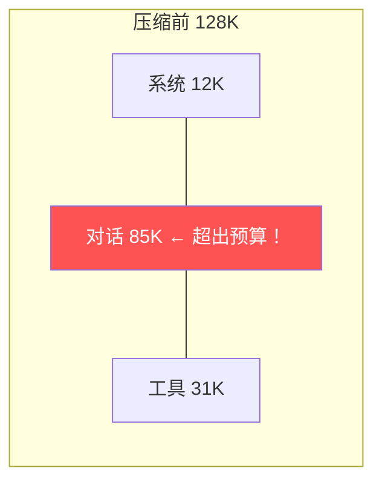
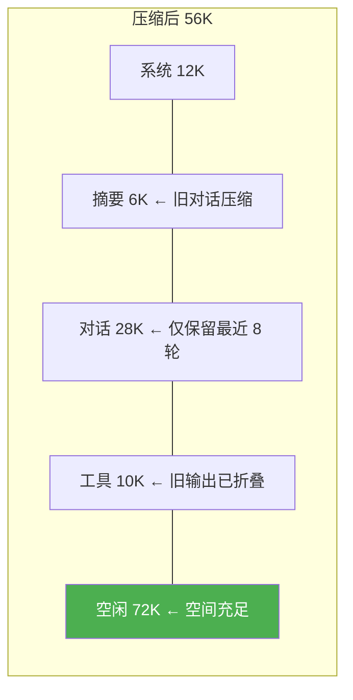

# CodeForge Sprint 3：上下文工程 + 项目指令 + 代码库摘要

> 目标：Agent 理解项目结构，长对话不爆窗口
> 时间：1.5 周 · 前置：Sprint 2 完成

---

## 核心设计思想（借鉴 Claude Code ch10-13）

> **上下文不是越多越好——它是一种稀缺资源，需要像预算一样管理。**
>
> Claude Code 的四级上下文管理策略：
> 1. **Preserve（保留）**：系统指令、项目说明、最近对话——这些是最有价值的，始终保留
> 2. **Compress（压缩）**：旧对话轮次——用摘要替代原文，保留信息量但减少 token
> 3. **Fold（折叠）**：工具返回的大段输出——只在需要时展开，默认折叠为摘要
> 4. **Truncate（截断）**：最后手段——直接截断超出窗口的内容

---

## Day 1-3：ContextBudgetManager Token 预算分配

### Step 1：Token 预算模型

```java
package com.codeforge.context;

import org.springframework.ai.chat.messages.Message;
import org.springframework.beans.factory.annotation.Value;
import org.springframework.stereotype.Component;

import java.util.List;

/**
 * Token 预算管理器
 *
 * 把上下文窗口想象成一块固定大小的蛋糕，按优先级切分：
 *
 * ┌──────────────────────────────────────────┐
 * │            Context Window (128K)          │
 * ├──────────────────────────────────────────┤
 * │  System Prompt + 项目指令    ~4K (固定)   │ ← 永远保留
 * │  Tool 定义                   ~8K (固定)   │ ← 永远保留
 * ├──────────────────────────────────────────┤
 * │  最近 N 轮对话               ~32K (动态)  │ ← 高优先级保留
 * │  压缩后的历史摘要             ~8K (动态)  │ ← 中优先级
 * ├──────────────────────────────────────────┤
 * │  工具返回结果                ~16K (可裁剪)│ ← 低优先级，可折叠
 * │  检索到的代码片段             ~8K (可裁剪)│ ← 低优先级
 * ├──────────────────────────────────────────┤
 * │  留给 LLM 生成               ~52K (预留)  │ ← 输出空间
 * └──────────────────────────────────────────┘
 */
@Component
public class ContextBudgetManager {

    @Value("${codeforge.context.max-tokens:128000}")
    private int maxContextTokens;

    @Value("${codeforge.context.system-budget:12000}")
    private int systemBudget;       // 系统 + 工具定义

    @Value("${codeforge.context.recent-turns:32}")
    private int recentTurnsBudget;  // 最近对话

    @Value("${codeforge.context.summary-budget:8}")
    private int summaryBudgetK;     // 历史摘要

    @Value("${codeforge.context.tool-output:16}")
    private int toolOutputBudgetK;  // 工具输出

    @Value("${codeforge.context.output-reserve:52}")
    private int outputReserveK;     // 输出预留

    /**
     * 计算当前消息列表的 token 估算值
     * 粗略估算：1 token ≈ 4 字符（英文）或 ≈ 1.5 字（中文）
     */
    public int estimateTokens(List<Message> messages) {
        return messages.stream()
                .mapToInt(m -> estimateTokens(m.getText()))
                .sum();
    }

    public int estimateTokens(String text) {
        if (text == null || text.isEmpty()) return 0;
        // 粗略估算：中文字符按 1.5 token/字，ASCII 按 0.25 token/字符
        int cjk = 0, ascii = 0;
        for (char c : text.toCharArray()) {
            if (c > 127) cjk++;
            else ascii++;
        }
        return (int) (cjk * 1.5 + ascii * 0.25);
    }

    /**
     * 检查预算是否超限，返回需要释放的 token 数
     */
    public int getOverflow(List<Message> messages) {
        int used = estimateTokens(messages);
        int limit = maxContextTokens - outputReserveK * 1000;
        return Math.max(0, used - limit);
    }

    /**
     * 决定保留多少轮最近对话
     */
    public int getMaxRecentTurns() {
        return recentTurnsBudget / 4; // 每轮平均 4K token
    }

    // Getters
    public int getRecentTurnsBudget() { return recentTurnsBudget; }
    public int getSummaryBudgetK() { return summaryBudgetK; }
    public int getToolOutputBudgetK() { return toolOutputBudgetK; }
}
```

### Step 2：ContextCompactor 上下文压缩器

```java
package com.codeforge.context;

import org.springframework.ai.chat.client.ChatClient;
import org.springframework.ai.chat.messages.Message;
import org.springframework.ai.chat.messages.UserMessage;
import org.springframework.ai.chat.messages.AssistantMessage;
import org.springframework.stereotype.Component;

import java.util.ArrayList;
import java.util.List;

/**
 * 上下文压缩器——四级策略
 *
 * 当 token 超预算时，按顺序执行：
 * 1. Fold：折叠旧工具输出（大段代码 → 摘要行）
 * 2. Compress：压缩旧对话（多轮 → 摘要）
 * 3. Truncate：截断单条超长消息
 * 4. Drop：最后手段，丢弃最低优先级消息
 */
@Component
public class ContextCompactor {

    private final ChatClient summarizer; // 专用摘要 ChatClient（不带工具）
    private final ContextBudgetManager budget;

    public ContextCompactor(ChatClient.Builder builder, ContextBudgetManager budget) {
        this.summarizer = builder.build(); // 轻量摘要客户端
        this.budget = budget;
    }

    /**
     * 压缩消息列表，使其符合 token 预算
     */
    public List<Message> compact(List<Message> messages) {
        int overflow = budget.getOverflow(messages);
        if (overflow <= 0) return messages;

        List<Message> result = new ArrayList<>(messages);

        // Level 1: 折叠旧工具输出
        result = foldOldToolResults(result);
        overflow = budget.getOverflow(result);
        if (overflow <= 0) return result;

        // Level 2: 压缩旧对话轮次
        result = compressOldTurns(result);
        overflow = budget.getOverflow(result);
        if (overflow <= 0) return result;

        // Level 3: 截断超长消息
        result = truncateLongMessages(result);
        overflow = budget.getOverflow(result);
        if (overflow <= 0) return result;

        // Level 4: 丢弃最低优先级消息
        result = dropLowPriority(result, overflow);

        return result;
    }

    /**
     * Level 1：折叠旧工具输出
     * 把超过 N 行的工具返回结果替换为摘要行
     */
    private List<Message> foldOldToolResults(List<Message> messages) {
        List<Message> result = new ArrayList<>();
        int foldThreshold = 50; // 超过 50 行的工具输出才折叠

        for (int i = 0; i < messages.size(); i++) {
            Message msg = messages.get(i);
            String text = msg.getText();

            if (text != null && text.lines().count() > foldThreshold) {
                // 判断是否是工具输出（通常是 AssistantMessage 中的工具响应）
                int lineCount = (int) text.lines().count();
                String firstLine = text.lines().findFirst().orElse("");
                String folded = """
                    [折叠的工具输出 — 共 %d 行]
                    首行：%s
                    ...
                    末行：%s
                    """.formatted(lineCount, firstLine,
                            text.lines().reduce((a, b) -> b).orElse(""));

                // 重建消息（保留角色信息）
                if (msg instanceof AssistantMessage am) {
                    result.add(new AssistantMessage(folded));
                } else {
                    result.add(new UserMessage(folded));
                }
            } else {
                result.add(msg);
            }
        }

        return result;
    }

    /**
     * Level 2：压缩旧对话轮次
     * 保留最近 N 轮原文，更早的轮次用 LLM 生成摘要
     */
    private List<Message> compressOldTurns(List<Message> messages) {
        int maxRecent = budget.getMaxRecentTurns();

        // 如果消息数量不够多，不需要压缩
        if (messages.size() <= maxRecent * 2 + 1) {
            return messages;
        }

        // 找到分割点：保留最近 maxRecent*2 条消息 + system
        int splitIndex = messages.size() - maxRecent * 2;
        List<Message> oldMessages = messages.subList(0, splitIndex);
        List<Message> recentMessages = messages.subList(splitIndex, messages.size());

        // 用 LLM 生成旧对话摘要
        String summary = generateSummary(oldMessages);

        List<Message> result = new ArrayList<>();
        result.add(new UserMessage("【之前的对话摘要】\n" + summary));
        result.addAll(recentMessages);

        return result;
    }

    /**
     * Level 3：截断超长单条消息
     */
    private List<Message> truncateLongMessages(List<Message> messages) {
        int maxSingleMessageTokens = budget.getToolOutputBudgetK() * 1000;

        return messages.stream().map(msg -> {
            int tokens = budget.estimateTokens(msg.getText());
            if (tokens > maxSingleMessageTokens) {
                String truncated = msg.getText().substring(0, maxSingleMessageTokens * 3); // token→char 粗略转换
                truncated += "\n\n[... 消息被截断，原始大小约 " + tokens + " tokens ...]";
                if (msg instanceof AssistantMessage) {
                    return (Message) new AssistantMessage(truncated);
                } else {
                    return (Message) new UserMessage(truncated);
                }
            }
            return msg;
        }).toList();
    }

    /**
     * Level 4：丢弃最低优先级
     */
    private List<Message> dropLowPriority(List<Message> messages, int overflowTokens) {
        // 优先丢弃工具输出，再丢弃旧对话
        // System prompt 和最近 2 轮永远不丢
        List<Message> result = new ArrayList<>(messages);
        int tokensToDrop = overflowTokens;

        for (int i = result.size() - 3; i >= 0 && tokensToDrop > 0; i--) {
            // 从倒数第 3 条往前丢（保留最近 2 轮）
            Message msg = result.get(i);
            int msgTokens = budget.estimateTokens(msg.getText());

            result.remove(i);
            tokensToDrop -= msgTokens;
        }

        return result;
    }

    /**
     * 用 LLM 生成对话摘要
     */
    private String generateSummary(List<Message> messages) {
        var conversationText = new StringBuilder();
        for (Message msg : messages) {
            conversationText.append("[").append(msg.getMessageType()).append("]: ")
                    .append(msg.getText()).append("\n\n");
        }

        return summarizer.prompt()
                .system("""
                    你是对话压缩器。把下面的对话历史压缩为简洁摘要。
                    规则：
                    - 保留关键决策、用户需求、Agent 的操作结果
                    - 丢弃寒暄、重复确认、工具输出细节
                    - 摘要不超过 500 字
                    - 用要点格式
                    """)
                .user(conversationText.toString())
                .call()
                .content();
    }
}
```

---

## Day 4-6：ProjectContext 项目指令

### Step 3：ProjectContext（类似 CLAUDE.md）

```java
package com.codeforge.context;

import org.springframework.stereotype.Component;

import java.io.IOException;
import java.nio.file.*;
import java.util.Optional;

/**
 * 项目指令——类似 Claude Code 的 CLAUDE.md
 *
 * 自动加载项目根目录下的 .codeforge 文件，作为系统指令注入。
 * 层次结构（高优先级覆盖低优先级）：
 *   ~/.codeforge           ← 用户全局指令
 *   project/.codeforge     ← 项目级指令
 *   project/sub/.codeforge ← 子目录级指令（Agent 工作在该目录时加载）
 */
@Component
public class ProjectContext {

    private static final String CONFIG_FILE = ".codeforge";

    /**
     * 加载完整的项目指令（合并全局 + 项目 + 子目录）
     */
    public String loadInstructions(Path projectRoot) {
        var sb = new StringBuilder();

        // 1. 全局指令
        loadFile(Path.of(System.getProperty("user.home"), CONFIG_FILE))
                .ifPresent(content -> sb.append("【全局指令】\n").append(content).append("\n\n"));

        // 2. 项目指令
        loadFile(projectRoot.resolve(CONFIG_FILE))
                .ifPresent(content -> sb.append("【项目指令】\n").append(content).append("\n\n"));

        return sb.toString();
    }

    private Optional<String> loadFile(Path path) {
        try {
            if (Files.exists(path) && Files.isRegularFile(path)) {
                return Optional.of(Files.readString(path));
            }
        } catch (IOException ignored) {}
        return Optional.empty();
    }

    /**
     * 创建项目指令模板
     */
    public String getTemplate() {
        return """
            # 项目指令

            ## 项目概述
            项目名称：你的项目名
            技术栈：Java 21 + Spring Boot 3.5 + Spring AI

            ## 编码规范
            - 使用 record 定义不可变数据
            - 使用 Lombok @Slf4j 替代手写 logger
            - Service 层方法必须有日志（入口+出口）
            - Controller 层统一用 ApiResponse 包装返回值

            ## 构建 & 测试
            - 构建：mvn clean package -DskipTests
            - 测试：mvn test
            - 单个测试类：mvn test -Dtest=XxxTest

            ## 已知问题
            - （列出 Agent 应该注意的已知问题）

            ## 不要修改
            - src/main/resources/application.yml（敏感配置）
            - src/test/（测试目录）
            """;
    }
}
```

### Step 4：CodebaseSummary 代码库摘要

```java
package com.codeforge.context;

import org.springframework.ai.chat.client.ChatClient;
import org.springframework.stereotype.Component;

import java.io.IOException;
import java.nio.file.*;
import java.util.*;
import java.util.stream.Collectors;
import java.util.stream.Stream;

/**
 * 代码库摘要——让 Agent 快速理解项目结构
 *
 * 类似 Claude Code 的"代码地图"功能：
 * 1. 扫描项目目录结构
 * 2. 提取关键信息（包结构、主要类、依赖关系）
 * 3. 用 LLM 生成自然语言摘要
 * 4. 缓存结果，只在文件变更时重新生成
 */
@Component
public class CodebaseSummary {

    private final ChatClient summarizer;
    private String cachedSummary = null;
    private long lastBuildTime = 0;

    private static final Set<String> CODE_EXTENSIONS = Set.of(
        ".java", ".xml", ".yml", ".yaml", ".properties", ".sql"
    );

    private static final Set<String> IGNORE_DIRS = Set.of(
        "target", "node_modules", ".git", ".idea", "dist", "build"
    );

    public CodebaseSummary(ChatClient.Builder builder) {
        this.summarizer = builder.build();
    }

    /**
     * 获取代码库摘要（有缓存）
     */
    public String getSummary(Path projectRoot) {
        // 检查是否需要刷新
        if (cachedSummary != null && !isStale(projectRoot)) {
            return cachedSummary;
        }

        cachedSummary = generateSummary(projectRoot);
        lastBuildTime = System.currentTimeMillis();
        return cachedSummary;
    }

    /**
     * 检查代码库是否有变更
     */
    private boolean isStale(Path projectRoot) {
        try (Stream<Path> stream = Files.walk(projectRoot, 3)) {
            return stream
                    .filter(Files::isRegularFile)
                    .filter(p -> CODE_EXTENSIONS.stream()
                            .anyMatch(ext -> p.toString().endsWith(ext)))
                    .filter(p -> IGNORE_DIRS.stream()
                            .noneMatch(ignore -> p.toString().contains("/" + ignore + "/")))
                    .anyMatch(p -> {
                        try {
                            return Files.getLastModifiedTime(p).toMillis() > lastBuildTime;
                        } catch (IOException e) { return false; }
                    });
        } catch (IOException e) {
            return true; // 出错时强制刷新
        }
    }

    /**
     * 生成代码库摘要
     */
    private String generateSummary(Path projectRoot) {
        // 1. 收集项目结构信息
        String dirTree = buildDirectoryTree(projectRoot);
        String keyClasses = findKeyClasses(projectRoot);
        String dependencies = extractDependencies(projectRoot);

        // 2. 用 LLM 生成自然语言摘要
        return summarizer.prompt()
                .system("""
                    你是代码库分析器。根据项目结构信息，生成简洁的项目摘要。
                    输出格式：
                    ## 项目概览（一句话）
                    ## 包结构（主要的包及其职责）
                    ## 核心类（最重要的 5-10 个类及其作用）
                    ## 依赖关系（关键依赖）
                    ## 构建/测试命令
                    """)
                .user("""
                    目录结构：
                    %s

                    核心类：
                    %s

                    依赖：
                    %s
                    """.formatted(dirTree, keyClasses, dependencies))
                .call()
                .content();
    }

    /**
     * 构建目录树（深度 3 层）
     */
    private String buildDirectoryTree(Path root) {
        var sb = new StringBuilder();
        try (Stream<Path> stream = Files.walk(root, 3)) {
            stream.filter(p -> IGNORE_DIRS.stream()
                        .noneMatch(ignore -> p.toString().contains("/" + ignore)))
                  .filter(p -> p != root)
                  .sorted()
                  .forEach(p -> {
                      int depth = root.relativize(p).getNameCount();
                      String indent = "  ".repeat(depth);
                      String name = p.getFileName().toString();
                      sb.append(indent).append(name);
                      if (Files.isDirectory(p)) sb.append("/");
                      sb.append("\n");
                  });
        } catch (IOException e) {
            sb.append("（无法读取目录结构：").append(e.getMessage()).append("）");
        }
        return sb.toString();
    }

    /**
     * 找出关键类（@Component/@Service/@RestController/@Configuration）
     */
    private String findKeyClasses(Path root) {
        try (Stream<Path> stream = Files.walk(root)) {
            return stream
                    .filter(p -> p.toString().endsWith(".java"))
                    .filter(p -> IGNORE_DIRS.stream()
                            .noneMatch(ignore -> p.toString().contains("/" + ignore)))
                    .map(p -> {
                        try {
                            String content = Files.readString(p);
                            List<String> annotations = new ArrayList<>();
                            if (content.contains("@RestController") || content.contains("@Controller"))
                                annotations.add("Controller");
                            if (content.contains("@Service"))
                                annotations.add("Service");
                            if (content.contains("@Configuration"))
                                annotations.add("Config");
                            if (content.contains("@Repository"))
                                annotations.add("Repository");
                            if (content.contains("@Component"))
                                annotations.add("Component");
                            if (content.contains("@SpringBootApplication"))
                                annotations.add("Main");

                            if (annotations.isEmpty()) return null;

                            // 提取类名
                            String className = p.getFileName().toString().replace(".java", "");
                            return className + " [" + String.join("/", annotations) + "]";
                        } catch (IOException e) { return null; }
                    })
                    .filter(Objects::nonNull)
                    .collect(Collectors.joining("\n"));
        } catch (IOException e) {
            return "（无法扫描 Java 文件）";
        }
    }

    /**
     * 提取 pom.xml 中的依赖
     */
    private String extractDependencies(Path root) {
        Path pom = root.resolve("pom.xml");
        if (!Files.exists(pom)) return "（未找到 pom.xml）";

        try {
            String content = Files.readString(pom);
            var deps = new ArrayList<String>();
            var lines = content.lines().toList();
            boolean inDependency = false;
            String currentArtifact = "";

            for (String line : lines) {
                if (line.contains("<artifactId>") && !line.contains("</dependencies>")) {
                    String artifact = line.replaceAll(".*<artifactId>(.*)</artifactId>.*", "$1").trim();
                    if (inDependency) {
                        currentArtifact = artifact;
                    }
                }
                if (line.contains("<dependency>")) inDependency = true;
                if (line.contains("</dependency>")) {
                    if (!currentArtifact.isEmpty()) {
                        deps.add(currentArtifact);
                        currentArtifact = "";
                    }
                    inDependency = false;
                }
            }

            return String.join("\n", deps);
        } catch (IOException e) {
            return "（无法读取 pom.xml）";
        }
    }
}
```

---

## Day 7-9：Advisor 集成 + 上下文裁剪

### Step 5：ContextManagementAdvisor

```java
package com.codeforge.context;

import org.springframework.ai.chat.client.advisor.api.*;
import org.springframework.ai.chat.messages.Message;
import org.springframework.stereotype.Component;

import java.util.List;

/**
 * 上下文管理 Advisor——在每次请求前检查并压缩上下文
 *
 * 执行顺序：在 MemoryAdvisor 之后（拿到完整历史），在 LLM 调用之前
 */
@Component
public class ContextManagementAdvisor implements CallAdvisor, StreamAdvisor {

    private final ContextBudgetManager budgetManager;
    private final ContextCompactor compactor;

    public ContextManagementAdvisor(ContextBudgetManager budgetManager,
                                     ContextCompactor compactor) {
        this.budgetManager = budgetManager;
        this.compactor = compactor;
    }

    @Override
    public int getOrder() { return 2; } // 在 MemoryAdvisor(0) 之后

    @Override
    public AdvisedResponse adviseCall(AdvisedRequest request, CallAdvisorChain chain) {
        // 检查预算
        List<Message> messages = request.messages();
        int overflow = budgetManager.getOverflow(messages);

        if (overflow > 0) {
            // 执行压缩
            List<Message> compacted = compactor.compact(messages);
            request = AdvisedRequest.from(request)
                    .withMessages(compacted)
                    .build();
        }

        return chain.nextCall(request);
    }

    @Override
    public AdvisedResponse adviseStream(AdvisedRequest request, StreamAdvisorChain chain) {
        return adviseCall(request, chain);
    }
}
```

### Step 6：更新 AgentConfig 注入上下文管理

```java
@Configuration
public class AgentConfig {

    @Bean
    public ChatClient chatClient(ChatClient.Builder builder,
                                  ChatMemory memory,
                                  InputFilterAdvisor inputFilter,
                                  ContextManagementAdvisor contextManager,
                                  BudgetGuardAdvisor budgetGuard,
                                  LoopDetectionAdvisor loopDetection,
                                  PermissionAdvisor permission,
                                  TokenBillingAdvisor billing,
                                  AuditAdvisor audit,
                                  ToolRegistry toolRegistry,
                                  ProjectContext projectContext,
                                  CodebaseSummary codebaseSummary) {

        // 加载项目指令
        String projectInstructions = projectContext.loadInstructions(
                Path.of(System.getProperty("user.dir")));

        // 加载代码库摘要
        String codebaseSummaryText = codebaseSummary.getSummary(
                Path.of(System.getProperty("user.dir")));

        return builder
                .defaultSystem("""
                    你是 CodeForge，一个 Java AI 编程助手。

                    %s

                    == 代码库概览 ==
                    %s

                    == 工作规则 ==
                    1. 每次只执行一步，观察结果后再决定下一步
                    2. 修改文件前先 read_file 读取当前内容
                    3. 执行 Shell 命令前检查权限模式
                    4. 任务完成后用自然语言汇总
                    """.formatted(projectInstructions, codebaseSummaryText))
                .defaultAdvisors(
                    inputFilter,                              // -100
                    MessageChatMemoryAdvisor.builder(memory).build(), // 0
                    contextManager,                           // 2: 上下文管理
                    permission,                               // 5: 权限检查
                    budgetGuard,                              // 8: 预算保护
                    loopDetection,                            // 9: 死循环检测
                    billing,                                  // 10: 计费
                    audit                                     // 300: 审计
                )
                .defaultTools(toolRegistry.getEnabledTools())
                .build();
    }
}
```

### Step 7：上下文相关配置

```yaml
codeforge:
  context:
    max-tokens: 128000           # 上下文窗口大小
    system-budget: 12000         # 系统+工具定义预算
    recent-turns: 32             # 最近对话保留（K tokens）
    summary-budget: 8            # 历史摘要预算（K tokens）
    tool-output: 16              # 工具输出预算（K tokens）
    output-reserve: 52           # 输出预留（K tokens）
    codeforge-file: .codeforge   # 项目指令文件名
```

---

## Day 10：上下文可视化

### Step 8：前端 Token 预算面板

```html
<!-- 在 Web IDE 状态栏添加 Token 预算面板 -->
<div class="context-meter" id="ctx-meter">
    <div class="ctx-bar">
        <div class="ctx-segment system" title="系统指令 + 工具定义" style="width: 9%">
            系统 12K
        </div>
        <div class="ctx-segment recent" title="最近对话" style="width: 25%" id="ctx-recent">
            对话 32K
        </div>
        <div class="ctx-segment summary" title="历史摘要" style="width: 6%" id="ctx-summary">
            摘要 8K
        </div>
        <div class="ctx-segment tools" title="工具输出" style="width: 12%" id="ctx-tools">
            工具 16K
        </div>
        <div class="ctx-segment free" title="剩余空间" style="width: 48%" id="ctx-free">
            空闲 60K
        </div>
    </div>
    <span class="ctx-label">76K / 128K</span>
</div>

<style>
.ctx-bar {
    display: flex;
    height: 20px;
    border-radius: 4px;
    overflow: hidden;
    background: #1e1e1e;
}
.ctx-segment {
    display: flex;
    align-items: center;
    justify-content: center;
    font-size: 10px;
    color: white;
    transition: width 0.3s;
}
.ctx-segment.system { background: #569cd6; }
.ctx-segment.recent { background: #4ec9b0; }
.ctx-segment.summary { background: #dcdcaa; }
.ctx-segment.tools { background: #ce9178; }
.ctx-segment.free { background: #2d2d2d; color: #666; }
</style>
```

---

## 上下文压缩效果验证

验证场景：50 轮长对话

**压缩前（Round 50）——超出预算：**


**压缩后（自动触发 Compact）——空间充足：**


---

## Sprint 3 验收

- [ ] 50 轮长对话不爆窗口
- [ ] 旧对话被自动压缩为摘要
- [ ] 大段工具输出被自动折叠
- [ ] Agent 知道项目的编码规范（来自 .codeforge）
- [ ] Agent 了解项目结构（来自代码库摘要）
- [ ] Token 预算面板实时显示
- [ ] .codeforge 文件正确加载和注入
- [ ] 代码库摘要在文件变更后自动刷新

---

## 下一步

→ [Sprint 4：子 Agent + 代码评审](Sprint4-子Agent评审.md)
