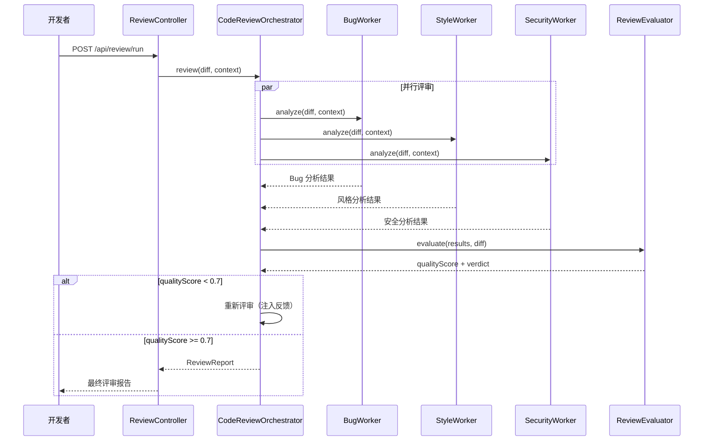

# CodeForge Sprint 4：子 Agent 委派 + 自动代码评审

> 目标：主 Agent 能委派子任务，自动触发多维代码评审
> 时间：1.5 周 · 前置：Sprint 3 完成

---

## 核心设计思想（借鉴 Claude Code ch6-9）

> **多 Agent 不是"多个 Agent 凑在一起"，而是 Actor 模型——每个 Agent 有独立的上下文、工具、生命周期，通过消息而非共享内存通信。**
>
> Claude Code 的 SubAgent 设计：
> 1. 主 Agent 遇到复杂子任务时，创建一个子 Agent
> 2. 子 Agent 有**独立的上下文窗口**（不与主 Agent 共享历史）
> 3. 子 Agent 有**受限的工具集**（只给它完成任务所需的工具）
> 4. 子 Agent 完成后，只把**结果摘要**返回给主 Agent（不是全部输出）
> 5. 主 Agent 综合子 Agent 的结果，继续执行

---

## Day 1-3：SubAgentTool 子 Agent 委派

### Step 1：SubAgentContext 子 Agent 上下文

```java
package com.codeforge.agent;

import java.util.List;

/**
 * 子 Agent 上下文——独立的执行环境
 *
 * 关键隔离点（借鉴 Claude Code Actor 模型）：
 * - 独立 sessionId（不共享主 Agent 的对话历史）
 * - 独立工具集（最小权限原则）
 * - 独立预算（防止子 Agent 消耗主 Agent 的预算）
 * - 独立轮次限制（子 Agent 不应该跑太久）
 */
public record SubAgentContext(
    String parentSessionId,
    String subSessionId,
    String task,
    List<String> allowedTools,
    int maxTurns,
    int tokenBudget
) {
    public static SubAgentContext of(String parentSessionId, String task,
                                      List<String> allowedTools, int maxTurns) {
        return new SubAgentContext(
            parentSessionId,
            parentSessionId + "_sub_" + System.currentTimeMillis(),
            task,
            allowedTools,
            maxTurns,
            16000 // 子 Agent 默认 16K token 预算
        );
    }
}
```

### Step 2：SubAgentExecutor 子 Agent 执行器

```java
package com.codeforge.agent;

import com.codeforge.tool.ToolRegistry;
import com.codeforge.permission.PermissionModel;
import org.springframework.ai.chat.client.ChatClient;
import org.springframework.stereotype.Component;

import java.util.Arrays;
import java.util.List;

/**
 * 子 Agent 执行器——创建并运行子 Agent
 *
 * 子 Agent 使用独立的 ChatClient（轻量配置），
 * 不带主 Agent 的完整 Advisor 链（只带基础防护）。
 */
@Component
public class SubAgentExecutor {

    private final ChatClient.Builder chatClientBuilder;
    private final ToolRegistry toolRegistry;

    public SubAgentExecutor(ChatClient.Builder chatClientBuilder,
                             ToolRegistry toolRegistry) {
        this.chatClientBuilder = chatClientBuilder;
        this.toolRegistry = toolRegistry;
    }

    /**
     * 执行子 Agent 任务
     *
     * @return 子 Agent 的结果摘要（不是全部输出）
     */
    public String execute(SubAgentContext ctx) {
        // 1. 获取子 Agent 允许使用的工具（按名称过滤）
        Object[] tools = ctx.allowedTools().stream()
                .map(toolRegistry::getTool)
                .filter(java.util.Objects::nonNull)
                .toArray();

        // 2. 构建轻量 ChatClient（只带预算防护，不带完整 Advisor 链）
        ChatClient subClient = chatClientBuilder
                .defaultSystem("""
                    你是一个专注的子 Agent。你的任务：
                    %s

                    规则：
                    - 只做分配给你的任务，不要发散
                    - 最多 %d 轮操作
                    - 完成后简洁汇报结果（不超过 500 字）
                    - 不需要与用户交互
                    """.formatted(ctx.task(), ctx.maxTurns()))
                .build();

        // 3. 执行
        try {
            String result = subClient.prompt()
                    .user(ctx.task())
                    .tools(tools)
                    .call()
                    .content();

            // 4. 返回摘要（不是全部输出）
            if (result != null && result.length() > 2000) {
                // 如果结果太长，截断
                return result.substring(0, 2000) + "\n\n[子 Agent 结果截断]";
            }
            return result != null ? result : "（子 Agent 无输出）";

        } catch (Exception e) {
            return "⚠️ 子 Agent 执行失败：" + e.getMessage();
        }
    }
}
```

### Step 3：SubAgentTool（注册为工具，让主 Agent 自主委派）

```java
package com.codeforge.agent;

import com.codeforge.tool.Tool;
import org.springframework.ai.tool.annotation.ToolParam;
import org.springframework.stereotype.Component;

import java.util.Arrays;
import java.util.List;

/**
 * 子 Agent 委派工具——让主 Agent 能创建子 Agent
 *
 * 主 Agent 调用此工具时，系统创建一个子 Agent 处理独立子任务。
 * 子 Agent 的结果返回给主 Agent，主 Agent 继续综合处理。
 */
@Component
public class SubAgentTool implements Tool {

    private final SubAgentExecutor executor;

    public SubAgentTool(SubAgentExecutor executor) {
        this.executor = executor;
    }

    @Override public String name() { return "delegate_subtask"; }
    @Override public String description() {
        return "委派一个独立子任务给子 Agent。"
             + "适用于需要多步骤、可并行的子任务。"
             + "子 Agent 有独立上下文，不受主对话历史影响。";
    }

    @org.springframework.ai.tool.annotation.Tool(description =
        "委派子任务给子 Agent。"
        + "task 是子任务的详细描述。"
        + "allowedTools 是子 Agent 可以使用的工具列表（逗号分隔）。"
        + "maxTurns 是子 Agent 最大执行轮次（建议 5-15）。"
        + "返回子 Agent 的结果摘要。")
    public String delegateSubtask(
            String task,
            String allowedTools,
            @ToolParam(description = "最大执行轮次", required = false) Integer maxTurns
    ) {
        int turns = maxTurns != null ? maxTurns : 10;

        List<String> tools = Arrays.asList(allowedTools.split(",\\s*"));

        var ctx = SubAgentContext.of("current", task, tools, turns);

        String result = executor.execute(ctx);

        return "子 Agent 执行结果：\n" + result;
    }
}
```

---

## Day 4-7：代码评审 Workflow

### Step 4：CodeReviewOrchestrator（Parallelization 模式）

```java
package com.codeforge.review;

import org.springframework.ai.chat.client.ChatClient;
import org.springframework.stereotype.Component;
import reactor.core.publisher.Mono;

import java.time.Duration;
import java.util.List;
import java.util.Map;

/**
 * 代码评审编排器——Parallelization + Evaluator-Optimizer
 *
 * 工作流：
 * 1. 获取代码变更（git diff）
 * 2. 并行执行 3 个评审 Worker（Bug/Style/Security）← Parallelization
 * 3. 收集所有 Worker 的结果
 * 4. Evaluator 检查评审质量 ← Evaluator-Optimizer
 * 5. 如果质量不达标，优化后重新评审
 * 6. 合并为最终报告
 */
@Component
public class CodeReviewOrchestrator {

    private final ChatClient.Builder clientBuilder;
    private final BugAnalysisWorker bugWorker;
    private final StyleAnalysisWorker styleWorker;
    private final SecurityAnalysisWorker securityWorker;
    private final ReviewEvaluator evaluator;

    public CodeReviewOrchestrator(ChatClient.Builder clientBuilder,
                                    BugAnalysisWorker bugWorker,
                                    StyleAnalysisWorker styleWorker,
                                    SecurityAnalysisWorker securityWorker,
                                    ReviewEvaluator evaluator) {
        this.clientBuilder = clientBuilder;
        this.bugWorker = bugWorker;
        this.styleWorker = styleWorker;
        this.securityWorker = securityWorker;
        this.evaluator = evaluator;
    }

    /**
     * 执行代码评审
     *
     * @param diff       git diff 内容
     * @param context    项目上下文（相关文件、规范等）
     * @return           评审报告 JSON
     */
    public Mono<ReviewReport> review(String diff, String context) {
        // Phase 1: 并行评审
        Mono<String> bugResult = Mono.fromCallable(() -> bugWorker.analyze(diff, context))
                .timeout(Duration.ofSeconds(30))
                .onErrorResume(e -> Mono.just("⚠️ Bug 分析失败：" + e.getMessage()));

        Mono<String> styleResult = Mono.fromCallable(() -> styleWorker.analyze(diff, context))
                .timeout(Duration.ofSeconds(30))
                .onErrorResume(e -> Mono.just("⚠️ 风格分析失败：" + e.getMessage()));

        Mono<String> securityResult = Mono.fromCallable(() -> securityWorker.analyze(diff, context))
                .timeout(Duration.ofSeconds(30))
                .onErrorResume(e -> Mono.just("⚠️ 安全分析失败：" + e.getMessage()));

        // 并行执行，等待全部完成
        return Mono.zip(bugResult, styleResult, securityResult)
                .flatMap(tuple -> {
                    var results = Map.of(
                        "bug", tuple.getT1(),
                        "style", tuple.getT2(),
                        "security", tuple.getT3()
                    );

                    // Phase 2: 评估评审质量
                    return evaluator.evaluate(results, diff)
                            .flatMap(evaluation -> {
                                if (evaluation.qualityScore() < 0.7) {
                                    // Phase 3: 质量不达标，重新评审（最多 1 次重试）
                                    return redoReview(diff, context, evaluation.feedback());
                                }
                                return Mono.just(buildReport(results, evaluation));
                            });
                });
    }

    /**
     * 重试评审（Evaluator-Optimizer 的优化环节）
     */
    private Mono<ReviewReport> redoReview(String diff, String context, String feedback) {
        // 把 Evaluator 的反馈注入 Worker 的 prompt，重新评审
        String enhancedContext = context + "\n\n【评审反馈】" + feedback;

        return review(diff, enhancedContext); // 递归（但有 budget 限制）
    }

    /**
     * 构建最终评审报告
     */
    private ReviewReport buildReport(Map<String, String> results,
                                      ReviewEvaluator.Evaluation evaluation) {
        return new ReviewReport(
            results.get("bug"),
            results.get("style"),
            results.get("security"),
            evaluation.qualityScore(),
            evaluation.overallVerdict(),
            java.time.Instant.now()
        );
    }

    public record ReviewReport(
        String bugAnalysis,
        String styleAnalysis,
        String securityAnalysis,
        double qualityScore,
        String overallVerdict,
        java.time.Instant timestamp
    ) {}
}
```

### Step 5：评审 Worker 基类

```java
package com.codeforge.review;

import org.springframework.ai.chat.client.ChatClient;

/**
 * 评审 Worker 基类——每个 Worker 是一个专用的 LLM 调用
 *
 * Worker 设计原则：
 * - 单一职责（一个 Worker 只评审一个维度）
 * - 独立上下文（不与其他 Worker 共享历史）
 * - 结构化输出（固定 JSON 格式，方便后续处理）
 * - 有超时保护（单个 Worker 不超过 30s）
 */
public abstract class ReviewWorker {

    protected final ChatClient client;

    protected ReviewWorker(ChatClient.Builder builder) {
        this.client = builder.build();
    }

    /**
     * 子类实现的评审逻辑
     */
    public abstract String analyze(String diff, String context);

    /**
     * 获取 Worker 维度名称
     */
    public abstract String dimension();
}
```

### Step 6：BugAnalysisWorker

```java
package com.codeforge.review;

import org.springframework.ai.chat.client.ChatClient;
import org.springframework.stereotype.Component;

@Component
public class BugAnalysisWorker extends ReviewWorker {

    public BugAnalysisWorker(ChatClient.Builder builder) {
        super(builder);
    }

    @Override
    public String dimension() { return "bug"; }

    @Override
    public String analyze(String diff, String context) {
        return client.prompt()
                .system("""
                    你是 Bug 分析专家。分析以下代码变更中的潜在 Bug。

                    检查维度：
                    1. 空指针风险（NPE）
                    2. 并发问题（竞态条件、死锁）
                    3. 资源泄漏（未关闭的流/连接）
                    4. 边界条件（off-by-one、数组越界）
                    5. 异常处理（吞异常、错误的 catch 顺序）
                    6. 逻辑错误（条件判断、循环）

                    输出格式（JSON）：
                    {
                      "issues": [
                        {
                          "severity": "critical|major|minor",
                          "line": "行号或行范围",
                          "description": "问题描述",
                          "suggestion": "修复建议"
                        }
                      ],
                      "summary": "整体 Bug 风险评估"
                    }
                    如果没有发现问题，返回 {"issues": [], "summary": "未发现明显 Bug"}。
                    """)
                .user("""
                    == 项目上下文 ==
                    %s

                    == 代码变更 ==
                    %s
                    """.formatted(context, diff))
                .call()
                .content();
    }
}
```

### Step 7：StyleAnalysisWorker + SecurityAnalysisWorker

```java
@Component
public class StyleAnalysisWorker extends ReviewWorker {

    public StyleAnalysisWorker(ChatClient.Builder builder) { super(builder); }

    @Override public String dimension() { return "style"; }

    @Override
    public String analyze(String diff, String context) {
        return client.prompt()
                .system("""
                    你是代码风格审查专家。分析以下代码变更的风格问题。

                    检查维度：
                    1. 命名规范（变量/方法/类名是否符合 Java 惯例）
                    2. 方法长度（单个方法不超过 50 行）
                    3. 圈复杂度（if/for/while 嵌套不超过 3 层）
                    4. 注释完整性（公共 API 必须有 Javadoc）
                    5. 代码重复（DRY 原则）
                    6. SOLID 原则遵循情况

                    输出格式与 BugAnalysisWorker 相同。
                    """)
                .user("== 项目上下文 ==\n%s\n\n== 代码变更 ==\n%s"
                        .formatted(context, diff))
                .call()
                .content();
    }
}
```

```java
@Component
public class SecurityAnalysisWorker extends ReviewWorker {

    public SecurityAnalysisWorker(ChatClient.Builder builder) { super(builder); }

    @Override public String dimension() { return "security"; }

    @Override
    public String analyze(String diff, String context) {
        return client.prompt()
                .system("""
                    你是安全审计专家。分析以下代码变更的安全风险。

                    检查维度：
                    1. 注入风险（SQL 注入、命令注入、XSS）
                    2. 认证/授权缺陷（硬编码密钥、缺失权限校验）
                    3. 敏感数据暴露（日志泄露密码、明文存储）
                    4. 不安全依赖（已知漏洞的库版本）
                    5. Prompt Injection 风险（如果是 AI 应用）
                    6. 路径遍历风险

                    输出格式与 BugAnalysisWorker 相同。
                    """)
                .user("== 项目上下文 ==\n%s\n\n== 代码变更 ==\n%s"
                        .formatted(context, diff))
                .call()
                .content();
    }
}
```

### Step 8：ReviewEvaluator（Evaluator-Optimizer）

```java
package com.codeforge.review;

import org.springframework.ai.chat.client.ChatClient;
import org.springframework.stereotype.Component;
import reactor.core.publisher.Mono;

import java.util.Map;

/**
 * 评审质量评估器——Evaluator-Optimizer 模式
 *
 * 检查评审报告的质量：
 * - 是否真的分析了代码（而不是套话）
 * - 问题描述是否具体（有行号、有修复建议）
 * - 是否遗漏了明显的问题
 *
 * 如果质量不达标，给出反馈让 Worker 重新评审。
 */
@Component
public class ReviewEvaluator {

    private final ChatClient client;

    public ReviewEvaluator(ChatClient.Builder builder) {
        this.client = builder.build();
    }

    public Mono<Evaluation> evaluate(Map<String, String> reviewResults, String diff) {
        return Mono.fromCallable(() -> {
            String evaluation = client.prompt()
                    .system("""
                        你是评审质量检查器。评估以下代码评审报告的质量。

                        检查：
                        1. 每个 Worker 是否提供了具体的问题描述（不是泛泛而谈）
                        2. 严重度分级是否合理
                        3. 是否有明显的遗漏（对照 diff 检查）

                        输出格式（JSON）：
                        {
                          "qualityScore": 0.0-1.0,
                          "feedback": "如果质量不达标，给出改进建议",
                          "verdict": "APPROVE | REQUEST_CHANGES | REJECT"
                        }
                        """)
                    .user("""
                        == 代码变更 ==
                        %s

                        == Bug 分析 ==
                        %s

                        == 风格分析 ==
                        %s

                        == 安全分析 ==
                        %s
                        """.formatted(diff,
                                reviewResults.get("bug"),
                                reviewResults.get("style"),
                                reviewResults.get("security")))
                    .call()
                    .content();

            // 简单解析（实际项目中用 JSON 解析）
            double score = parseScore(evaluation);
            String verdict = parseVerdict(evaluation);
            String feedback = parseFeedback(evaluation);

            return new Evaluation(score, verdict, feedback);
        });
    }

    private double parseScore(String json) {
        // 简化：实际用 Jackson 解析
        try {
            String scoreStr = json.replaceAll(".*\"qualityScore\"\\s*:\\s*([\\d.]+).*", "$1");
            return Double.parseDouble(scoreStr);
        } catch (Exception e) { return 0.8; } // 默认达标
    }

    private String parseVerdict(String json) {
        if (json.contains("APPROVE")) return "APPROVE";
        if (json.contains("REJECT")) return "REJECT";
        return "REQUEST_CHANGES";
    }

    private String parseFeedback(String json) {
        try {
            return json.replaceAll(".*\"feedback\"\\s*:\\s*\"([^\"]+)\".*", "$1");
        } catch (Exception e) { return ""; }
    }

    public record Evaluation(
        double qualityScore,
        String overallVerdict,
        String feedback
    ) {}
}
```

---

## Day 8-9：评审 API + 报告格式

### Step 9：ReviewController

```java
package com.codeforge.controller;

import com.codeforge.review.CodeReviewOrchestrator;
import com.codeforge.tool.git.GitDiffTool;
import org.springframework.web.bind.annotation.*;
import reactor.core.publisher.Mono;

@RestController
@RequestMapping("/api/review")
public class ReviewController {

    private final CodeReviewOrchestrator orchestrator;
    private final GitDiffTool gitDiffTool;

    public ReviewController(CodeReviewOrchestrator orchestrator, GitDiffTool gitDiffTool) {
        this.orchestrator = orchestrator;
        this.gitDiffTool = gitDiffTool;
    }

    /**
     * 触发代码评审（使用当前 git diff）
     */
    @PostMapping("/run")
    public Mono<CodeReviewOrchestrator.ReviewReport> runReview(
            @RequestParam(defaultValue = "unstaged") String diffTarget,
            @RequestParam(defaultValue = "") String context
    ) {
        String diff = gitDiffTool.gitDiff(diffTarget);
        return orchestrator.review(diff, context);
    }

    /**
     * 提交代码进行评审（直接传入 diff）
     */
    @PostMapping("/diff")
    public Mono<CodeReviewOrchestrator.ReviewReport> reviewDiff(
            @RequestBody ReviewRequest request
    ) {
        return orchestrator.review(request.diff(), request.context());
    }

    public record ReviewRequest(String diff, String context) {}
}
```

### Step 10：评审报告前端展示

```javascript
// 前端评审面板
async function runReview() {
    const response = await fetch('/api/review/run', { method: 'POST' });
    const report = await response.json();

    const panel = document.getElementById('review-panel');
    panel.innerHTML = `
        <div class="review-report">
            <h2>代码评审报告</h2>
            <div class="verdict ${report.overallVerdict.toLowerCase()}">
                ${getVerdictIcon(report.overallVerdict)}
                质量：${(report.qualityScore * 100).toFixed(0)}%
            </div>

            <details open>
                <summary>🐛 Bug 分析</summary>
                <pre>${formatJson(report.bugAnalysis)}</pre>
            </details>

            <details open>
                <summary>🎨 风格分析</summary>
                <pre>${formatJson(report.styleAnalysis)}</pre>
            </details>

            <details open>
                <summary>🔒 安全分析</summary>
                <pre>${formatJson(report.securityAnalysis)}</pre>
            </details>
        </div>
    `;
}
```

---

## 代码评审流程图



---

## Sprint 4 验收

- [ ] 主 Agent 能调用 `delegate_subtask` 委派子任务
- [ ] 子 Agent 有独立上下文，不影响主对话
- [ ] 子 Agent 结果返回给主 Agent（不是全部输出，是摘要）
- [ ] 代码评审 3 个 Worker 并行执行
- [ ] Evaluator 能检查评审质量
- [ ] 质量不达标时自动重试（最多 1 次）
- [ ] 评审报告包含 Bug/风格/安全 三个维度
- [ ] 前端能展示评审报告
- [ ] 评审有超时保护（单个 Worker 不超过 30s）

---

## 子 Agent 使用示例

```
用户：给 UserService 加上分页查询功能，同时审查一下现有的错误处理

主 Agent（思考）：
  这个任务可以拆分为两个独立子任务：
  1. 加分页查询（需要文件工具 + 编辑工具）
  2. 审查错误处理（需要文件工具，只读）

主 Agent（调用 delegate_subtask）：
  → 子 Agent A：task="在 UserService 中添加分页查询方法"
               allowedTools="read_file, edit_file, grep"
               maxTurns=10

  → 子 Agent B：task="审查 UserService 的错误处理是否完善"
               allowedTools="read_file, grep"
               maxTurns=5

  （两个子 Agent 并行执行）

主 Agent（收到结果后）：
  子 Agent A 完成了分页查询。
  子 Agent B 发现了 3 处错误处理问题。
  综合汇报给用户。
```

---

## 下一步

→ [Sprint 5：测试 + 部署](Sprint5-测试部署.md)
