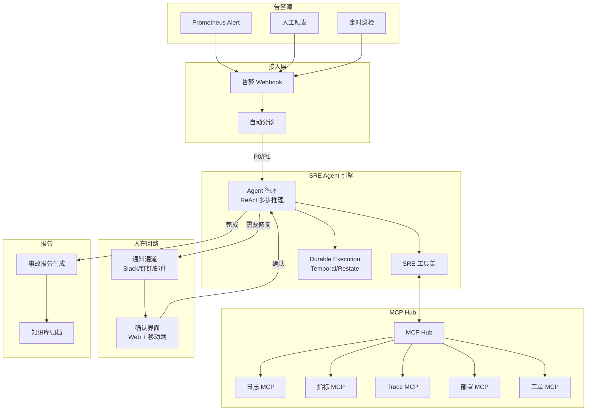

# 企业级项目四：AI 运维自治平台（AIOps）

> 基于 SRE Agent 的自治系统——告警接入、自动调查、根因分析、修复确认。
> 融合 Durable Execution + MCP Hub + AI SRE 三大前沿方向。

---

## 为什么是这一个项目

| 项目 | 关注点 | 回答什么问题 |
|------|-------|------------|
| AgentForge | 怎么造一个客服 Agent | "我能做出 AI 应用吗？" |
| CodeForge | 怎么造一个深度 Agent | "我能做出 Claude Code 级系统吗？" |
| AgentOps | 怎么管多个 Agent | "我能让 10 个 Agent 稳定运行吗？" |
| **AIOps** | **Agent 怎么做运维** | **"Agent 能自己运维系统吗？"** |

这是四个项目中**技术最前沿**的一个——它融合了三个阶段6的前沿方向。

---

## 核心功能

```
1. 告警接入与自动分诊
   - Prometheus Alert → 自动触发 SRE Agent
   - Agent 判断严重度（P0-P3）
   - P0/P1 自动启动调查，P2/P3 排队

2. 多源数据自动收集
   - 日志查询工具（ELK/Loki）
   - 指标查询工具（Prometheus）
   - Trace 查询工具（Jaeger/Tempo）
   - 变更记录查询工具

3. 根因分析（ReAct 多步推理）
   - Agent 形成假设 → 查询数据验证 → 确认/排除
   - 借鉴阶段3-01 的 Agent 循环

4. Durable Execution 持久化执行
   - Temporal/Restate 集成
   - 调查过程中断后自动恢复
   - 每一步都有 Checkpoint

5. MCP Hub 工具市场
   - 监控/工单/部署 等系统通过 MCP Server 接入
   - Agent 通过 Hub 发现和使用工具

6. 修复方案 + 人在回路
   - Agent 生成修复方案（含风险和回滚）
   - 人工确认后执行
   - 修复后自动验证

7. 事故报告自动生成
   - 结构化的 MTTR 分析
   - 根因 + 时间线 + 修复方案
```

---

## 架构设计



---

## 项目目录结构

```
ai-ops/
├── src/main/java/com/aiops/
│   ├── AiOpsApplication.java
│   │
│   ├── alert/                        # 告警接入
│   │   ├── AlertWebhookController.java
│   │   ├── AlertTriageService.java
│   │   └── AlertSeverity.java
│   │
│   ├── agent/                        # SRE Agent
│   │   ├── SREAgentLoop.java         # ReAct 循环
│   │   ├── HypothesisTracker.java    # 假设追踪
│   │   └── InvestigationState.java   # 调查状态
│   │
│   ├── tools/                        # SRE 工具集
│   │   ├── LogQueryTool.java         # 日志查询
│   │   ├── MetricQueryTool.java      # 指标查询
│   │   ├── TraceQueryTool.java       # Trace 查询
│   │   ├── ChangeQueryTool.java      # 变更查询
│   │   ├── DeployTool.java           # 部署操作
│   │   └── RemediationTool.java      # 修复执行
│   │
│   ├── durable/                      # Durable Execution
│   │   ├── InvestigationWorkflow.java
│   │   └── InvestigationActivities.java
│   │
│   ├── mcphub/                       # MCP Hub
│   │   ├── McpHubService.java
│   │   └── McpServerRegistration.java
│   │
│   ├── approval/                     # 人在回路
│   │   ├── ApprovalService.java
│   │   ├── NotificationService.java
│   │   └── ApprovalController.java
│   │
│   └── report/                       # 事故报告
│       ├── IncidentReportService.java
│       └── ReportTemplate.java
│
├── docker-compose.yml
└── pom.xml
```

---

## 分阶段构建计划（4 周）

### Sprint 1（第 1 周）：告警接入 + 工具集

| 交付物 | 说明 |
|--------|------|
| AlertWebhookController | 接收 Prometheus 告警 |
| AlertTriageService | 自动分诊（P0-P3） |
| LogQueryTool | 对接 Loki/ELK |
| MetricQueryTool | 对接 Prometheus |
| TraceQueryTool | 对接 Jaeger |
| ChangeQueryTool | 查询最近变更 |

### Sprint 2（第 1-2 周）：SRE Agent 循环

| 交付物 | 说明 |
|--------|------|
| SREAgentLoop | ReAct 推理循环 |
| HypothesisTracker | 根因假设追踪 |
| SRE 系统提示词 | 专业 SRE 推理规则 |
| 三重保护 | maxTurns + budget + loop detection |

### Sprint 3（第 2-3 周）：Durable Execution + MCP Hub

| 交付物 | 说明 |
|--------|------|
| InvestigationWorkflow | Temporal 工作流 |
| InvestigationActivities | 可持久化的操作步骤 |
| McpHubService | MCP Hub 核心 |
| MCP Server 接入 | 注册多个 MCP Server |

### Sprint 4（第 3-4 周）：人在回路 + 报告 + 部署

| 交付物 | 说明 |
|--------|------|
| ApprovalService | 修复确认流程 |
| NotificationService | Slack/钉钉通知 |
| IncidentReportService | 自动生成事故报告 |
| Docker Compose | 全栈部署 |

---

## 验收标准

- [ ] Prometheus 告警能触发 SRE Agent
- [ ] Agent 能查询日志/指标/Trace/变更记录
- [ ] Agent 能形成根因假设并验证
- [ ] 调查过程持久化（崩溃可恢复）
- [ ] 修复操作需要人工确认
- [ ] 自动生成结构化事故报告
- [ ] MCP Hub 能管理多个 MCP Server
- [ ] Docker 一键部署

---

## 详细实现文档索引

| Sprint | 文档 | 核心内容 |
|--------|------|---------|
| Sprint 1 | [告警接入 + 工具集](Sprint1-告警工具.md) | Webhook + SRE 工具 |
| Sprint 2 | [SRE Agent 循环](Sprint2-Agent循环.md) | ReAct 推理 + 假设追踪 |
| Sprint 3 | [Durable + MCP Hub](Sprint3-DurableMCP.md) | Temporal + MCP Hub |
| Sprint 4 | [确认 + 报告 + 部署](Sprint4-确认报告.md) | 人在回路 + 报告生成 |
